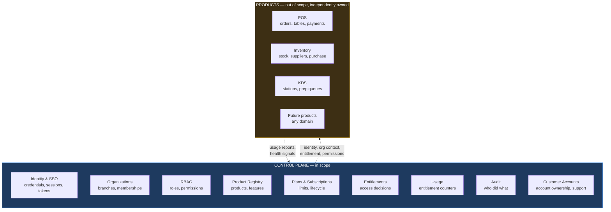
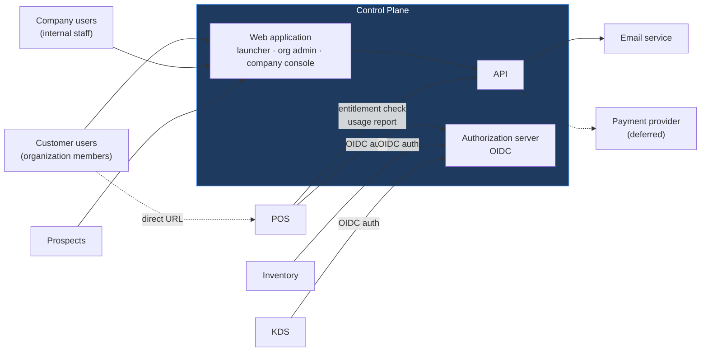
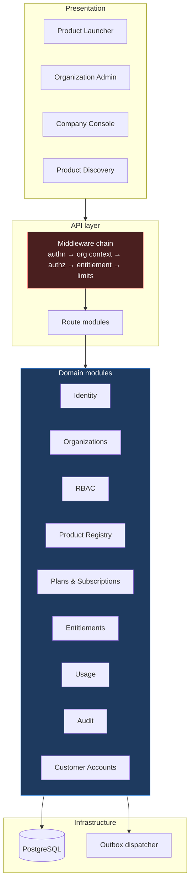
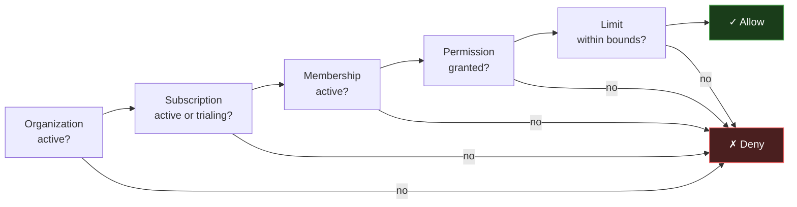
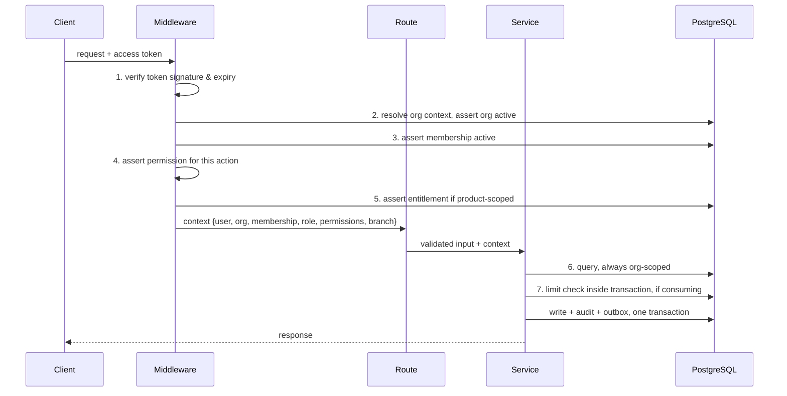
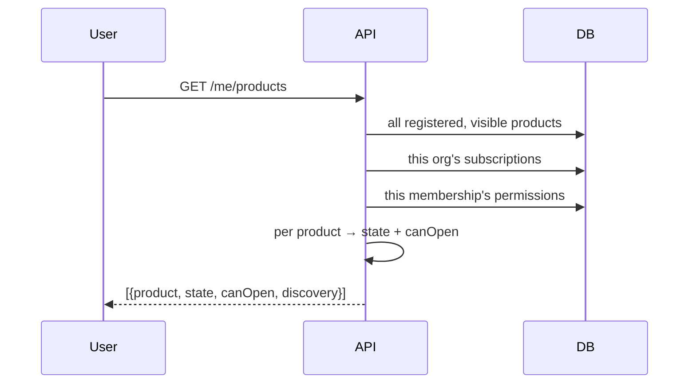
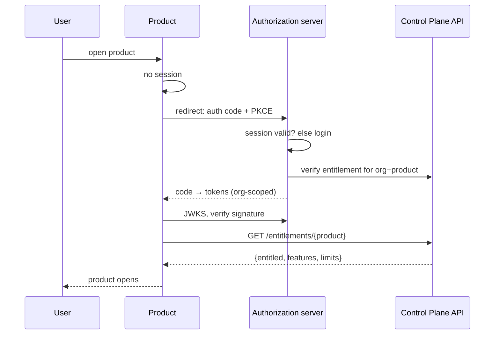

# 02 — System Overview

This document defines what the system is, where its boundaries lie, who uses it, and how work flows through it. It is the orientation document: a new engineer should be able to read this one file and understand the shape of the platform before reading any other.

---

## 1. What this system is

The Company Central Control Plane is the **platform layer** beneath a family of independent SaaS products. It owns identity, tenancy, access and commercial entitlement for the whole ecosystem, and it owns none of the products' business domains.

The single sentence that governs every design decision:

> **The Control Plane answers "who are you, which organization are you acting as, what has that organization bought, and what are you allowed to do" — and nothing else.**

If a proposed feature does not answer one of those four questions, it belongs in a product, not here. This test is applied throughout, and it is the test to apply when a future requirement is ambiguous.

### 1.1 What it is not

It is not a restaurant system. Restaurant products are the first ecosystem, not the domain (baseline §41). The Control Plane contains no concept of an order, a table, a stock item or a kitchen station, and the presence of any such concept in its schema would be an architectural defect.

It is not a product gateway. Products are reached directly at their own URLs; the Control Plane issues the identity and entitlement they verify, but it does not proxy their traffic. A proxy would make the Control Plane a single point of failure for the entire ecosystem — a far worse property than the occasional need for a product to re-verify.

It is not a billing system. It holds billing *metadata* — what plan, what period, what status — and defers payment processing (baseline §39, ADR-D1).

---

## 2. System boundaries



The dotted arrows are the only coupling between the two halves, and they are deliberately thin. A product needs to know *who is here and what may they do*; the Control Plane needs to know *how much of a metered resource has been consumed*. Nothing else crosses. This is what allows a product team to work without knowing how the Control Plane is built, and the Control Plane to add a product without knowing what that product does.

---

## 3. Actors

### 3.1 Company (internal) actors

These hold **platform-scoped** role assignments. Their power is dangerous by construction — a platform-scoped role can reach across tenants — so every such assignment is audited and none is self-grantable (ADR-005).

| Actor | What they do | Why they need cross-tenant reach |
|---|---|---|
| Super Administrator | Full platform control, including granting platform roles | Must be able to recover from any state |
| Platform Administrator | Manages products, features, plans | Configures the ecosystem itself |
| Account Manager | Owns the commercial relationship for assigned organizations | Sells, renews, upgrades |
| Customer Success Manager | Monitors health and usage of assigned organizations | Proactive retention |
| Support Agent | Investigates customer issues | Must see a customer's state to help them |
| Billing Administrator | Manages subscriptions and billing metadata | Activates, suspends, adjusts commercially |
| Operations Administrator | Monitors system health, product integration status | Keeps the platform running |

### 3.2 Organization (customer) actors

These hold **organization-scoped** memberships. A human may hold several, in different organizations, with a different role in each (baseline §8) — this is a first-class case, not an edge case.

| Actor | What they do |
|---|---|
| Organization Owner | Full control of their organization; the billing and contractual counterpart |
| Organization Admin | Manages users, roles, branches within subscription limits |
| Product Admin | Administers a specific product for the organization |
| Manager | Operational role, product-dependent scope |
| Staff | Day-to-day product use |
| Viewer | Read-only |

### 3.3 Non-human actors

| Actor | Interaction |
|---|---|
| Product applications | Verify tokens via JWKS, call entitlement APIs, receive webhooks, report usage |
| Prospective customers | Self-register an organization; browse product discovery pages |

---

## 4. System context



Two entry paths matter and both must work identically (baseline §37). A user may arrive at the launcher and click into a product, or go straight to a product's URL having never visited the Control Plane. The second path is the one that is easy to get wrong: the product finds no session, redirects to the authorization server, and the user returns authenticated with organization context resolved. The access decision is the same in both cases, because it is made in the same place.

---

## 5. Major components



The middleware chain is highlighted because it is where the platform's security invariant is enforced, in a fixed order, for every protected request. Its stages are described in §7.

### 5.1 Module responsibilities

| Module | Owns | Does not own |
|---|---|---|
| **Identity** | Users, credentials, sessions, tokens, OIDC endpoints, MFA | Authorization decisions, organization data |
| **Organizations** | Organizations, branches, memberships, invitations | Roles (RBAC owns them), limits (Subscriptions owns them) |
| **RBAC** | Roles, permissions, assignments, permission resolution | Entitlement — whether the organization bought the product |
| **Product Registry** | Products, features, categories, discovery content | Any product's business logic |
| **Plans & Subscriptions** | Plans, plan features, limit configuration, subscription lifecycle | Payment processing |
| **Entitlements** | The access decision: may this organization use this product | The permission decision (RBAC owns it) |
| **Usage** | Entitlement counters (authoritative); product-reported metrics (informational) | Product domain analytics |
| **Audit** | Immutable record of significant actions | Application logs |
| **Customer Accounts** | Account ownership, support ownership, customer lifecycle state | Entitlement |

The "does not own" column is the operative half of this table. Most architectural drift begins with a module reaching for something adjacent that it could plausibly handle.

---

## 6. The central security invariant

Everything in the platform's access control reduces to this conjunction, from baseline §23:



Five independent conditions, all required, every one evaluated server-side. Two properties of this chain deserve emphasis because they are where similar systems fail:

**The gates are independent and must be tested independently.** An entitled organization whose user lacks permission must be denied; a permitted user whose organization lacks entitlement must be denied (ADR-015). The second case is the one commonly missed, because it only appears when a subscription lapses while permissions remain.

**The denial reason must not leak.** A denial tells the user what they need to know — "your plan does not include this product", "you do not have permission" — without revealing whether a resource exists in another tenant. The difference between "not found" and "not permitted" can itself be an information leak across organizations.

---

## 7. Request flow

Every protected request passes the same chain, in this order. The order is not arbitrary: each stage depends on what the previous established, and a stage that runs early enough to be cheap should run early.



Three details carry most of the weight:

**Organization context comes from the token, never from the request body** (ADR-012). A client-supplied `organization_id` is the classic tenant-escape vector: it looks like ordinary input and it is trusted by accident.

**State writes, audit records and outbox events commit in one transaction.** An action that happened but was not audited is an integrity failure, and an event that fires for a change that rolled back is worse — it tells other systems about a thing that never occurred (ADR-009).

**Limit checks happen inside the transaction that consumes the resource, not before it** (ADR-011). Checking first and inserting afterwards is a race that two concurrent requests will win together.

---

## 8. Major data flows

### 8.1 Rendering the launcher

Per baseline §36 and ADR-013 — no product identifier is hardcoded anywhere in this flow:



The backend returns every product with a computed state — `active`, `trialing`, `expired`, `suspended`, `not_subscribed` — and the frontend renders whatever arrives. A new product appears in the launcher the moment it is registered, with no release.

### 8.2 Opening a product via SSO



The product verifies the token locally against published JWKS — no network call for authentication — but asks the Control Plane for entitlement, because entitlement is live state that a token cannot represent (ADR-004). This is the division that makes tokens cacheable and revocation immediate at the same time.

### 8.3 Inviting a user against a limit

```mermaid
sequenceDiagram
    participant A as Org Admin
    participant API
    participant DB

    A->>API: POST /memberships (invite)
    API->>API: authn, org context, permission
    API->>DB: BEGIN; lock subscription row
    API->>DB: effective limit (override ?? plan)
    API->>DB: count current members
    alt within limit
        API->>DB: insert membership + audit + outbox; COMMIT
        API-->>A: 201 created
    else limit reached
        API->>DB: ROLLBACK
        API-->>A: 409 + upgrade options
    end
```

The row lock is what makes this correct under concurrency. The error response carries the information the user needs to act — current limit, current usage, available upgrades — because baseline §39 makes hitting a limit the entry point to the upgrade flow rather than a dead end.

---

## 9. Extension model: adding a product

The test of whether this architecture succeeded (baseline §14, master prompt §33). Adding a product requires:

1. A row in `products` — name, slug, URL, icon, category, discovery copy.
2. Rows in `features` for the capabilities it exposes.
3. An OIDC client registration so it can authenticate users.
4. Plans with limit configuration, if it is sold.

It requires **no** change to: the launcher, the entitlement engine, the RBAC engine, the API surface, the admin console, or the database schema. If any of those needs touching to onboard a product, the architecture has regressed and the regression should be fixed rather than worked around.

---

## 10. Scale posture

The architecture targets correctness at early scale with clear headroom, not speculative capacity (master prompt §38):

| Dimension | Initial approach | Headroom when needed |
|---|---|---|
| Application | Stateless; sessions in Postgres | Horizontal instances behind a load balancer |
| Database | Single Postgres | Read replicas for reporting, then partitioning by organization |
| Sessions, rate limits, cache | Postgres tables behind interfaces | Redis, swapped without touching call sites (ADR-008) |
| Events | Transactional outbox | Broker fed by the same outbox (ADR-009) |
| Modules | In-process, strictly bounded | Extraction to services along existing interfaces (ADR-001) |

Every row's right-hand column is reachable without redesign, because the left-hand column was built behind an interface. That is the whole scalability strategy: not building for scale now, but making sure nothing has to be unbuilt later.

---

Next: `03-hld.md`.
