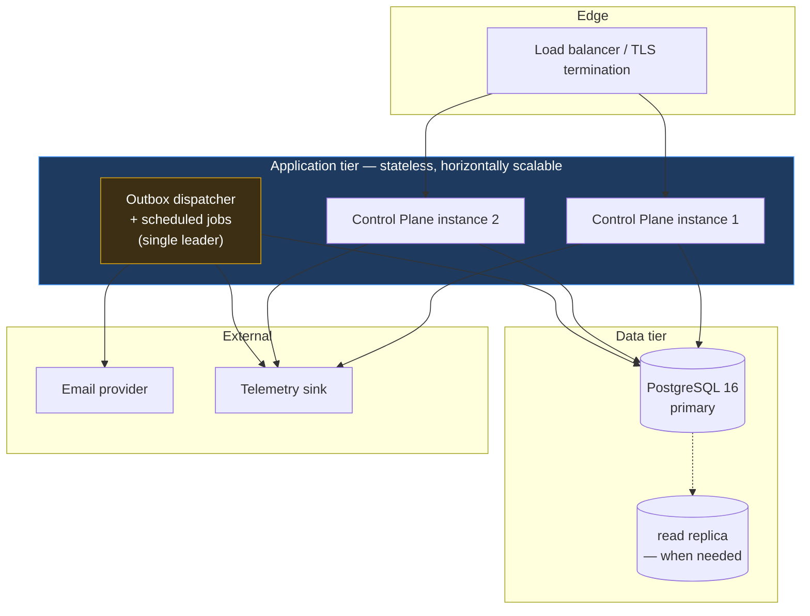
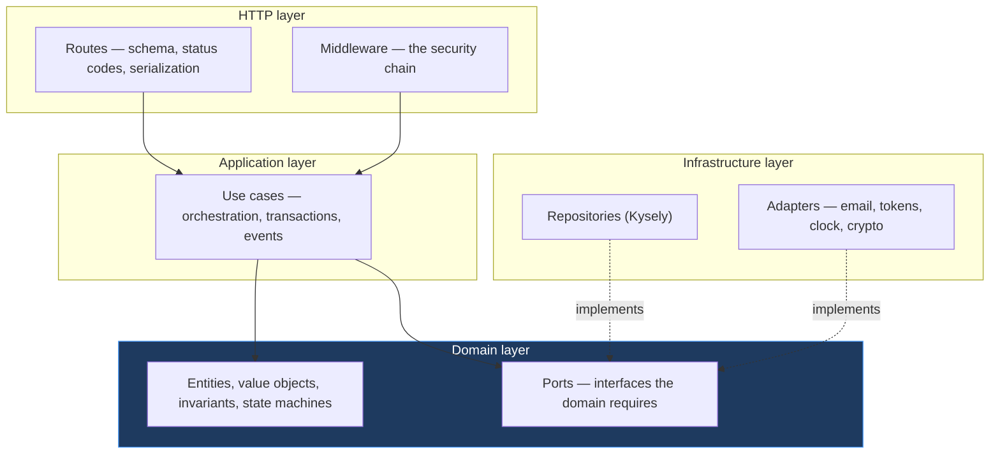
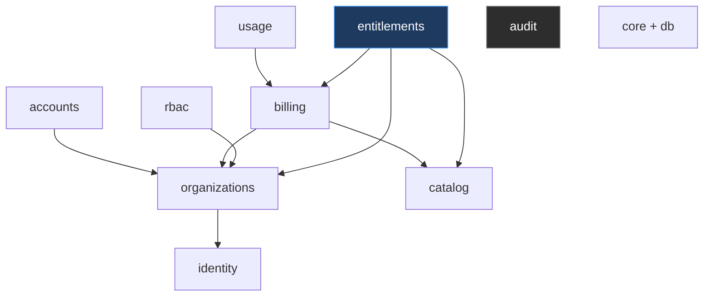
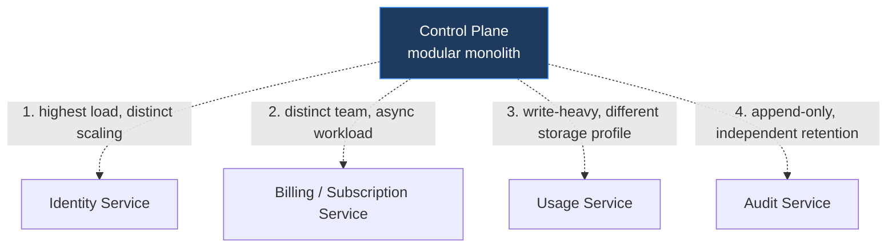

# 03 — High-Level Design

Where `02-system-overview.md` describes what the system does, this document describes how it is built: the runtime topology, the layering inside the application, the module structure, and the seams along which the system can later be pulled apart.

---

## 1. Technology stack

| Layer | Choice | Rationale |
|---|---|---|
| Runtime | Node.js 24 LTS | Installed; stable ESM, native test runner (ADR-002) |
| Language | TypeScript, `strict` | Master prompt §32; strictness from commit one |
| Package manager | pnpm 11 workspaces | Strict dependency isolation enforces module boundaries |
| HTTP framework | Fastify | Schema-first validation, low overhead, strong plugin encapsulation that mirrors module boundaries |
| Validation | Zod | One schema serves runtime validation, static types and OpenAPI generation |
| Database | PostgreSQL 16+ | Baseline §33; needs real transactions, row locks, partial unique indexes, JSONB |
| Query layer | Kysely | Typed SQL without an ORM's hidden query generation; limit enforcement and tenant scoping need visible, predictable SQL |
| Migrations | Kysely migrations, forward-only | Reviewable SQL, deterministic ordering |
| Auth primitives | `jose`, `argon2` | ADR-003 constraints: no hand-rolled crypto |
| Frontend | **Next.js 15 App Router + React 19** | ADR-019 — public discovery pages are SEO-relevant and need server rendering; one framework for all four surfaces. *Amends the original React + Vite choice; see `22-change-log.md` AR-007* |
| Frontend styling | Tailwind CSS v4 + CSS custom properties | ADR-021 — zero runtime, which matters for dense tables and Server Components |
| Component library | Radix Primitives, first-party wrapper at `packages/ui` | ADR-020 |
| Logging | Pino, structured JSON | Correlation ids from the first endpoint |
| Tracing | OpenTelemetry | Instrumented early; exporter chosen at deployment |
| Testing | `node:test` + Testcontainers/remote Postgres | Integration tests must run without Docker where possible (AR-003) |

### 1.1 Why Kysely rather than an ORM

This is a deliberate choice with security consequences, not a preference. Two of the platform's hardest requirements — race-safe limit enforcement (ADR-011) and structural tenant scoping (ADR-012) — depend on knowing exactly what SQL runs. `SELECT ... FOR UPDATE` on a subscription row, partial unique indexes over active subscriptions, and the guarantee that no query omits `organization_id` are all things an ORM's lazy loading and implicit query generation make harder to verify. Kysely is a typed query builder: the SQL is visible in the code, and the types still catch a missing column. Where an ORM's ergonomics would help — simple CRUD — the cost of hand-written queries is small; where it would hurt, the cost is a tenant leak.

---

## 2. Runtime topology



The application tier is stateless — sessions live in Postgres (ADR-008), so any instance can serve any request and scaling is a matter of adding instances.

**The dispatcher is deliberately not stateless.** Outbox delivery and scheduled jobs (subscription expiry, session purge, trial-ending notices) must run exactly once per tick, not once per instance. Three instances independently expiring subscriptions would send three notification emails. The dispatcher therefore holds a Postgres advisory lock as a leader election: whichever process holds it dispatches, the others idle and take over if it dies. This is the simplest correct answer at this scale and needs no coordination service.

---

## 3. Application layering



Dependencies point inward; the domain layer imports nothing from the outer layers. The dotted arrows are the inversion — infrastructure implements interfaces the domain declares.

This matters practically, not just aesthetically: it is what lets the subscription state machine, the limit-resolution rules and the permission-resolution logic be unit-tested with no database at all. Given that Postgres is not yet installed on the development machine (AR-003), that property is the difference between making progress and being blocked.

**The rule that keeps this honest:** no `import` of `kysely`, `fastify` or any provider SDK may appear under a module's `domain/` directory. It is enforced by lint, not by review, because review forgets.

### 3.1 The clock is a port

Time is injected, never read directly via `Date.now()` in domain code. Subscription expiry, trial ends, token lifetimes and lockout windows are all time-dependent, and testing "what happens the moment a trial expires" against the real clock means either waiting or sleeping. With an injectable clock it is an assertion.

---

## 4. Module structure

```text
apps/
  api/                  Fastify server: composition root, middleware, route registration
  web/                  React: launcher, org admin, company console, discovery
packages/
  core/                 shared kernel — Result types, errors, ids, clock port, pagination
  db/                   Kysely instance, generated types, migrations, transaction helper
  modules/
    identity/           users, credentials, sessions, tokens, OIDC endpoints, MFA
    organizations/      organizations, branches, memberships, invitations
    rbac/               roles, permissions, assignments, resolution
    catalog/            product registry, features, discovery content
    billing/            plans, plan features, subscriptions, limit configuration
    entitlements/       the access decision engine
    usage/              entitlement counters, product-reported metrics
    audit/              append-only audit log
    accounts/           customer account ownership, support ownership
  contracts/            shared API + event + integration types, published to products
  ui/                   design system components
```

Each module directory has the same internal shape:

```text
modules/<name>/
  domain/        entities, value objects, state machines, ports — no I/O, no framework
  application/   use cases; one file per use case, each a transaction boundary
  infrastructure/ repository implementations, adapters
  http/          routes and schemas
  index.ts       the module's public interface — the only legal import surface
```

### 4.1 Module dependency rules

Enforced mechanically by pnpm's strict linking plus a lint rule; a violation fails the build.



1. A module imports another only through its `index.ts`. Reaching into `../organizations/infrastructure/` is a build failure.
2. A module never reads another module's tables. If entitlements needs subscription state, it calls the billing module's interface.
3. The graph is acyclic. A needed cycle means the boundary is drawn wrongly, and the fix is to redraw it or extract the shared concept — not to add the import.
4. `audit` is depended on by everything and depends on nothing but `core`. It is a sink.
5. `core` and `db` are leaves that everything may use.

The acyclic rule is what preserves ADR-001's extraction path. A cycle between two modules means they cannot be separated, and the first cycle admitted is the point at which the modular monolith quietly becomes a monolith.

---

## 5. The middleware chain

The chain is the platform's security perimeter. It is defined once, in one file, and applied declaratively per route — never reimplemented inside a handler.

```mermaid
graph LR
    R["request"] --> C["correlation id"]
    C --> RL["rate limit"]
    RL --> AU["authenticate<br/>verify JWT"]
    AU --> OC["org context<br/>from token claims"]
    OC --> OS["org status<br/>active?"]
    OS --> MS["membership<br/>active?"]
    MS --> PM["permission<br/>required for route"]
    PM --> EN["entitlement<br/>if product-scoped"]
    EN --> V["validate body"]
    V --> H["handler"]

    style AU fill:#4a1f1f,stroke:#ff6b6b,color:#fff
    style OC fill:#4a1f1f,stroke:#ff6b6b,color:#fff
    style PM fill:#4a1f1f,stroke:#ff6b6b,color:#fff
    style EN fill:#4a1f1f,stroke:#ff6b6b,color:#fff
```



Each route declares what it needs:

```ts
app.post('/organizations/:id/memberships', {
  schema: { body: CreateMembershipSchema },
  config: {
    auth: 'required',
    scope: 'organization',
    permission: 'organization.members.create',
    consumesLimit: 'users',
  },
}, handler)
```

Three properties follow from declaring rather than coding this:

**The default is deny.** A route with no `config` is rejected at registration time by a startup assertion, not served unprotected. The dangerous failure mode for declarative security is the forgotten annotation, so forgetting must break the build rather than open a hole.

**Authorization is auditable by reading route definitions.** A reviewer can see every endpoint's required permission in one place, which is the only way a permission model stays coherent as endpoints multiply.

**`consumesLimit` marks where ADR-011 applies**, so the transactional enforcement cannot be omitted silently.

---

## 6. Tenant isolation mechanics

Isolation is structural, per ADR-012 — three layers, so that no single mistake is sufficient to breach it.

**Layer 1 — the token is org-scoped.** An access token carries exactly one `org_id`. A token minted for Organization A cannot address Organization B, because there is nowhere in the request for another organization to come from.

**Layer 2 — repository signatures require the scope.** Organization-owned repositories take a branded `OrgScope` as a required first parameter:

```ts
type OrgScope = { readonly organizationId: OrganizationId; readonly __brand: 'OrgScope' }

interface BranchRepository {
  findById(scope: OrgScope, id: BranchId): Promise<Branch | null>
  list(scope: OrgScope, page: Page): Promise<Paged<Branch>>
}
```

A scope-less query does not compile. The branded type means a bare string cannot be passed in its place, and `OrgScope` can only be constructed by the middleware that derived it from a verified token. This turns "remember to scope your query" from a convention into a type error.

**Layer 3 — cross-tenant access is one named, audited path.** Company staff legitimately need cross-organization reads. That capability lives in explicitly-named repository methods (`listAcrossTenants`), each requiring a platform-scoped permission and writing an audit record. The dangerous capability exists, visibly, in one place — which is far safer than a general-purpose escape hatch that is easy to reach for.

Postgres row-level security is evaluated as a fourth layer in `15-security-architecture.md`; it is defense in depth, not a substitute for the above, because RLS protects against a bad query but not against a connection that sets the wrong tenant.

---

## 7. Transaction and event boundaries

One use case, one transaction. Inside it: the state change, the audit record, and the outbox rows.

```ts
await db.transaction(async (tx) => {
  const sub = await subscriptions.lockForUpdate(tx, scope, productId)   // ADR-011
  const limit = await limits.effective(tx, sub, 'users')
  const used  = await memberships.countActive(tx, scope)
  if (limit !== null && used >= limit) throw new LimitReached('users', limit, used)

  const m = await memberships.insert(tx, scope, input)
  await audit.record(tx, { actor, action: 'membership.created', resource: m.id })
  await outbox.enqueue(tx, { type: 'UserInvited', payload: { ... } })
  return m
})
```

The grouping is not convenience — it is three correctness properties at once. An action cannot occur unaudited. An event cannot announce a change that rolled back. And the limit check cannot be overtaken by a concurrent request, because the lock is held for the duration.

Side effects that can fail independently — sending the invitation email, calling a product's webhook — happen **outside** the transaction, driven by the outbox. A mail provider timeout must not roll back a membership that was legitimately created.

---

## 8. Frontend architecture

Four surfaces, one codebase, strictly separated by **Next.js route group**, each with its own bundle boundary (ADR-019). Full specification in `docs/design/11-frontend-architecture.md`.

| Surface | Audience | Route group | Rendering |
|---|---|---|---|
| Product Discovery | Anyone, incl. anonymous | `(public)` — `/products/[slug]` | **Server-rendered** — public and SEO-relevant |
| Identity flows | Unauthenticated | `(auth)` — `/login`, `/register`, … | Server shell + client forms |
| Launcher | Customer users | `(app)` — `/` | Server shell + client grid |
| Organization Admin | Org owners/admins | `(app)` — `/org/*` | Mostly client |
| Company Console | Internal staff | `(admin)` — `/admin/*` | Mostly client, **separate bundle** |

The Company Console remains a separate bundle. A customer user's browser should never download the code for cross-tenant administration — not as a security control, since authorization is server-side regardless, but because shipping the admin surface to every customer invites someone to probe it.

**Session handling** (ADR-032): the web app's session is an httpOnly, `Secure`, `SameSite=Strict` cookie set by a Next route handler, and **access tokens never reach JavaScript**. Route handlers proxy authenticated requests to this API, attaching the token server-side. That proxy is deliberately thin — **no business logic, no authorization, no validation** — because a BFF that grows logic becomes a second place where access is decided, which is the duplication this architecture exists to avoid. Product applications are unaffected and continue to use the standard OIDC flow (`12-product-integration-contract.md`).

> **Amendment (design review D-6).** This section originally described a Vite SPA with lazy-loaded bundles. The framework is now Next.js App Router per ADR-019; the **intent is preserved** — the admin console is still a separate bundle, now via route groups rather than lazy imports. Recorded in `22-change-log.md` AR-007.

### 8.1 What the frontend is not permitted to do

- **No authorization decisions.** The UI hides what the user cannot do, for usability. The server denies it, for security. Master prompt §13 — a hidden button is not a control.
- **No limit arithmetic.** It displays "2 of 2 users" from the API; it never computes whether an action is permitted (§34).
- **No product-specific branches.** It renders registry data (ADR-013).
- **No business logic in components.** Rules live server-side; the client renders state and submits intent.

---

## 9. Future service extraction

The seams, in the order they would most plausibly be cut (baseline §34). Each is already an interface, so extraction is a transport change rather than a redesign.



| Seam | Extraction trigger | What makes it ready |
|---|---|---|
| Identity | Auth traffic scales separately from admin traffic | Already an OIDC-conformant boundary (ADR-003) |
| Billing | A dedicated billing team, or payment-provider integration grows | Interface-only coupling to entitlements |
| Usage | Metering volume outgrows the primary database | Append-mostly; no foreign keys inward |
| Audit | Retention or compliance demands separate storage | Already a pure sink (§4.1) |

Entitlements is deliberately **not** on this list. It is the hottest read path and the most security-critical decision in the system; splitting it across a network would add latency to every request and a failure mode to every access decision. It stays in-process.

---

## 10. What is deliberately absent

Recorded so that each absence reads as a decision rather than an omission (master prompt §38):

| Not included | Why | Revisit when |
|---|---|---|
| Redis | Postgres is sufficient; interfaces permit the swap (ADR-008) | Session p99 or counter contention degrades |
| Kafka | Outbox covers all identified events (ADR-009) | Cross-product streaming volume justifies it |
| Kubernetes | Compose suffices; Docker not yet installed locally (ADR-D4) | Multi-instance orchestration needed |
| GraphQL | REST with typed contracts serves known clients well | Clients need widely varying projections |
| Event sourcing | Audit log covers the real requirement — knowing who did what | Full state reconstruction becomes a requirement |
| CQRS | One read model, one write model, no divergent scaling | Reporting load conflicts with transactional load |
| Microservices | ADR-001 | A trigger in §9 fires |

---

Next: `04-erd.md`.
