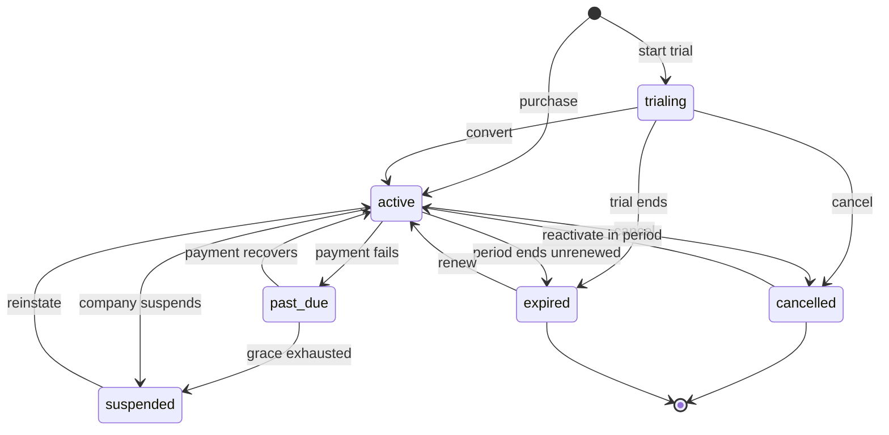

# 04 — Entity Relationship Design

The production data model. The baseline's entity list (§35) is conceptual; this document normalizes it, resolves the ambiguities the audit found, and specifies constraints precisely enough to implement from — because in a multi-tenant system the database constraints are the last line of defense, and the only one that holds when application code has a bug.

---

## 1. Conventions

| Convention | Rule | Why |
|---|---|---|
| Primary keys | UUID v7, `id` | Time-sortable (so index locality is good, unlike v4) and non-enumerable (unlike serial ints, which leak customer counts and invite id-guessing across tenants) |
| Timestamps | `timestamptz`, always UTC | A platform spanning time zones cannot store naive timestamps |
| Audit columns | `created_at`, `updated_at` on every mutable table | Non-negotiable for support and forensics |
| Soft delete | `deleted_at timestamptz NULL`, only where history matters | Hard-deleting an organization destroys the audit trail that proves what happened |
| Naming | `snake_case`, plural tables, `<singular>_id` FKs | One convention, mechanically predictable |
| Enums | Postgres `CHECK` constraints over text, not native enum types | Adding a value to a native enum needs DDL and locks; a CHECK is a cheap altered constraint |
| Money | `numeric(19,4)` + ISO currency code | Never floats |
| Flexible data | `jsonb` only for genuinely open-ended structures | A column that will be queried or constrained must be a column |
| Tenant column | `organization_id` on every org-owned table | Enables both the type-level scoping of ADR-012 and database-level RLS |

### 1.0 Practical notes on the conventions

> **Correction (review R-10).** Two conventions above need an implementation note, or they will fail on first contact with PostgreSQL 16.

**UUID v7 is generated in the application, not the database.** Native `uuidv7()` arrived in PostgreSQL 18; this platform targets 16+ (§1), so there is no server-side generator. Ids are generated in Node and passed in on insert. Columns therefore carry **no** `DEFAULT gen_random_uuid()` — a v4 default would silently undermine the time-ordering the choice was made for, and the mix would be invisible.

**`citext` requires an extension.** `CREATE EXTENSION IF NOT EXISTS citext;` must be the first migration, before any table using it. Where a managed Postgres forbids the extension, the fallback is `text` plus a unique index on `lower(email)` — functionally equivalent, since `lower()` *is* immutable.

### 1.1 The tenant column is denormalized on purpose

Several tables could reach their organization transitively — a `usage_record` belongs to a `subscription`, which belongs to an organization. Carrying `organization_id` directly anyway is deliberate redundancy with two payoffs: every tenant-scoped query filters on a local indexed column rather than a join, and row-level security can be applied uniformly to every table with one policy shape. The redundancy is protected by a composite foreign key where possible, so the two paths cannot disagree.

---

## 2. Full ERD

```mermaid
erDiagram
    users ||--o{ user_credentials : has
    users ||--o{ sessions : has
    sessions ||--o{ refresh_tokens : family_of
    users ||--o{ memberships : holds
    users ||--o{ platform_role_assignments : holds
    users ||--o{ mfa_factors : enrolls

    organizations ||--o{ branches : contains
    organizations ||--o{ memberships : contains
    organizations ||--o{ subscriptions : holds
    organizations ||--o| customer_accounts : has
    organizations ||--o{ invitations : issues
    invitations ||--o{ invitation_roles : assigns
    roles ||--o{ invitation_roles : promised_by
    organizations ||--o{ organization_product_requests : requests

    memberships ||--o{ membership_roles : assigned
    memberships ||--o{ membership_branches : scoped_to
    memberships ||--o{ membership_products : seats
    products ||--o{ membership_products : seated_in
    invitations ||--o{ invitation_products : promises
    products ||--o{ invitation_products : promised_in
    branches ||--o{ membership_branches : scopes

    roles ||--o{ membership_roles : used_by
    roles ||--o{ role_permissions : grants
    roles ||--o{ platform_role_assignments : used_by
    permissions ||--o{ role_permissions : granted_by

    products ||--o{ features : exposes
    products ||--o{ plans : priced_by
    products ||--o{ subscriptions : subscribed
    products ||--o{ permissions : scopes
    products ||--o{ roles : scopes
    products ||--o{ oidc_clients : authenticates

    plans ||--o{ plan_features : includes
    features ||--o{ plan_features : included_in

    subscriptions ||--o{ subscription_overrides : overridden_by
    subscriptions ||--o{ usage_records : meters
    subscriptions ||--o{ subscription_events : history
    plans ||--o{ subscriptions : governs

    users ||--o{ audit_logs : actor
    organizations ||--o{ audit_logs : subject

    outbox_events }o--|| organizations : about
```



The diagram omits the operational tables (`outbox_events`, `rate_limit_counters`, `jwks_keys`) except where they relate; they are specified in §13.

---

## 3. Identity

### 3.1 `users`

One row per human. One identity for company staff and customer users alike (ADR-005).

| Column | Type | Null | Notes |
|---|---|---|---|
| `id` | uuid | no | PK |
| `email` | citext | no | Unique where not deleted. `citext` because email case must not create two accounts |
| `email_verified_at` | timestamptz | yes | Null = unverified |
| `full_name` | text | no | |
| `phone` | text | yes | |
| `avatar_url` | text | yes | |
| `locale` | text | no | Default `'en'` |
| `timezone` | text | no | Default `'UTC'` |
| `status` | text | no | `pending_verification` \| `active` \| `suspended` \| `deactivated`. CHECK |
| `last_login_at` | timestamptz | yes | |
| `failed_login_count` | int | no | Default 0 |
| `locked_until` | timestamptz | yes | Brute-force lockout |
| `created_at` / `updated_at` | timestamptz | no | |
| `deleted_at` | timestamptz | yes | Soft delete |

**Constraints and indexes**

```sql
CREATE UNIQUE INDEX users_email_unique ON users (email) WHERE deleted_at IS NULL;
CREATE INDEX users_status_idx ON users (status) WHERE deleted_at IS NULL;
```

A *partial* unique index, not a plain one. A plain unique index would permanently reserve a deleted user's email, so a customer who left and returned could never re-register. Scoping uniqueness to live rows fixes that while still preventing duplicates.

**No `is_company_user` column.** Whether someone is staff is derived from `platform_role_assignments`. A boolean would be a second source of truth for the most privilege-sensitive fact in the system, and it would drift (ADR-005).

**Lifecycle:** `pending_verification` → `active` → (`suspended` ⇄ `active`) → `deactivated`. Only `active` may authenticate.

### 3.2 `user_credentials`

Separated from `users` so that password material is never selected by an ordinary user query. A `SELECT *` on `users` is common; on credentials it must be deliberate.

| Column | Type | Null | Notes |
|---|---|---|---|
| `id` | uuid | no | PK |
| `user_id` | uuid | no | FK → users, cascade |
| `password_hash` | text | no | Argon2id only (ADR-003) |
| `algorithm` | text | no | Stored so a future rehash can be detected |
| `password_changed_at` | timestamptz | no | |
| `must_change_password` | boolean | no | Default false |
| `created_at` / `updated_at` | timestamptz | no | |

```sql
CREATE UNIQUE INDEX user_credentials_user_unique ON user_credentials (user_id);
```

Storing `algorithm` enables transparent upgrade: when parameters are hardened, the next successful login rehashes. Without the column there is no way to know which rows are stale.

### 3.3 `sessions`

Server-side and revocable, which is what makes immediate suspension possible (ADR-004).

| Column | Type | Null | Notes |
|---|---|---|---|
| `id` | uuid | no | PK; the session family id |
| `user_id` | uuid | no | FK → users, cascade |
| `organization_id` | uuid | yes | Active org context; null before selection |
| `issued_at` | timestamptz | no | |
| `expires_at` | timestamptz | no | |
| `last_used_at` | timestamptz | no | |
| `revoked_at` | timestamptz | yes | |
| `revoked_reason` | text | yes | `logout` \| `rotation_reuse` \| `org_suspended` \| `password_changed` \| `admin` |
| `ip_address` | inet | yes | |
| `user_agent` | text | yes | |
| `created_at` | timestamptz | no | |

```sql
CREATE INDEX sessions_user_active_idx ON sessions (user_id) WHERE revoked_at IS NULL;
CREATE INDEX sessions_expiry_idx ON sessions (expires_at) WHERE revoked_at IS NULL;
```

The expiry index exists for the purge job — without it, cleanup table-scans a growing table.

> **Correction (review R-8) — `previous_token_hash` does not satisfy ADR-003 constraint 4.** The original design claimed this single column implemented refresh-token theft detection. It detects only reuse of the *immediately* preceding token. Consider the real attack: a token `N` is stolen, the legitimate user keeps working and rotates to `N+1`, `N+2`, `N+3`. The thief now presents `N`. It matches neither `refresh_token_hash` (`N+3`) nor `previous_token_hash` (`N+2`), so it is rejected as merely invalid — and the family is **not** revoked. The request is denied, but the breach signal is thrown away: we have positive evidence that a historical token leaked, and we neither revoke the session nor alert. ADR-003 constraint 4 requires that reuse of *any* consumed token revoke the whole family, so the column was insufficient for the guarantee the ADR makes.
>
> `previous_token_hash` is replaced by a child table recording every token ever issued in the family, so reuse of any ancestor is detectable.

### 3.3.1 `refresh_tokens`

| Column | Type | Null | Notes |
|---|---|---|---|
| `id` | uuid | no | PK |
| `session_id` | uuid | no | FK → sessions, cascade. The family |
| `token_hash` | text | no | Unique, SHA-256 |
| `generation` | int | no | 0, 1, 2 … within the family |
| `issued_at` | timestamptz | no | |
| `expires_at` | timestamptz | no | |
| `consumed_at` | timestamptz | yes | Set on rotation; non-null = already spent |
| `replaced_by_id` | uuid | yes | FK → refresh_tokens, self |

```sql
CREATE UNIQUE INDEX refresh_tokens_hash_idx ON refresh_tokens (token_hash);
CREATE INDEX refresh_tokens_session_idx ON refresh_tokens (session_id);
CREATE UNIQUE INDEX refresh_tokens_live_idx
  ON refresh_tokens (session_id) WHERE consumed_at IS NULL;
```

**Presentation logic**, which is the whole point of the table:

| Token presented | Response |
|---|---|
| Not found | Reject. No session to revoke |
| Found, `consumed_at IS NULL`, unexpired | Rotate: consume it, issue the next generation |
| Found, `consumed_at IS NOT NULL` | **Reuse detected** — revoke the entire session family (`revoked_reason = 'rotation_reuse'`), audit, alert |

`refresh_tokens_live_idx` enforces at most one live token per family, so a race between two simultaneous refreshes cannot mint two valid branches — one wins and the other is correctly treated as reuse. `sessions.refresh_token_hash` and `previous_token_hash` are removed; the session row keeps identity and revocation state, while token material lives here.

### 3.4 `mfa_factors`

Present from the first migration even though MFA ships later (ADR-003 constraint 8). Adding auth tables to a live system with sessions in flight is harder than having them unused.

| Column | Type | Null | Notes |
|---|---|---|---|
| `id` | uuid | no | PK |
| `user_id` | uuid | no | FK → users, cascade |
| `type` | text | no | `totp` \| `webauthn` \| `recovery_code`. CHECK |
| `secret_encrypted` | text | yes | Encrypted at rest, never plaintext |
| `credential_id` | text | yes | WebAuthn |
| `public_key` | text | yes | WebAuthn |
| `label` | text | yes | User-facing device name |
| `confirmed_at` | timestamptz | yes | Unconfirmed factors do not satisfy MFA |
| `last_used_at` | timestamptz | yes | |
| `created_at` | timestamptz | no | |

### 3.5 `oidc_clients`

One row per product that authenticates users (ADR-003). First-party only; no dynamic registration.

| Column | Type | Null | Notes |
|---|---|---|---|
| `id` | uuid | no | PK |
| `product_id` | uuid | yes | FK → products. Null for the Control Plane's own web app |
| `client_id` | text | no | Unique, public |
| `client_secret_hash` | text | yes | Null for public PKCE clients |
| `name` | text | no | |
| `redirect_uris` | text[] | no | Exact-match allowlist |
| `post_logout_redirect_uris` | text[] | no | |
| `grant_types` | text[] | no | Default `{authorization_code,refresh_token}` |
| `require_pkce` | boolean | no | Default **true** |
| `access_token_ttl_seconds` | int | no | Default 900 |
| `refresh_token_ttl_seconds` | int | no | Default 2592000 |
| `status` | text | no | `active` \| `disabled` |
| `created_at` / `updated_at` | timestamptz | no | |

Redirect URIs are exact-match, never prefix or wildcard. Wildcard redirect matching is a standing open-redirect vulnerability that turns into token theft, and it is the single most common OAuth misconfiguration.

---

## 4. Organizations

### 4.1 `organizations`

The tenant. The most important row in the system — everything org-owned points at it.

| Column | Type | Null | Notes |
|---|---|---|---|
| `id` | uuid | no | PK |
| `name` | text | no | Display name |
| `slug` | text | no | Unique where not deleted; URL-safe |
| `legal_name` | text | yes | |
| `status` | text | no | `pending` \| `active` \| `suspended` \| `cancelled`. CHECK |
| `suspended_at` | timestamptz | yes | |
| `suspension_reason` | text | yes | |
| `industry` | text | yes | Descriptive only — never drives logic (baseline §41) |
| `country` | text | yes | ISO 3166-1 alpha-2 |
| `timezone` | text | no | Default `'UTC'` |
| `currency` | text | no | Default `'USD'`; ISO 4217 |
| `billing_email` | citext | yes | |
| `metadata` | jsonb | no | Default `'{}'` |
| `created_by_user_id` | uuid | yes | FK → users |
| `created_at` / `updated_at` | timestamptz | no | |
| `deleted_at` | timestamptz | yes | |

```sql
CREATE UNIQUE INDEX organizations_slug_unique ON organizations (slug) WHERE deleted_at IS NULL;
CREATE INDEX organizations_status_idx ON organizations (status) WHERE deleted_at IS NULL;
```

`industry` is descriptive metadata only. The moment any code branches on it, the Control Plane has become domain-aware and baseline §41 is violated.

**`suspended` is the critical status.** It must deny access immediately across every product (baseline §13), which is why entitlement is checked server-side per request rather than trusted from a token (ADR-004).

### 4.2 `branches`

| Column | Type | Null | Notes |
|---|---|---|---|
| `id` | uuid | no | PK |
| `organization_id` | uuid | no | FK → organizations, cascade |
| `name` | text | no | |
| `code` | text | yes | Customer-defined identifier |
| `address` | jsonb | yes | Shape varies by country; never queried structurally |
| `timezone` | text | yes | Falls back to the organization's |
| `status` | text | no | `active` \| `inactive`. CHECK |
| `is_primary` | boolean | no | Default false |
| `created_at` / `updated_at` | timestamptz | no | |
| `deleted_at` | timestamptz | yes | |

```sql
CREATE UNIQUE INDEX branches_org_code_unique
  ON branches (organization_id, code) WHERE code IS NOT NULL AND deleted_at IS NULL;
CREATE UNIQUE INDEX branches_one_primary
  ON branches (organization_id) WHERE is_primary AND deleted_at IS NULL;
CREATE INDEX branches_org_idx ON branches (organization_id) WHERE deleted_at IS NULL;
```

`branches_one_primary` is a partial unique index enforcing "at most one primary branch per organization" in the database. Application-only enforcement of this kind of rule fails under concurrency; the index cannot.

Branches count against a plan's `branches` limit (ADR-010), enforced per ADR-011.

### 4.3 `memberships`

The join that makes multi-organization users work (baseline §8, §9). A user has one membership per organization.

| Column | Type | Null | Notes |
|---|---|---|---|
| `id` | uuid | no | PK |
| `user_id` | uuid | no | FK → users |
| `organization_id` | uuid | no | FK → organizations, cascade |
| `status` | text | no | `active` \| `suspended` \| `removed`. CHECK |
| `is_owner` | boolean | no | Default false |
| `all_branches` | boolean | no | Default true (ADR-014) |
| `default_branch_id` | uuid | yes | FK → branches |
| `invited_by_user_id` | uuid | yes | FK → users |
| `invited_at` | timestamptz | yes | |
| `joined_at` | timestamptz | yes | |
| `removed_at` | timestamptz | yes | |
| `last_active_at` | timestamptz | yes | |
| `created_at` / `updated_at` | timestamptz | no | |

```sql
CREATE UNIQUE INDEX memberships_user_org_unique
  ON memberships (user_id, organization_id) WHERE status <> 'removed';
CREATE INDEX memberships_org_occupying_idx
  ON memberships (organization_id) WHERE status IN ('active','suspended');
CREATE INDEX memberships_user_idx ON memberships (user_id) WHERE status = 'active';
```

> **Correction (review R-3).** The original design gave this table a `status = 'invited'` **and** kept a separate `invitations` table, describing both as reserving a seat. That was two defects at once.
>
> First, it was structurally impossible: `user_id` is NOT NULL with a foreign key to `users`, but an invitation is sent to an *email address* that frequently belongs to no user yet. There is no row to point at, so an `invited` membership could not be created in the ordinary case.
>
> Second, it was a duplicated source of truth — exactly the class of defect ADR-006 exists to prevent. Two tables both claiming to represent "a pending seat" will disagree, and the disagreement surfaces as either a double-counted seat or a bypassed limit.
>
> The corrected model: **an invitation is not a membership.** A membership exists only once a real user has accepted, so `invited` is removed from its status set. Seat occupancy is therefore counted across both tables, which §4.6 defines precisely.

**Which statuses occupy a seat:** `active` and `suspended`. Suspended members still hold their seat — freeing it requires removal, not suspension. Were suspension to free a seat, an organization could suspend a member, add another, then unsuspend, and sit permanently over its limit. `memberships_org_occupying_idx` matches this predicate exactly so the count stays fast inside the lock-holding transaction (ADR-011), where duration directly determines how long concurrent invitations block.

### 4.4 `membership_branches`

Only populated when `all_branches = false` (ADR-014).

| Column | Type | Null | Notes |
|---|---|---|---|
| `membership_id` | uuid | no | PK part; FK → memberships, cascade |
| `branch_id` | uuid | no | PK part; FK → branches, cascade |
| `organization_id` | uuid | no | Denormalized guard |
| `created_at` | timestamptz | no | |

```sql
PRIMARY KEY (membership_id, branch_id)
```

`organization_id` is carried here as a guard against a membership in Organization A being linked to a branch in Organization B — a cross-tenant corruption that composite foreign keys to `(id, organization_id)` on both parents make structurally impossible.

### 4.5 `invitations`

| Column | Type | Null | Notes |
|---|---|---|---|
| `id` | uuid | no | PK |
| `organization_id` | uuid | no | FK → organizations, cascade |
| `email` | citext | no | |
| `token_hash` | text | no | Unique. Hash only — a leaked invitations table must not grant access |
| `invited_by_user_id` | uuid | no | FK → users |
| `status` | text | no | `pending` \| `accepted` \| `expired` \| `revoked`. CHECK |
| `expires_at` | timestamptz | no | |
| `accepted_at` | timestamptz | yes | |
| `accepted_user_id` | uuid | yes | FK → users |
| `created_at` / `updated_at` | timestamptz | no | |

```sql
CREATE UNIQUE INDEX invitations_token_idx ON invitations (token_hash);
CREATE UNIQUE INDEX invitations_org_email_pending
  ON invitations (organization_id, email) WHERE status = 'pending';
CREATE INDEX invitations_org_pending_idx
  ON invitations (organization_id) WHERE status = 'pending';
```

An invitation reserves a seat on creation, so accepting one cannot fail on a limit the organization has since exhausted — a user clicking a valid link and being rejected is a bad experience manufactured by deferring the check. §4.6 defines how that reservation is counted.

### 4.5.1 `invitation_roles`

| Column | Type | Null | Notes |
|---|---|---|---|
| `invitation_id` | uuid | no | PK part; FK → invitations, cascade |
| `role_id` | uuid | no | PK part; FK → roles, **restrict** |

```sql
PRIMARY KEY (invitation_id, role_id)
```

> **Correction (review R-4).** `invitations.role_ids` was a `uuid[]`. Postgres cannot enforce a foreign key from an array element, so a role could be deleted while invitations still referenced it, and acceptance would then either fail obscurely or silently grant nothing. Since these rows decide what permissions a new member receives, dangling references here are an authorization defect, not a tidiness issue. A junction table restores integrity, and `RESTRICT` means a role still promised to a pending invitation cannot be deleted out from under it.

### 4.6 Seat occupancy — the authoritative definition

**A seat is held on a product, not on the organization** (ADR-018, confirmed). Organization membership itself is uncapped — a member who has been granted no product consumes no seat and costs nothing. What is capped is the number of members granted access to each subscribed product.

Because a seat can be held either by an accepted grant or by an outstanding invitation promising one, "seats used" is a union across two tables. It is defined **once**, here, and implemented **once**, in the limits service — never re-derived at a call site:

```sql
-- Seats used for one (organization, product) pair.
SELECT
  (SELECT count(*)
     FROM membership_products mp
     JOIN memberships m ON m.id = mp.membership_id
    WHERE mp.organization_id = $1
      AND mp.product_id      = $2
      AND mp.revoked_at IS NULL
      AND m.status IN ('active','suspended'))
+ (SELECT count(*)
     FROM invitation_products ip
     JOIN invitations i ON i.id = ip.invitation_id
    WHERE i.organization_id = $1
      AND ip.product_id     = $2
      AND i.status          = 'pending'
      AND i.expires_at      > now())
AS seats_used;
```

Four decisions are embedded here, each of which is a bypass if taken the other way:

- **Pending invitations count.** Otherwise an organization issues unlimited invitations and exceeds its limit the instant they are accepted — a bypass needing no API abuse at all, just patience.
- **Expired invitations do not.** They cannot be accepted, so holding a seat would permanently strand it.
- **Suspended members keep their seats** (§4.3). Were suspension to free one, an organization could suspend a member, add another, then unsuspend, and sit permanently over its limit.
- **A removed membership releases every product seat it held**, via the cascade in §4.7. Revoking product access one row at a time while leaving a removed membership's grants live would strand seats that nobody can see or reclaim.

Expiry is evaluated at read time via `now()` rather than by a status transition, so a lapsed invitation frees its seat immediately even if the sweeper job that marks it `expired` has not yet run. A limit that depends on a background job having run is a limit that is wrong for a while.

### 4.6.1 Which resources are counted per product, and which per organization

Seats are product-scoped, but not every limited resource is. Branches belong to the organization (§4.2), not to a product, so a branch limit cannot be resolved against a single subscription. The two cases need different resolution and different lock targets, and conflating them is how one of them ends up unenforceable:

| Resource | Scope | Effective limit | Lock target under ADR-011 |
|---|---|---|---|
| `users` | product | That product's subscription — override, else plan | That subscription row |
| `branches` | organization | **MAX** across all access-granting subscriptions; unlimited (NULL) wins | The organization row |

For organization-scoped resources the most generous active plan wins. An organization paying for POS Pro with 3 branches and Inventory Basic with 1 can create 3 branches: it has bought the right once, and branches are shared infrastructure rather than per-product capacity. Taking the minimum instead would mean adding a cheap second product silently *reduced* what the customer could already do — a result no customer would accept as correct.

The lock target differs because the resource does. Product-scoped counts serialize on the subscription row, so invitations to different products never block each other. Organization-scoped counts serialize on the organization row, because the limit is derived from several subscriptions at once and no single one of them is the authority.

This distinction is carried in the schema by `features.countable_scope` (§6.2), not inferred in code.

### 4.7 `membership_products`

The user-level product grant. This is what makes a seat a countable, lockable, auditable thing, and it is what represents baseline §23's second question — *can **this user** use this product* — as data rather than as an inference.

| Column | Type | Null | Notes |
|---|---|---|---|
| `id` | uuid | no | PK |
| `membership_id` | uuid | no | FK → memberships, cascade |
| `organization_id` | uuid | no | Tenant guard; composite FK per §13.1 |
| `product_id` | uuid | no | FK → products, restrict |
| `granted_at` | timestamptz | no | |
| `granted_by_user_id` | uuid | no | FK → users. Every seat traces to a person |
| `revoked_at` | timestamptz | yes | |
| `revoked_by_user_id` | uuid | yes | FK → users |

```sql
CREATE UNIQUE INDEX membership_products_live_unique
  ON membership_products (membership_id, product_id) WHERE revoked_at IS NULL;
CREATE INDEX membership_products_seat_count_idx
  ON membership_products (organization_id, product_id) WHERE revoked_at IS NULL;
CREATE INDEX membership_products_membership_idx
  ON membership_products (membership_id) WHERE revoked_at IS NULL;
```

`membership_products_seat_count_idx` matches the seat-count predicate exactly, because that count runs inside the lock-holding transaction of ADR-011 where its duration determines how long concurrent grants block.

Revocation is a timestamp rather than a delete, so the history of who held a seat and when survives — needed both for audit (baseline §31) and for answering a customer disputing a seat charge.

**Why product access is a grant and not an inference.** Before this table, a user's product access could only be derived from whether their roles happened to include that product's permissions. That derivation fails as a seat model in three ways: counting it requires a join across roles and permissions inside a lock, editing a role would silently change seat consumption for every member holding it, and granting someone a read-only permission for reporting would have consumed a paid seat. An explicit grant separates *entitlement to occupy a seat* from *what you may do once seated* — which is the same separation ADR-015 draws between entitlement and permission, applied one level down.

### 4.7.1 `invitation_products`

Which product seats an invitation promises. Required so the seat is reserved at invitation time rather than at acceptance (§4.5).

| Column | Type | Null | Notes |
|---|---|---|---|
| `invitation_id` | uuid | no | PK part; FK → invitations, cascade |
| `product_id` | uuid | no | PK part; FK → products, restrict |

```sql
PRIMARY KEY (invitation_id, product_id);
CREATE INDEX invitation_products_product_idx ON invitation_products (product_id);
```

Accepting an invitation converts each row here into a `membership_products` grant, in the same transaction that creates the membership. No fresh limit check is needed at acceptance, because the seats were already reserved and held — which is the point of reserving them.

### 4.7.2 Over-provisioning after a downgrade

A real state the model must represent rather than prevent: an organization with 5 POS seats occupied downgrades to a 2-seat plan. The seats are already held, and the platform must not pick two members to silently disconnect.

The rule: **downgrade never revokes seats automatically.** The subscription enters a state where `seats_used > effective_limit`, which is permitted and visible. Its consequences are:

- No new seats may be granted for that product until usage falls below the limit.
- Existing holders keep working — a paying customer is not cut off by arithmetic.
- The organization admin is shown the overage and asked to revoke seats or upgrade.
- The company console surfaces it for the account manager, since it is a renewal conversation.

Enforcement therefore compares against the limit **only when granting**, never by sweeping existing grants. A background job that revoked seats to satisfy a new limit would be a system removing a named person's access with no human decision — the kind of automation that destroys trust in a platform far faster than an overage report does.

---

## 5. RBAC

### 5.1 `permissions`

The catalog of every action the platform recognizes. Seeded by migration, not user-editable — a permission is a contract with code.

| Column | Type | Null | Notes |
|---|---|---|---|
| `id` | uuid | no | PK |
| `key` | text | no | Unique. `<domain>.<resource>.<action>`, e.g. `organization.members.create` |
| `scope` | text | no | `platform` \| `organization` \| `product`. CHECK |
| `product_id` | uuid | yes | FK → products. Required when scope = `product` |
| `description` | text | no | |
| `is_dangerous` | boolean | no | Default false; forces extra confirmation and audit emphasis |
| `created_at` | timestamptz | no | |

```sql
CREATE UNIQUE INDEX permissions_key_unique ON permissions (key);
ALTER TABLE permissions ADD CONSTRAINT permissions_product_scope_chk
  CHECK ((scope = 'product') = (product_id IS NOT NULL));
```

The CHECK makes a product-scoped permission without a product — and a non-product permission with one — unrepresentable. Partially-valid rows in a permission table are how authorization bugs begin.

Product permissions are registered when a product registers, which is what lets a new product define its own permissions without a schema change (baseline §14).

### 5.2 `roles`

| Column | Type | Null | Notes |
|---|---|---|---|
| `id` | uuid | no | PK |
| `key` | text | yes | Set for system roles; null for custom |
| `name` | text | no | |
| `description` | text | yes | |
| `scope` | text | no | `platform` \| `organization` \| `product`. CHECK |
| `product_id` | uuid | yes | FK → products |
| `organization_id` | uuid | yes | FK → organizations. Null = system template; set = org's custom role |
| `is_system` | boolean | no | Default false; system roles are immutable |
| `is_assignable` | boolean | no | Default true |
| `created_at` / `updated_at` | timestamptz | no | |

```sql
CREATE UNIQUE INDEX roles_key_unique ON roles (key) WHERE key IS NOT NULL;
CREATE UNIQUE INDEX roles_org_name_unique
  ON roles (organization_id, name) WHERE organization_id IS NOT NULL;
CREATE INDEX roles_scope_idx ON roles (scope);

-- R-11: scope and the two scoping columns must agree.
ALTER TABLE roles ADD CONSTRAINT roles_scope_coherence_chk CHECK (
     (scope = 'platform'     AND product_id IS NULL     AND organization_id IS NULL)
  OR (scope = 'product'      AND product_id IS NOT NULL)
  OR (scope = 'organization' AND product_id IS NULL)
);
```

> **Correction (review R-11).** `permissions` had a CHECK tying `scope` to `product_id` (§5.1) but `roles` had none, despite carrying *two* scoping columns. A row with `scope = 'platform'` and `organization_id` set was representable, and its meaning is incoherent — is it a platform-wide privilege or one organization's custom role? Since `platform` scope is the cross-tenant privilege (ADR-005), an incoherent row here is a potential privilege-escalation surface rather than a data-tidiness problem. The CHECK makes it unrepresentable.

The `organization_id` column carries two meanings deliberately: null means a system template available to all organizations (Organization Owner, Admin, Staff, Viewer per baseline §22), while a value means a custom role that organization defined. One table, because permission resolution must treat both identically — two tables would mean two resolution paths, and the weaker one becomes the bypass.

`is_system` protects the roles the platform's own logic depends on from being edited into something harmless.

### 5.3 `role_permissions`

| Column | Type | Null | Notes |
|---|---|---|---|
| `role_id` | uuid | no | PK part; FK → roles, cascade |
| `permission_id` | uuid | no | PK part; FK → permissions, cascade |
| `created_at` | timestamptz | no | |

```sql
PRIMARY KEY (role_id, permission_id)
```

Grants only — no deny rows. Deny rules require precedence resolution, and a permission model whose outcome depends on rule ordering is one nobody can reason about confidently. Permissions are additive; the effective set is the union across a membership's roles.

### 5.4 `membership_roles`

| Column | Type | Null | Notes |
|---|---|---|---|
| `membership_id` | uuid | no | PK part; FK → memberships, cascade |
| `role_id` | uuid | no | PK part; FK → roles |
| `granted_by_user_id` | uuid | yes | FK → users |
| `created_at` | timestamptz | no | |

```sql
PRIMARY KEY (membership_id, role_id)
```

### 5.5 `platform_role_assignments`

Company staff privileges, separated from organization memberships (ADR-005). A separate table because this is the most dangerous grant in the system and it should be impossible to create one by accident while editing memberships.

| Column | Type | Null | Notes |
|---|---|---|---|
| `id` | uuid | no | PK |
| `user_id` | uuid | no | FK → users, cascade |
| `role_id` | uuid | no | FK → roles; role.scope must be `platform` |
| `granted_by_user_id` | uuid | no | FK → users. Not nullable — every grant has an accountable grantor |
| `expires_at` | timestamptz | yes | Supports time-boxed elevation |
| `revoked_at` | timestamptz | yes | |
| `created_at` | timestamptz | no | |

```sql
CREATE UNIQUE INDEX platform_role_user_role_unique
  ON platform_role_assignments (user_id, role_id) WHERE revoked_at IS NULL;
CREATE INDEX platform_role_user_idx
  ON platform_role_assignments (user_id) WHERE revoked_at IS NULL;
```

`granted_by_user_id` is NOT NULL so that every platform privilege traces to a person. `expires_at` enables temporary elevation — a support agent granted access for one investigation — which is the mechanism that keeps standing privilege low.

### 5.6 Account-scoped assignment: `customer_account_assignments`

Account managers and CSMs are assigned to specific organizations (baseline §21). This table is what allows a support agent to be scoped to their own accounts rather than all tenants.

| Column | Type | Null | Notes |
|---|---|---|---|
| `id` | uuid | no | PK |
| `organization_id` | uuid | no | FK → organizations, cascade |
| `user_id` | uuid | no | FK → users |
| `relationship` | text | no | `account_manager` \| `success_manager` \| `support_owner`. CHECK |
| `assigned_by_user_id` | uuid | no | FK → users |
| `is_primary` | boolean | no | Default true |
| `created_at` / `updated_at` | timestamptz | no | |
| `ended_at` | timestamptz | yes | |

```sql
CREATE UNIQUE INDEX cust_acct_one_primary
  ON customer_account_assignments (organization_id, relationship)
  WHERE is_primary AND ended_at IS NULL;
```

---

## 6. Product registry

### 6.1 `products`

Global, never per-organization (baseline §11). This table is the reason a new product needs no code (ADR-013).

| Column | Type | Null | Notes |
|---|---|---|---|
| `id` | uuid | no | PK |
| `slug` | text | no | Unique, stable, URL-safe. Never used in a code branch |
| `name` | text | no | |
| `tagline` | text | yes | Launcher subtitle |
| `description` | text | yes | Discovery page body |
| `icon_url` | text | yes | |
| `accent_color` | text | yes | Launcher tile color — presentation as data, not CSS branches |
| `category` | text | yes | Launcher grouping |
| `app_url` | text | yes | Where the launcher sends the user |
| `marketing_url` | text | yes | |
| `status` | text | no | `draft` \| `beta` \| `active` \| `deprecated` \| `retired`. CHECK |
| `visibility` | text | no | `public` \| `private` \| `hidden`. CHECK |
| `owner_team` | text | yes | Internal accountability |
| `version` | text | yes | |
| `sort_order` | int | no | Default 0 |
| `supports_sso` | boolean | no | Default true |
| `health_check_url` | text | yes | For integration monitoring |
| `metadata` | jsonb | no | Default `'{}'` |
| `created_at` / `updated_at` | timestamptz | no | |
| `deleted_at` | timestamptz | yes | |

```sql
CREATE UNIQUE INDEX products_slug_unique ON products (slug) WHERE deleted_at IS NULL;
CREATE INDEX products_visible_idx ON products (status, visibility, sort_order) WHERE deleted_at IS NULL;
```

`visibility` distinguishes three cases the launcher must handle: `public` appears to everyone (discoverable, per baseline §38); `private` appears only to organizations holding a subscription (for custom or pilot products); `hidden` appears to nobody but company staff (pre-launch).

Note that `accent_color` and `icon_url` live here. Presentation details that would otherwise become frontend conditionals are registry data — that is what "the launcher does not hardcode products" requires in practice.

### 6.2 `features`

Capabilities a product exposes, which plans then include or exclude.

| Column | Type | Null | Notes |
|---|---|---|---|
| `id` | uuid | no | PK |
| `product_id` | uuid | no | FK → products, cascade |
| `key` | text | no | Unique per product, e.g. `pos.split_bill` |
| `name` | text | no | |
| `description` | text | yes | |
| `type` | text | no | `boolean` \| `limit` \| `quota`. CHECK |
| `enforced_by` | text | no | `control_plane` \| `product`. CHECK |
| `countable_resource` | text | yes | Only when `enforced_by = 'control_plane'`: `users` \| `branches`. CHECK |
| `countable_scope` | text | yes | Only when `enforced_by = 'control_plane'`: `product` \| `organization`. CHECK. See §4.6.1 |
| `unit` | text | yes | Display unit for limit/quota: `users`, `branches`, `gb`, `orders_per_month` |
| `is_public` | boolean | no | Default true; shown on the discovery page |
| `sort_order` | int | no | Default 0 |
| `created_at` / `updated_at` | timestamptz | no | |

```sql
CREATE UNIQUE INDEX features_product_key_unique ON features (product_id, key);
ALTER TABLE features ADD CONSTRAINT features_unit_chk
  CHECK ((type = 'boolean') OR (unit IS NOT NULL));
ALTER TABLE features ADD CONSTRAINT features_countable_chk
  CHECK ((enforced_by = 'control_plane') = (countable_resource IS NOT NULL));
ALTER TABLE features ADD CONSTRAINT features_countable_scope_chk
  CHECK ((countable_resource IS NOT NULL) = (countable_scope IS NOT NULL));
```

`countable_scope` tells the limits service *how* to resolve and *what to lock* — per-product against one subscription, or organization-wide as a MAX across subscriptions (§4.6.1). It is data rather than a hardcoded mapping from `countable_resource`, so a future countable resource declares its own aggregation instead of requiring a change to the enforcement code.

> **Correction (review R-7) — accidental product-domain coupling.** The original `unit` column mixed two incompatible kinds of value in one free-text field: `users` and `branches`, which are Control Plane concepts it owns tables for, alongside `orders_per_month` and `gb`, which are *product* concepts it knows nothing about. Nothing in the schema distinguished them, so the limit-enforcement code would have had to decide at runtime which units it could act on — and the only way to do that is to recognize specific strings. Recognizing `'orders_per_month'` means the Control Plane knows what an order is, which is precisely the coupling baseline §4.2 and §41 forbid, arriving through a column default rather than a deliberate decision.
>
> `enforced_by` makes the boundary explicit and `countable_resource` is a closed enum of resources the Control Plane actually stores. The Control Plane enforces **only** its own resources; every other limit is passed to the product as data through the entitlement API (`12-product-integration-contract.md`), and the product enforces it in its own domain. Adding a product with exotic metering needs no Control Plane change, because the Control Plane never interprets those units — it only carries them.

Three feature types, because they are enforced differently and conflating them produces wrong enforcement:

- **`boolean`** — on or off. Checked at access time.
- **`limit`** — a ceiling on a concurrent count (users, branches). Checked transactionally against a live count (ADR-011).
- **`quota`** — a consumable amount per period (orders per month). Checked against accumulated usage and reset each period.

The CHECK ensures a limit or quota always declares its unit, since a ceiling without a unit cannot be enforced or displayed.

### 6.3 Discovery content: `product_discovery_sections`

Baseline §14 requires a real discovery page for non-subscribed products, not a disabled button. That content is data so marketing can change it without a deployment.

| Column | Type | Null | Notes |
|---|---|---|---|
| `id` | uuid | no | PK |
| `product_id` | uuid | no | FK → products, cascade |
| `heading` | text | no | |
| `body` | text | yes | Markdown |
| `bullets` | text[] | yes | The "✓ Stock management" list |
| `image_url` | text | yes | |
| `sort_order` | int | no | Default 0 |
| `created_at` / `updated_at` | timestamptz | no | |

---

## 7. Plans and subscriptions

### 7.1 `plans`

| Column | Type | Null | Notes |
|---|---|---|---|
| `id` | uuid | no | PK |
| `product_id` | uuid | no | FK → products, cascade |
| `key` | text | no | Unique per product: `basic`, `pro`, `enterprise` |
| `name` | text | no | |
| `description` | text | yes | |
| `tier` | int | no | Ordering for upgrade/downgrade comparison |
| `price_amount` | numeric(19,4) | yes | Null = contact sales |
| `price_currency` | text | yes | ISO 4217 |
| `billing_interval` | text | yes | `month` \| `year` \| `one_time`. CHECK |
| `trial_days` | int | no | Default 0 |
| `support_level` | text | yes | |
| `status` | text | no | `draft` \| `active` \| `grandfathered` \| `retired`. CHECK |
| `is_public` | boolean | no | Default true |
| `sort_order` | int | no | Default 0 |
| `created_at` / `updated_at` | timestamptz | no | |

```sql
CREATE UNIQUE INDEX plans_product_key_unique ON plans (product_id, key);
CREATE INDEX plans_product_public_idx ON plans (product_id, tier) WHERE status = 'active' AND is_public;
```

`tier` gives upgrade and downgrade an unambiguous meaning — comparing prices would break for custom-priced plans, and comparing names is not comparison at all.

`grandfathered` is required by reality: a plan withdrawn from sale must keep working for customers already on it. Without this status the only options are breaking existing customers or never retiring a plan.

### 7.2 `plan_features` — where limits live

**This is the table that makes ADR-010 real.** Every limit in the platform is a row here. No limit appears in code.

| Column | Type | Null | Notes |
|---|---|---|---|
| `id` | uuid | no | PK |
| `plan_id` | uuid | no | FK → plans, cascade |
| `feature_id` | uuid | no | FK → features |
| `is_enabled` | boolean | no | Default true; for boolean features |
| `limit_value` | bigint | yes | **NULL means unlimited** |
| `created_at` / `updated_at` | timestamptz | no | |

```sql
CREATE UNIQUE INDEX plan_features_unique ON plan_features (plan_id, feature_id);
ALTER TABLE plan_features ADD CONSTRAINT plan_features_limit_nonneg
  CHECK (limit_value IS NULL OR limit_value >= 0);
```

**NULL means unlimited — explicitly, not by sentinel.** A magic value like `-1` or `999999` eventually gets compared with `>=` by code that does not know it is magic, and the result is either a limit that cannot be exceeded or one that cannot be enforced. NULL forces the handling to be explicit because the comparison cannot be written carelessly.

A missing row means the feature is **not included**, not unlimited. Absence must be the restrictive case: a plan that forgot to list a feature should not accidentally grant it without bound.

### 7.3 `subscriptions`

The single source of truth for product access (ADR-006). `organization_products` does not exist as a writable table.

| Column | Type | Null | Notes |
|---|---|---|---|
| `id` | uuid | no | PK |
| `organization_id` | uuid | no | FK → organizations, cascade |
| `product_id` | uuid | no | FK → products |
| `plan_id` | uuid | no | FK → plans |
| `status` | text | no | See §7.4. CHECK |
| `started_at` | timestamptz | no | |
| `current_period_start` | timestamptz | yes | |
| `current_period_end` | timestamptz | yes | |
| `trial_ends_at` | timestamptz | yes | Set when status = `trialing` (ADR-007) |
| `cancel_at_period_end` | boolean | no | Default false |
| `cancelled_at` | timestamptz | yes | |
| `ended_at` | timestamptz | yes | |
| `suspended_at` | timestamptz | yes | |
| `suspension_reason` | text | yes | |
| `external_billing_ref` | text | yes | Payment provider id, deferred (ADR-D1) |
| `created_by_user_id` | uuid | yes | FK → users |
| `notes` | text | yes | Internal |
| `created_at` / `updated_at` | timestamptz | no | |

```sql
-- At most one live subscription per organization per product.
CREATE UNIQUE INDEX subscriptions_org_product_live
  ON subscriptions (organization_id, product_id)
  WHERE status IN ('trialing','active','past_due','suspended');

CREATE INDEX subscriptions_org_idx ON subscriptions (organization_id);
CREATE INDEX subscriptions_plan_idx ON subscriptions (plan_id);   -- R-12
CREATE INDEX subscriptions_expiry_idx ON subscriptions (current_period_end)
  WHERE status IN ('trialing','active');
CREATE INDEX subscriptions_trial_idx ON subscriptions (trial_ends_at) WHERE status = 'trialing';
```

`subscriptions_org_product_live` is the most important index in the schema. It makes duplicate entitlement — two active POS subscriptions for one organization, with different limits, where enforcement would read whichever it found first — impossible at the database level. Including `past_due` and `suspended` in the predicate matters: those states still occupy the slot, so a suspended subscription cannot be bypassed by creating a fresh one alongside it.

Historical rows (`expired`, `cancelled`) are retained, so "active" is always a status predicate and never row existence.

### 7.4 Subscription lifecycle



| Status | Access granted | Meaning |
|---|---|---|
| `trialing` | **yes** | Temporary access, `trial_ends_at` set (ADR-007) |
| `active` | **yes** | Paid and current |
| `past_due` | **yes** (grace) | Payment failed; access retained briefly rather than cutting a paying customer off on a card expiry |
| `suspended` | no | Company disabled it (baseline §13) |
| `cancelled` | no after period end | Cancelled; may run to period end |
| `expired` | no | Period ended unrenewed |

Only `trialing`, `active` and `past_due` grant access. This list exists in exactly one place in the code — the entitlement service — because duplicating it is how one path ends up more permissive than another.

### 7.5 `subscription_overrides`

Per-subscription limit overrides. This is what the product owner's requirement — limits decided per customer — needs in order to work without editing shared plans.

| Column | Type | Null | Notes |
|---|---|---|---|
| `id` | uuid | no | PK |
| `subscription_id` | uuid | no | FK → subscriptions, cascade |
| `feature_id` | uuid | no | FK → features |
| `is_enabled` | boolean | yes | Overrides the plan's boolean value |
| `limit_value` | bigint | yes | Overrides the plan's limit; NULL + `is_unlimited` = unlimited |
| `is_unlimited` | boolean | no | Default false; distinguishes "unlimited" from "no override" |
| `reason` | text | no | Why this deal exists — required for audit |
| `granted_by_user_id` | uuid | no | FK → users |
| `expires_at` | timestamptz | yes | Time-boxed concessions; evaluated at resolution time |
| `superseded_at` | timestamptz | yes | Set when replaced by a newer override; retains history |
| `created_at` / `updated_at` | timestamptz | no | |

```sql
CREATE UNIQUE INDEX subscription_overrides_unique
  ON subscription_overrides (subscription_id, feature_id) WHERE superseded_at IS NULL;
```

> **Correction (review R-2).** The original form of this index was
> `WHERE expires_at IS NULL OR expires_at > now()`. That is not a legal partial index: Postgres requires an index predicate to be IMMUTABLE, and `now()` is STABLE, so the migration would have failed outright with *"functions in index predicate must be marked IMMUTABLE"*. The deeper problem is conceptual — an index predicate is evaluated at write time, not continuously, so even if Postgres had allowed it the uniqueness would not have "expired" as time passed. Expiry is a *read-time* condition and belongs in the resolution query. Uniqueness is now keyed on `superseded_at`, which is a fact the application sets explicitly, and expiry history is preserved rather than silently permitting a duplicate row.

`is_unlimited` exists because NULL is already doing work: in `plan_features`, NULL means unlimited, but here a NULL `limit_value` must be able to mean "this override does not change the numeric limit". An explicit boolean removes the ambiguity rather than overloading NULL twice.

`reason` and `granted_by_user_id` are NOT NULL deliberately. A customer whose limit differs from their plan, with no record of who granted it or why, is a support and revenue problem waiting to happen.

**Resolution order** (one implementation, in the limits service):

```text
active override for (subscription, feature)
  → else plan_features row for (plan, feature)
    → else feature not included → deny
```

### 7.6 `subscription_events`

Immutable lifecycle history. Separate from `audit_logs` because this is subscription state history queried by the billing UI, not a security trail.

| Column | Type | Null | Notes |
|---|---|---|---|
| `id` | uuid | no | PK |
| `subscription_id` | uuid | no | FK → subscriptions, cascade |
| `organization_id` | uuid | no | Denormalized for tenant-scoped queries |
| `event_type` | text | no | `created` \| `activated` \| `trial_started` \| `trial_ended` \| `upgraded` \| `downgraded` \| `renewed` \| `suspended` \| `reinstated` \| `cancelled` \| `expired` |
| `from_plan_id` | uuid | yes | FK → plans |
| `to_plan_id` | uuid | yes | FK → plans |
| `from_status` | text | yes | |
| `to_status` | text | yes | |
| `actor_user_id` | uuid | yes | FK → users; null for system transitions |
| `metadata` | jsonb | no | Default `'{}'` |
| `created_at` | timestamptz | no | |

---

## 8. Entitlement reads

There is no `entitlements` table. Entitlement is **derived**, which is the whole point of ADR-006 — a stored entitlement is a cache that can disagree with the subscription that justifies it.

A view keeps the derivation in one place:

```sql
CREATE VIEW v_organization_products
WITH (security_invoker = true) AS
SELECT
  o.id  AS organization_id,
  p.id  AS product_id,
  p.slug,
  s.id  AS subscription_id,
  s.plan_id,
  CASE
    WHEN o.status <> 'active'                       THEN 'org_inactive'
    WHEN s.id IS NULL                               THEN 'not_subscribed'
    WHEN s.status = 'suspended'                     THEN 'suspended'
    WHEN s.status = 'trialing'
     AND s.trial_ends_at > now()                    THEN 'trialing'
    WHEN s.status = 'trialing'                      THEN 'expired'  -- trial lapsed
    WHEN s.status IN ('active','past_due')          THEN 'active'
    WHEN s.status IN ('expired','cancelled')        THEN 'expired'
    ELSE 'not_subscribed'
  END AS access_state,
  (s.status = 'past_due')          AS payment_attention_required,
  s.trial_ends_at,
  s.current_period_end
FROM organizations o
CROSS JOIN products p
LEFT JOIN LATERAL (
  SELECT sub.*
  FROM subscriptions sub
  WHERE sub.organization_id = o.id
    AND sub.product_id      = p.id
  ORDER BY
    (sub.status IN ('trialing','active','past_due','suspended')) DESC,
    sub.created_at DESC
  LIMIT 1
) s ON true
WHERE o.deleted_at IS NULL
  AND p.deleted_at IS NULL
  AND p.status <> 'retired'
  AND (
        p.visibility = 'public'
     OR (p.visibility = 'private' AND s.id IS NOT NULL)
      );
```

> **Corrections (review R-6).** Three defects, two of them making the view produce wrong launcher states:
>
> **The `expired` state was unreachable.** The original join filtered to `status IN ('trialing','active','past_due','suspended')`, so an expired or cancelled subscription never joined — `s.id` was NULL and the `CASE` returned `not_subscribed`. The branch testing for `expired`/`cancelled` was dead code that could never execute. Baseline §13 requires Expired as a distinct launcher state, so the view could not satisfy the baseline. A `LEFT JOIN LATERAL` now selects the most relevant subscription — preferring a live one, else the most recent historical one — so lapsed subscriptions report as `expired`.
>
> **A lapsed trial fell through to `not_subscribed`.** When `status = 'trialing'` but `trial_ends_at` had passed, no branch matched and the `ELSE` claimed the organization had never subscribed. Commercially this is the costliest possible wrong answer: a just-expired trial is the highest-intent upgrade moment in the funnel (baseline §39), and the launcher would have erased it. An explicit branch now maps it to `expired`.
>
> **`visibility` was ignored.** §6.1 defined three visibility levels and the view honored none, so `hidden` pre-launch products would have appeared in every customer's launcher. The `WHERE` clause now enforces them, and `security_invoker = true` makes the view run with the caller's row-level security rather than the definer's — without it, RLS on the base tables is bypassed by querying through the view, which would quietly undo §14.

The `CROSS JOIN` is intentional and is what baseline §38 asks for: every visible product appears for every organization, subscribed or not, because non-subscribed products must remain discoverable. The states this view returns are exactly the launcher's states (baseline §13), computed in one place rather than in the frontend.

`payment_attention_required` is surfaced separately because `past_due` grants access (§7.4) and so maps to `active` — but the organization still needs to be told to fix its payment. Folding that into the access state would force a choice between cutting off a paying customer and never warning them.

Ordering matters in the `CASE`: organization status is checked first, so a suspended organization loses access to everything regardless of its subscriptions.

---

## 9. Usage

Two kinds of usage, kept strictly apart to avoid pulling product logic into the Control Plane (audit item A5).

### 9.1 `usage_counters` — authoritative, entitlement-bearing

Counts the Control Plane owns and enforces against.

| Column | Type | Null | Notes |
|---|---|---|---|
| `id` | uuid | no | PK |
| `organization_id` | uuid | no | FK → organizations, cascade |
| `subscription_id` | uuid | yes | FK → subscriptions |
| `feature_id` | uuid | no | FK → features |
| `period_key` | text | no | `'lifetime'` for non-periodic counters, else `'YYYY-MM'` / `'YYYY-MM-DD'` |
| `period_start` | timestamptz | yes | Null for non-periodic counters |
| `period_end` | timestamptz | yes | |
| `used_value` | bigint | no | Default 0 |
| `updated_at` | timestamptz | no | |

```sql
CREATE UNIQUE INDEX usage_counters_unique
  ON usage_counters (organization_id, feature_id, period_key);
```

> **Correction (review R-1).** The original index was
> `(organization_id, feature_id, COALESCE(period_start, 'epoch'::timestamptz))`. That migration would have failed: casting a string literal to `timestamptz` is STABLE, not IMMUTABLE, because it depends on the session `TimeZone` setting, and Postgres rejects non-immutable expressions in an index. Rather than reach for a workaround, the fix removes the need for an expression at all: an explicit NOT NULL `period_key` makes the period an ordinary comparable value. This is also better operationally — `'2026-10'` is legible in a query result, while a coalesced epoch timestamp is a puzzle.

Concurrent-count features (`users`, `branches`) are **counted live** from their source tables during enforcement, not read from here — a cached count can drift, and a drifted user count is either a blocked legitimate invitation or a bypassed limit. This table serves periodic quotas, where live counting is not possible, and reporting.

### 9.2 `product_usage_reports` — informational only

What products report about their own domains (POS orders, inventory items). Per baseline §4.2 the Control Plane does not own these.

| Column | Type | Null | Notes |
|---|---|---|---|
| `id` | uuid | no | PK |
| `organization_id` | uuid | no | FK → organizations, cascade |
| `product_id` | uuid | no | FK → products |
| `branch_id` | uuid | yes | FK → branches |
| `metric_key` | text | no | Product-defined, e.g. `orders_created` |
| `metric_value` | bigint | no | |
| `period_start` | timestamptz | no | |
| `period_end` | timestamptz | no | |
| `reported_at` | timestamptz | no | |
| `idempotency_key` | text | no | Unique — reports are at-least-once |

```sql
CREATE UNIQUE INDEX product_usage_idempotency ON product_usage_reports (idempotency_key);
CREATE INDEX product_usage_org_product_idx
  ON product_usage_reports (organization_id, product_id, period_start DESC);
```

**These values must never influence an access decision.** They are self-reported by an external system, so trusting them for enforcement would let a product grant itself entitlement. They exist for the admin console's usage view, analytics and upgrade recommendations (baseline §30).

---

## 10. Customer accounts

### 10.1 `customer_accounts`

One row per organization, holding the commercial relationship (baseline §21).

| Column | Type | Null | Notes |
|---|---|---|---|
| `id` | uuid | no | PK |
| `organization_id` | uuid | no | FK → organizations, unique, cascade |
| `account_tier` | text | yes | `self_serve` \| `smb` \| `enterprise` |
| `lifecycle_stage` | text | no | `prospect` \| `trial` \| `customer` \| `at_risk` \| `churned`. CHECK |
| `health_score` | int | yes | 0–100, CSM-maintained |
| `mrr_amount` | numeric(19,4) | yes | Denormalized for reporting |
| `mrr_currency` | text | yes | |
| `renewal_date` | date | yes | |
| `churn_risk_note` | text | yes | |
| `metadata` | jsonb | no | Default `'{}'` |
| `created_at` / `updated_at` | timestamptz | no | |

Account ownership is in `customer_account_assignments` (§5.6) rather than as `account_manager_id` columns here, because an organization can have several relationships at once and roles change over time.

### 10.2 `organization_product_requests`

Captures the conversion flow from baseline §14 — Request Demo, Contact Team. Without this table the discovery page is a dead end and the launcher's commercial purpose is lost.

| Column | Type | Null | Notes |
|---|---|---|---|
| `id` | uuid | no | PK |
| `organization_id` | uuid | yes | Null for an anonymous prospect |
| `product_id` | uuid | no | FK → products |
| `requested_by_user_id` | uuid | yes | FK → users |
| `request_type` | text | no | `demo` \| `contact` \| `upgrade` \| `trial`. CHECK |
| `contact_name` | text | yes | |
| `contact_email` | citext | yes | |
| `contact_phone` | text | yes | |
| `message` | text | yes | |
| `status` | text | no | `new` \| `contacted` \| `qualified` \| `converted` \| `closed`. CHECK |
| `assigned_to_user_id` | uuid | yes | FK → users |
| `source` | text | yes | `launcher` \| `discovery_page` \| `limit_reached` |
| `created_at` / `updated_at` | timestamptz | no | |

`source` closes the loop on baseline §39: a request originating from `limit_reached` is a high-intent upgrade signal, and distinguishing it from idle browsing is the difference between a lead list and a sales queue.

---

## 11. Audit

### 11.1 `audit_logs`

Append-only. No `UPDATE`, no `DELETE` — enforced by database privileges, not by convention, because an audit log an application can rewrite proves nothing.

| Column | Type | Null | Notes |
|---|---|---|---|
| `id` | uuid | no | PK (v7 — time-ordered) |
| `actor_user_id` | uuid | yes | Null for system actions |
| `actor_type` | text | no | `user` \| `system` \| `product` \| `api_client`. CHECK |
| `actor_label` | text | yes | Denormalized name, so the log stays readable if the user is later deleted |
| `organization_id` | uuid | yes | Subject tenant; null for platform-level actions |
| `action` | text | no | `<resource>.<verb>`, e.g. `subscription.suspended` |
| `resource_type` | text | no | |
| `resource_id` | uuid | yes | |
| `resource_label` | text | yes | Denormalized |
| `outcome` | text | no | `success` \| `failure` \| `denied`. CHECK |
| `changes` | jsonb | yes | Before/after, with sensitive fields redacted |
| `metadata` | jsonb | no | Default `'{}'` |
| `ip_address` | inet | yes | |
| `user_agent` | text | yes | |
| `correlation_id` | uuid | yes | Ties the record to request logs and traces |
| `created_at` | timestamptz | no | |

```sql
CREATE INDEX audit_logs_org_time_idx ON audit_logs (organization_id, created_at DESC);
CREATE INDEX audit_logs_actor_time_idx ON audit_logs (actor_user_id, created_at DESC);
CREATE INDEX audit_logs_action_time_idx ON audit_logs (action, created_at DESC);
CREATE INDEX audit_logs_resource_idx ON audit_logs (resource_type, resource_id);
REVOKE UPDATE, DELETE ON audit_logs FROM app_role;
```

> **Correction (review R-13).** `REVOKE DELETE` as written would also block retention. Once `created_at` range partitioning is in use, expiring old audit data means `DROP`ping a partition, which requires privileges the application role must not hold. Retention therefore runs as a **separate maintenance role** with DDL rights on the partition parent only, invoked by a scheduled job — never by request-handling code. The application role keeps `INSERT` and `SELECT` and nothing else, which is what makes the log trustworthy.

Three design points earn their cost:

**Denormalized labels.** `actor_label` and `resource_label` capture names at write time. An audit entry reading "user 7f3a… deleted organization 9c2b…" is useless once those rows are gone, and the entries that matter most during an investigation are often the ones whose subjects were deleted.

**`outcome` includes `denied`.** Failed authorization attempts are the signal that matters for detecting probing. A log of only successful actions cannot show an attack that did not succeed.

**`correlation_id`** joins an audit entry to the request logs and trace for the same operation (`16-observability.md`), which is what turns "this happened" into "here is exactly what happened".

Growth is handled by monthly range partitioning on `created_at` when volume requires it; the time-ordered primary key and the time-leading indexes are already shaped for it.

---

## 12. Events: `outbox_events`

The transactional outbox (ADR-009). Written in the same transaction as the state change it describes.

| Column | Type | Null | Notes |
|---|---|---|---|
| `id` | uuid | no | PK |
| `event_type` | text | no | `SubscriptionActivated`, `UserInvited`, … |
| `event_version` | int | no | Default 1; schema evolution |
| `organization_id` | uuid | yes | |
| `aggregate_type` | text | no | |
| `aggregate_id` | uuid | no | |
| `payload` | jsonb | no | |
| `status` | text | no | `pending` \| `dispatched` \| `failed` \| `dead`. CHECK |
| `attempts` | int | no | Default 0 |
| `next_attempt_at` | timestamptz | no | Default `now()`; exponential backoff |
| `last_error` | text | yes | |
| `dispatched_at` | timestamptz | yes | |
| `correlation_id` | uuid | yes | |
| `created_at` | timestamptz | no | |

```sql
CREATE INDEX outbox_pending_idx ON outbox_events (next_attempt_at)
  WHERE status IN ('pending','failed');
CREATE INDEX outbox_dead_idx ON outbox_events (created_at) WHERE status = 'dead';
```

`dead` is a terminal state after exhausting retries — the dead-letter queue. The partial index on it exists because a non-empty dead set must trigger an alert; an event that silently gave up is worse than one that failed loudly.

### 12.1 Operational tables

| Table | Purpose | Key columns |
|---|---|---|
| `jwks_keys` | Signing key rotation (ADR-004) | `kid`, `public_key`, `private_key_encrypted`, `algorithm`, `status` (`active`/`retiring`/`retired`), `activated_at`, `retires_at` |
| `rate_limit_counters` | Rate limiting in Postgres (ADR-008) | `key`, `window_start`, `count`; unique on `(key, window_start)` |
| `password_reset_tokens` | Reset flow | `user_id`, `token_hash` (unique), `expires_at`, `used_at` |
| `email_verification_tokens` | Verification flow | `user_id`, `email`, `token_hash` (unique), `expires_at`, `used_at` |
| `authorization_codes` | OAuth code exchange | `code_hash`, `client_id`, `user_id`, `organization_id`, `redirect_uri`, `code_challenge`, `scope`, `expires_at`, `used_at` |

Every token table stores a **hash**, never the token, and carries `used_at` to enforce single use. A reset token that can be replayed is an account takeover; a database dump that contains usable tokens is the same.

`jwks_keys` includes a `retiring` state because rotation cannot be atomic: a key must stop signing before it stops verifying, or tokens already issued break mid-flight.

---

## 13. Referential integrity policy

| Relationship | On delete | Reasoning |
|---|---|---|
| `organizations` → org-owned tables | `CASCADE` | Hard-deleting an organization is rare and deliberate; orphaned tenant data is worse |
| `users` → `memberships` | `RESTRICT` | A user with live memberships must be deactivated, not deleted — deletion would silently remove someone's access and the record of it |
| `users` → `audit_logs` | `SET NULL` | The audit entry must survive; `actor_label` preserves readability |
| `products` → `subscriptions` | `RESTRICT` | A product with live subscriptions cannot be deleted; retire it instead |
| `plans` → `subscriptions` | `RESTRICT` | Same — hence the `grandfathered` status |
| `features` → `plan_features` | `CASCADE` | Removing a feature removes its plan inclusions |
| `branches` → `membership_branches` | `CASCADE` | |

The `RESTRICT` choices are the important ones. They make destructive mistakes fail loudly at the database rather than quietly removing customer access.

---

## 13.1 Composite integrity guards — cross-tenant and cross-product

> **Correction (review R-5).** This section is new. The original ERD applied a composite foreign-key guard to exactly one table (`membership_branches`, §4.4) and asserted the principle there, but did not apply it anywhere else. Every other place where a row references two parents that must agree was left unguarded. These are the worst class of defect in the document, because each one permits silent cross-tenant or cross-product corruption that no application test would notice until it produced a wrong access decision.

A simple foreign key checks that a parent *exists*. It cannot check that two parents *agree*. Wherever a row points at two things that must belong to the same organization or the same product, a composite key is required. Each guard needs a unique index on the parent's `(id, scope)` pair — redundant with the primary key, but that is what makes it referenceable:

```sql
-- Referenceable pairs on the parents.
CREATE UNIQUE INDEX branches_id_org        ON branches      (id, organization_id);
CREATE UNIQUE INDEX memberships_id_org     ON memberships   (id, organization_id);
CREATE UNIQUE INDEX subscriptions_id_org   ON subscriptions (id, organization_id);
CREATE UNIQUE INDEX plans_id_product       ON plans         (id, product_id);
CREATE UNIQUE INDEX features_id_product    ON features      (id, product_id);
```

### Tenant guards — prevent Organization A's row referencing Organization B's

| Table | Guard | What it prevents |
|---|---|---|
| `memberships` | `(default_branch_id, organization_id)` → `branches (id, organization_id)` | A member defaulting to another tenant's branch |
| `membership_branches` | both parents, as §4.4 | Already present |
| `membership_products` | `(membership_id, organization_id)` → `memberships (id, organization_id)` | A seat grant attributed to another tenant's member |
| `usage_counters` | `(subscription_id, organization_id)` → `subscriptions (id, organization_id)` | Usage attributed to another tenant's subscription |
| `product_usage_reports` | `(branch_id, organization_id)` → `branches (id, organization_id)` | A product reporting usage against another tenant's branch |
| `subscription_events` | `(subscription_id, organization_id)` → `subscriptions (id, organization_id)` | History attached to the wrong tenant |

`memberships.default_branch_id` is the sharpest of these. That branch id flows into the session context (baseline §25) and is handed to products as the user's active branch — so an unguarded value is a cross-tenant leak delivered by the Control Plane itself, with the product having no way to detect it.

### Product guards — prevent a subscription resolving another product's limits

| Table | Guard | What it prevents |
|---|---|---|
| `subscriptions` | `(plan_id, product_id)` → `plans (id, product_id)` | **A POS subscription pointing at an Inventory plan** |
| `plan_features` | plan's product must equal feature's product | A POS plan including an Inventory feature |
| `subscription_overrides` | feature's product must equal subscription's product | An override against a foreign product's feature |
| `role_permissions` | product-scoped role and permission must share a product | A POS role granting Inventory permissions |

The `subscriptions` guard is the most consequential constraint added by this review. Without it, nothing stopped a subscription from referencing a plan belonging to a different product — and since limit resolution walks `subscription → plan → plan_features` (§7.5), the organization would be silently enforced against **the wrong product's limits entirely**. A customer on POS Pro could be metered against Inventory Basic's ceilings. Worse, it is not a crash: it is a quiet, plausible-looking wrong answer in the exact code path that is supposed to be the platform's commercial control.

`plan_features`, `subscription_overrides` and `role_permissions` compare grandparent values, which a composite FK cannot express directly. Each is enforced by a trigger or a `CHECK` on a generated column; the implementation is specified in `19-implementation-plan.md` Phase 2. Where a trigger is used it must be `CONSTRAINT TRIGGER ... DEFERRABLE INITIALLY IMMEDIATE`, so it participates in the transaction properly.

## 14. Row-level security

Defense in depth behind ADR-012's type-level scoping. The pattern, applied uniformly to every table carrying `organization_id`:

```sql
ALTER TABLE branches ENABLE ROW LEVEL SECURITY;

CREATE POLICY branches_tenant ON branches
  USING (organization_id = current_setting('app.current_organization_id', true)::uuid);

CREATE POLICY branches_platform ON branches
  USING (current_setting('app.platform_scope', true) = 'true');
```

The application sets `app.current_organization_id` from the verified token at transaction start. If a query omits its tenant filter, RLS returns no rows instead of another tenant's.

This is a second net, not the first. It does not protect against the application setting the wrong organization id — only correct context resolution does that (§6 of the HLD). It is specified fully in `15-security-architecture.md` after measuring its overhead; RLS adds a predicate to every query, and the cost must be known rather than assumed.

---

## 14.1 Seat dimension — resolved

> **Review finding R-9, resolved 2026-10-01.** Confirmed with the product owner: **per-product seats** (Option A). ADR-018 moves to Accepted, and the model is folded into §4.6, §4.6.1, §4.7, §4.7.1 and §4.7.2 above. `membership_products` and `invitation_products` are part of the main model; this section is retained only as a pointer, since the change log and ADR-018 carry the reasoning.

The decision settles three things the schema previously could not answer: which subscription an invitation counts against (that product's), what to lock under ADR-011 (that subscription row, or the organization row for organization-scoped resources), and how baseline §23's user-level product access is represented (a grant row, not an inference from permissions).

## 15. How the model satisfies the baseline

| Baseline requirement | Mechanism |
|---|---|
| §8 Multi-organization users | `memberships`, unique on `(user_id, organization_id)` |
| §11 Global product registry | `products` global; no per-org duplication |
| §13 Product access states | `v_organization_products.access_state` |
| §16 Multiple product subscriptions | `subscriptions` unique per `(org, product)`, not per org |
| §17 Plan-defined limits | `plan_features.limit_value` |
| §18 Server-side limits, no bypass | Live counts + row lock (ADR-011); seats counted across grants *and* pending invitations (§4.6) |
| §18 Per-product seat capacity | `membership_products` + `invitation_products`, counted per `(org, product)` (ADR-018) |
| §23 Entitlement AND permission | `v_organization_products` + RBAC resolution, both required |
| §23 "Can **this user** use this product" | `membership_products` grant — data, not inferred from permissions |
| §24 Central identity | One `users` table, one credential store |
| §26 Tenant isolation | `organization_id` everywhere + branded scopes + RLS |
| §30 Usage | `usage_counters` (authoritative) vs `product_usage_reports` (informational) |
| §31 Audit | `audit_logs`, append-only, with `denied` outcomes |
| §14/§41 New products without redesign | `products` + `features` + `permissions` + `oidc_clients` are all data |

---

Next: `05-data-dictionary.md`.
