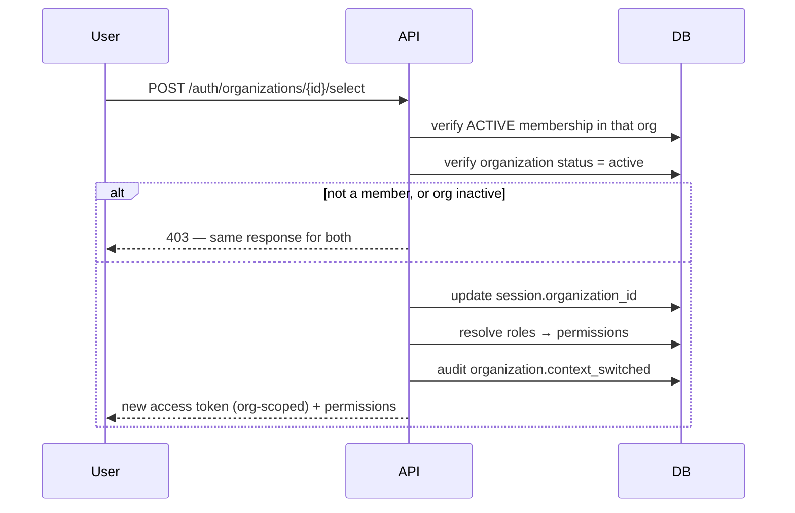
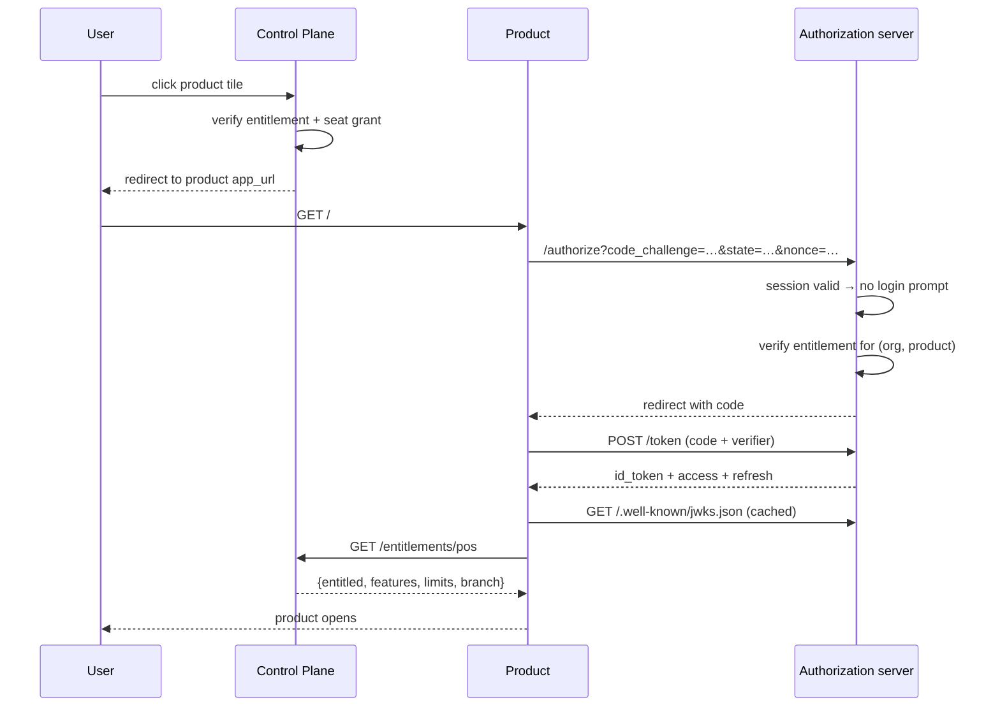

# 06 — Identity and SSO Architecture

Implements ADR-003 (in-house OIDC-conformant authorization server) and ADR-004 (token strategy). This document specifies every authentication flow, the token contract products rely on, and the places where a plausible-looking shortcut would create a vulnerability.

The goal from baseline §24, unchanged:

```text
One Login → Central Identity → Multiple Products
```

---

## 1. Role of the authorization server

The Control Plane is the **sole** identity authority for the ecosystem. Products hold no customer credentials (baseline §24).

It is deliberately **not** a general-purpose IdP. It serves first-party products the company deploys itself, which collapses the attack surface substantially:

| Supported | Not supported, by decision |
|---|---|
| Authorization code + PKCE | Implicit flow — tokens in URLs, logged and refererred |
| Refresh token rotation | Resource owner password grant — trains users to type credentials into products |
| Client credentials (product-to-Control-Plane) | Dynamic client registration — no untrusted clients exist |
| OIDC discovery + JWKS | Third-party consent screens — first-party only |

Each omission removes a class of vulnerability rather than merely unimplemented work. Implicit flow and the password grant are both formally discouraged by OAuth 2.1, and neither has a use case here.

---

## 2. Registration

Two distinct paths, because they have different trust properties.

### 2.1 Self-service — a prospect creates an organization

```mermaid
sequenceDiagram
    participant U as Visitor
    participant API
    participant DB
    participant Mail

    U->>API: POST /auth/register {email, password, name, org name}
    API->>API: validate; assess password strength
    API->>DB: BEGIN
    API->>DB: insert user (pending_verification)
    API->>DB: insert credentials (argon2id)
    API->>DB: insert organization (pending)
    API->>DB: insert membership (active, is_owner)
    API->>DB: assign Organization Owner role
    API->>DB: insert verification token (hashed)
    API->>DB: audit + outbox; COMMIT
    API-->>U: 202 — check your email
    Mail-->>U: verification link
    U->>API: GET /auth/verify?token=…
    API->>DB: consume token (single use), user→active, org→active
    API-->>U: redirect to login
```

One transaction creates user, credentials, organization, membership and owner role. A partial failure here is the worst onboarding outcome available — an organization with no owner, or a user who cannot log in and cannot re-register because their email is taken.

**The response is identical whether or not the email already exists.** Returning "email already registered" turns the endpoint into an account-existence oracle; instead the existing user receives a "someone tried to register with your address" notice, which informs the right person.

### 2.2 Invitation — joining an existing organization

```mermaid
sequenceDiagram
    participant I as Invitee
    participant API
    participant DB

    I->>API: GET /auth/invitations/{token}
    API->>DB: look up by hash; check pending + unexpired
    API-->>I: org name, inviter, products offered

    alt no existing account
        I->>API: POST /auth/invitations/{token}/accept {password, name}
        API->>DB: BEGIN; create user (active — invite proves the address)
    else already has an account
        I->>API: POST /auth/invitations/{token}/accept (authenticated)
        API->>DB: BEGIN
    end
    API->>DB: create membership (active)
    API->>DB: assign invitation_roles
    API->>DB: convert invitation_products → membership_products
    API->>DB: invitation → accepted
    API->>DB: audit + outbox; COMMIT
    API-->>I: session, org context set
```

Two details matter:

**An invited user is created `active`, skipping email verification.** Receiving the token at that address already proves control of it — the same proof verification provides. Requiring a second round would be ceremony without security.

**No limit check occurs at acceptance.** Seats were reserved when the invitation was issued (ERD §4.6). A user clicking a valid link and being told the organization is full is a bad experience manufactured by deferring the check.

---

## 3. Login

```mermaid
sequenceDiagram
    participant U as User
    participant API
    participant DB

    U->>API: POST /auth/login {email, password}
    API->>API: rate limit (IP + email)
    API->>DB: load user + credentials
    API->>API: argon2 verify — always, even if user absent
    alt invalid
        API->>DB: increment failures; audit (denied)
        API-->>U: 401 generic
    else valid
        API->>DB: reset failures; create session
        API->>DB: resolve memberships
        alt exactly one active membership
            API->>DB: set session org; mint org-scoped tokens
            API-->>U: tokens + org context
        else several or none
            API-->>U: tokens with NO org scope + org list
        end
    end
```

### 3.1 Non-obvious requirements

**Verify a hash even when the user does not exist.** Otherwise the endpoint returns faster for unknown addresses than for known ones, and that timing difference is a reliable account-enumeration oracle. A dummy argon2 verification against a fixed hash equalizes the path.

**One generic 401 for every failure.** Wrong password, unknown email, unverified, suspended, locked — all identical to the client. Internally they are distinguished in the audit log, where the information belongs.

**Lockout is per-account and per-IP, and lockout itself must not be a signal.** A locked account responds exactly as a wrong password does, so an attacker cannot confirm which accounts they have locked.

**Multi-organization users get a token with no organization scope.** This is the deliberate consequence of ADR-004: a token is scoped to one organization, so before selection there is nothing to scope it to. Such a token can call only `/me` and `/me/organizations` — it cannot touch tenant data, because there is no tenant in it yet.

---

## 4. Organization context and switching

Baseline §25 requires every request to resolve *who, what organization, what role, what branch*. The mechanism is that the organization is **inside the token** (ADR-004).



**Switching mints a new token; it never mutates an existing one.** A token's claims are signed and immutable — the only way to change scope is to issue a new one. This is what makes the scope trustworthy.

**"Not a member" and "organization inactive" return the same 403.** Distinguishing them reveals whether an organization exists, which is a cross-tenant information leak via the error channel.

The old access token remains technically valid until it expires (≤15 min), which is acceptable precisely because it is scoped to the *previous* organization and cannot reach the new one. Scoping is what makes the short window safe.

---

## 5. Token strategy

### 5.1 Access token

JWT, RS256, 10–15 minutes, verified by products against published JWKS with no network call to the Control Plane.

```json
{
  "iss": "https://id.company.com",
  "sub": "01932f8e-...",
  "aud": ["pos"],
  "exp": 1760000900,
  "iat": 1760000000,
  "jti": "01932f90-...",
  "sid": "01932f8f-...",
  "org": "01932a11-...",
  "mem": "01932a12-...",
  "branch": "01932a13-...",
  "all_branches": false,
  "scope": "openid profile",
  "perm_digest": "sha256:9f2c…",
  "amr": ["pwd"]
}
```

| Claim | Purpose |
|---|---|
| `sid` | Session family — lets a product correlate, and lets revocation be reasoned about |
| `org` | **The tenant boundary.** One organization per token |
| `mem` | Membership id — the subject of permission resolution |
| `branch`, `all_branches` | Branch context (baseline §25, ADR-014) |
| `perm_digest` | **Hash** of the resolved permission set, not the set itself |
| `amr` | Authentication methods — `pwd`, later `pwd,otp` |

**Why a permission digest rather than the permissions.** Embedding dozens of permission strings bloats every request header and, worse, makes them look authoritative to product developers — who would then enforce against a snapshot that a role edit has since invalidated. A digest keeps the token small and lets a product detect staleness and re-fetch, while making it obvious that the token is not the authority.

**The claims are never the final authority.** A product must still call the entitlement endpoint, because organization suspension and subscription expiry are live state that no signed snapshot can represent (ADR-004).

### 5.2 Refresh token

Opaque, high-entropy, stored only as a SHA-256 hash, single-use with rotation, per-family theft detection (ADR-017).

```mermaid
sequenceDiagram
    participant C as Client
    participant API
    participant DB

    C->>API: POST /auth/token (refresh)
    API->>DB: SELECT refresh_tokens WHERE token_hash = …
    alt not found
        API-->>C: 401
    else consumed_at IS NOT NULL
        API->>DB: revoke ENTIRE family (rotation_reuse)
        API->>DB: audit security event; alert
        API-->>C: 401
    else expired
        API-->>C: 401
    else valid
        API->>DB: BEGIN; consume; verify session + org still valid
        API->>DB: issue generation n+1; COMMIT
        API-->>C: new access + refresh token
    end
```

Rotation re-verifies that the user is active, the session unrevoked, the membership active and the organization active. This is the mechanism that makes suspension take effect within one token lifetime even for a client that holds a valid refresh token.

### 5.3 Key rotation

| Stage | Duration | Behavior |
|---|---|---|
| `active` | 90 days | Signs new tokens; published in JWKS |
| `retiring` | ≥ max token TTL | **Verifies only.** Still in JWKS |
| `retired` | — | Removed from JWKS |

The `retiring` stage is mandatory, not optional: a key removed the instant it stops signing would invalidate every token it already signed, breaking live sessions mid-request. Rotation cannot be atomic, so the overlap is the design.

Private keys are encrypted at rest with a KMS-held key; the application decrypts in memory and never logs them (S3, §1 of the data dictionary).

---

## 6. Product SSO

### 6.1 Launcher → product (session exists)



The user sees no login screen because the authorization server already holds a valid session — this is the whole of baseline §24's promise, and it needs no shared cookie domain or cross-product token passing.

**Entitlement is verified at `/authorize`, before a code is issued.** Issuing a token for a product the organization cannot use, and letting the product discover that afterwards, would scatter the access decision across every product. Checking at the authorization server keeps it central.

### 6.2 Direct product URL (no session)

Baseline §37's third flow, and the one most often got wrong:

```mermaid
sequenceDiagram
    participant U as User
    participant P as Product
    participant AS as Authorization server

    U->>P: GET pos.company.com/orders/42
    P->>P: no session; store return path in state
    P->>AS: /authorize (PKCE, state)
    AS->>AS: no session → login page
    U->>AS: credentials
    AS->>AS: resolve memberships
    alt several organizations
        AS->>U: choose organization
    end
    AS->>AS: verify entitlement
    AS-->>P: code, state returned
    P->>AS: exchange
    P-->>U: /orders/42 — original destination
```

The deep link survives in `state`, so the user lands where they intended rather than on a dashboard. `state` is also the CSRF defense for the callback and must be verified on return — an unverified `state` is a login-CSRF vulnerability.

### 6.3 What products must do

Non-negotiable; specified normatively in `12-product-integration-contract.md`:

1. Verify the JWT signature against cached JWKS. Never decode without verifying.
2. Validate `iss`, `aud`, `exp`, `nbf`, and `nonce` on an id_token.
3. Use `org` from the token as the tenant scope. **Never** accept an organization id from a request parameter.
4. Call `/entitlements/{product}` rather than trusting token claims for access.
5. Re-check entitlement periodically for long sessions, not only at login.
6. Handle 401 by refreshing, and 403 by sending the user to the Control Plane.

---

## 7. Logout

| Scope | Effect |
|---|---|
| Local | Product clears its own session; Control Plane session survives |
| Single logout | Control Plane session revoked, all refresh tokens consumed, registered products notified via back-channel logout |

Access tokens already issued remain cryptographically valid until expiry (≤15 min) — the standard trade-off of stateless verification. Where immediate termination matters (an employee dismissed, a credential compromised), the correct action is a **security revocation**: revoke the session *and* suspend the membership, so the next entitlement check fails regardless of token validity. This is why products are required to call the entitlement endpoint rather than rely on tokens.

---

## 8. Password reset

```mermaid
sequenceDiagram
    participant U as User
    participant API
    participant DB

    U->>API: POST /auth/password/forgot {email}
    API->>API: rate limit per email + IP
    API-->>U: 202 — always identical
    opt user exists and is active
        API->>DB: single-use hashed token, 30 min TTL
        API->>DB: invalidate prior unused tokens
        Note over API: email the link
    end
    U->>API: POST /auth/password/reset {token, new}
    API->>DB: find by hash; unexpired; used_at IS NULL
    API->>DB: BEGIN; argon2id hash; mark used
    API->>DB: revoke ALL sessions (password_changed)
    API->>DB: audit; COMMIT
```

**Always 202, regardless of whether the address exists.** Any difference in response, timing or wording is an account-existence oracle.

**A reset revokes every session.** A reset is often the response to a suspected compromise, and leaving the attacker's session alive would make it theatre.

**Prior unused tokens are invalidated.** Several live reset tokens widen the window for whichever one leaked.

---

## 9. MFA readiness

Not in the first release, but the schema (`mfa_factors`) and the flow accommodate it now (ADR-003 constraint 8), because retrofitting a step into a live login flow with sessions in flight is substantially harder than leaving a seam.

The seam: login returns either a token pair or an `mfa_required` challenge referencing a short-lived, single-purpose pending-MFA token that can do nothing except complete the challenge. The `amr` claim already carries the methods used, so a product or a policy can require step-up without a token-format change.

---

## 10. OIDC surface

| Endpoint | Purpose |
|---|---|
| `GET /.well-known/openid-configuration` | Discovery — the contract products integrate against |
| `GET /.well-known/jwks.json` | Public keys; cacheable |
| `GET /authorize` | Authorization code + PKCE |
| `POST /token` | Code exchange, refresh, client credentials |
| `GET /userinfo` | Standard claims |
| `POST /revoke` | Token revocation (RFC 7009) |
| `POST /introspect` | Introspection (RFC 7662), confidential clients only |
| `GET /end-session` | RP-initiated logout |

**Conformance is tested in CI** (ADR-003 constraint 6). This is what keeps the migration path to Keycloak or Ory real rather than aspirational: products depend on the specification, not on this implementation, so the implementation can be replaced.

---

## 11. Threats and mitigations

| Threat | Mitigation |
|---|---|
| Credential stuffing | Argon2id; per-account and per-IP rate limits; lockout indistinguishable from a wrong password |
| Account enumeration | Identical responses and equalized timing on login, registration and reset |
| Token theft | Short access TTL; rotation with per-token family detection (ADR-017) |
| Refresh replay | Any consumed token revokes the family and alerts |
| Authorization code interception | PKCE required; exact-match redirect URIs; single-use codes |
| Open redirect | Exact-match redirect allowlist — no wildcards, no prefixes |
| CSRF on callback | `state` required and verified |
| Session fixation | A new session id is issued on authentication |
| Privilege escalation via org switch | Active membership re-verified on every switch; new token minted |
| **Stale authorization after suspension** | Entitlement checked server-side per request; refresh re-validates (ADR-004) |
| Cross-tenant access via token | One `org` per token — structurally cannot address another tenant |
| Timing attacks on comparison | `crypto.timingSafeEqual` for all token comparisons |

---

## 12. What identity does not decide

The boundary that keeps this module replaceable (ADR-003 constraint 7). Identity establishes **who** and **which organization**. It does not decide:

- whether the organization may use a product → entitlements module
- whether the user may perform an action → RBAC module
- whether a limit permits an operation → limits service

Identity answers one question. The others are answered by services that own the data behind them — which is the division that let ADR-003 choose an in-house server without taking on the authorization problem as well.

---

Next: `07-rbac-and-authorization.md`.
