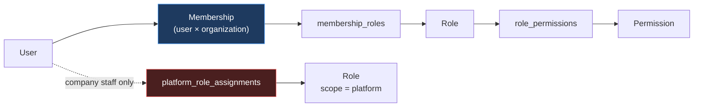
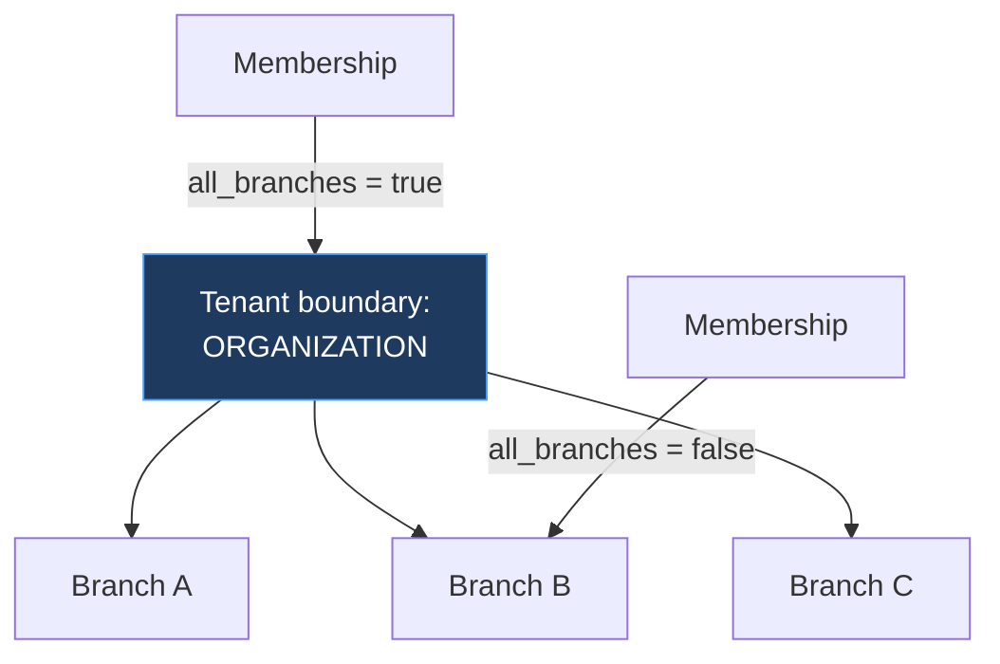
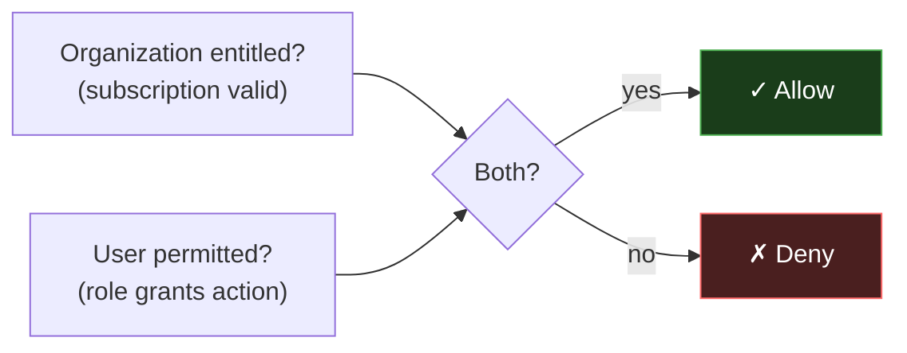

# 07 — RBAC and Authorization

Resolves audit ambiguity A1 (branch permissions, which the baseline deferred) and implements baseline §22, §23, §25 and §26. Authorization is enforced **server-side only**; the frontend hides what a user cannot do for usability, never for security (master prompt §13).

---

## 1. The chain

Baseline §22:

```text
User → Membership → Role → Permission
```

Membership is the pivot, and that is the whole reason multi-organization users work. A user has no permissions of their own — permissions attach to the *membership*, so the same human is an Admin in Organization A and a Viewer in Organization B with no conflict and no special-casing (baseline §8).



The red path is the cross-tenant privilege (ADR-005). It is a separate table precisely so that a platform grant can never be created as a side effect of editing an ordinary membership.

---

## 2. Permission scopes

| Scope | Answers | Context required |
|---|---|---|
| `platform` | May this staff member administer the platform? | Platform assignment |
| `organization` | May this member act on their own organization? | Active membership |
| `product` | May this member perform this product action? | Membership + entitlement + seat |

### 2.1 Naming

```text
<domain>.<resource>.<action>
```

| Example | Scope |
|---|---|
| `platform.organizations.suspend` | platform |
| `platform.plans.create` | platform |
| `organization.members.invite` | organization |
| `organization.branches.create` | organization |
| `pos.orders.void` | product |
| `inventory.stock.update` | product |

**Product permissions are registered by products, not hardcoded.** A new product declares its permissions at registration (baseline §14) and they become rows. Nothing in the Control Plane enumerates product actions, which is what lets a product define `pos.orders.void` without a Control Plane release.

### 2.2 Grants only — no deny rules

`role_permissions` holds grants. There are no deny rows, and the effective permission set is the **union** across a membership's roles.

Deny rules require precedence resolution, and a permission model whose outcome depends on rule ordering is one that nobody can reason about confidently — least of all during an incident, when someone needs to answer "why could this user do that?" in minutes. Union-of-grants has exactly one answer, computable by hand.

Where a restriction is genuinely needed, it is expressed by *not granting* — which means roles must be designed as coherent sets rather than as additive fragments.

---

## 3. System roles

### 3.1 Platform (company staff)

Per baseline §22. All are `is_system`, immutable.

| Role | Shape of access |
|---|---|
| `super_admin` | Everything, including granting platform roles. The only role that can create another super admin |
| `platform_admin` | Products, features, plans. **Not** platform role granting |
| `account_manager` | Read and commercial actions on **assigned** organizations only |
| `success_manager` | Read, usage and health on **assigned** organizations |
| `support_agent` | Read on assigned organizations; no commercial or destructive actions |
| `billing_admin` | Subscriptions, billing metadata, overrides across organizations |
| `operations_admin` | System health, product integration status, audit read |

**Platform roles are not uniformly cross-tenant.** `account_manager`, `success_manager` and `support_agent` are scoped to organizations they are *assigned* to via `customer_account_assignments`. This matters: a support team of fifty should not each hold read access to every customer, and assignment-scoping is what makes least privilege achievable without inventing a role per account.

Only `super_admin`, `platform_admin`, `billing_admin` and `operations_admin` are genuinely cross-tenant, and each of their cross-tenant reads is audited.

### 3.2 Organization

Templates with `organization_id IS NULL`, available to every organization (ERD §5.2).

| Role | Shape |
|---|---|
| `org_owner` | Full control of the organization, including billing and ownership transfer |
| `org_admin` | Members, roles, branches, product seats — within subscription limits |
| `product_admin` | Administers specific products for the organization |
| `manager` | Operational; product-dependent |
| `staff` | Day-to-day use |
| `viewer` | Read-only |

Organizations may define custom roles (`organization_id` set), composed only from permissions they are allowed to delegate (§6).

---

## 4. Resolution

```mermaid
sequenceDiagram
    participant R as Request
    participant MW as Middleware
    participant AZ as Authorization service
    participant DB

    R->>MW: access token
    MW->>MW: verify signature, expiry
    MW->>DB: membership by `mem` claim
    MW->>MW: membership active? org active?
    MW->>AZ: resolve(membership_id)
    AZ->>DB: roles → permissions (union)
    AZ-->>MW: Set<permission_key>
    MW->>MW: route's required permission present?
    MW->>MW: compare perm_digest; stale → re-resolve
    MW-->>R: allow, or 403
```

### 4.1 Resolution is from the database, not the token

The token carries only a **digest** (ADR-004). Permissions are resolved server-side per request.

The reason is that a role edit must take effect immediately. If the token carried the permission list, a user demoted from Admin to Viewer would retain Admin rights for up to the token's lifetime — and the one thing an administrator expects from revoking access is that it has happened.

Resolution is a single indexed query joining `membership_roles → role_permissions → permissions`, cached in-request. It is the hottest query in the system and is why `entitlements` is explicitly excluded from service extraction (HLD §9).

### 4.2 Default deny

```ts
function authorize(ctx: RequestContext, required: PermissionKey): void {
  if (!ctx.membership) throw new Forbidden()
  if (ctx.membership.status !== 'active') throw new Forbidden()
  if (ctx.organization.status !== 'active') throw new Forbidden()
  if (!ctx.permissions.has(required)) throw new Forbidden()
}
```

Every check is an assertion that throws. There is no `return true/false` variant, because a boolean invites being ignored — an unchecked return value is a silently unauthorized request, while an unhandled throw is a failed one.

A route with no declared permission **fails at server startup** (HLD §5). The dangerous failure mode of declarative security is the forgotten annotation, so forgetting must break the build rather than open a hole.

---

## 5. Branch-level authorization

**Resolves audit A1**, which baseline §10 explicitly deferred. Per ADR-014, the branch is a dimension inside the organization, not a tenant boundary.



Order of application, which must not be reversed:

1. **Organization scoping first** — always, unconditionally (ADR-012).
2. **Then** branch filtering, from the membership's allowed set.

Branch filtering is a *refinement within* a tenant, never a substitute for tenant scoping. Reversing the order would make a branch id sufficient to address data, and a branch id is guessable.

**Why branch is not a tenant boundary.** Making it one would double the isolation surface: every query would carry two scopes, and the second would be forgotten in exactly the places that matter. One tenant boundary, enforced structurally, is a rule that holds; two is a rule that erodes.

Products receive branch context in the token and apply it to their own domain data (baseline §25) — the Control Plane cannot do it for them, since it does not know their schemas.

---

## 6. Privilege escalation prevention

The rules that stop authorization from being self-amplifying. Each exists because its absence is a known escalation path.

| Rule | Attack it prevents |
|---|---|
| **No self-grant.** A user cannot assign a role to their own membership | Admin quietly promotes themselves to Owner |
| **No grant above your own set.** A granter may only assign permissions they hold | Admin creates a custom role with permissions they lack, assigns it to themselves |
| **Platform roles need `platform.roles.grant`**, held only by `super_admin` | Any staff member escalating to cross-tenant access |
| **Custom roles are capped** by what the organization may delegate | Organization grants itself a platform permission by naming it |
| **The last owner cannot be removed or demoted** | Organization becomes unadministrable and needs company recovery |
| **`is_system` roles are immutable** | Someone edits `viewer` to include write permissions, affecting every organization at once |
| **Every grant is audited** with actor and target | Escalation without a trace |

The second rule deserves emphasis because it is the subtle one: without it, the ability to *create roles* silently becomes the ability to hold *any* permission. The check is that the granter's effective permission set must be a superset of the role's.

---

## 7. Tenant isolation in authorization

Three layers, per ADR-012. Each independently sufficient to block a leak, which is the point — no single mistake breaches isolation.

**Layer 1 — the token carries one organization.** There is nowhere in a request for a second tenant to come from.

**Layer 2 — repository signatures require the scope.**

```ts
type OrgScope = { readonly organizationId: OrganizationId; readonly __brand: 'OrgScope' }

interface BranchRepository {
  findById(scope: OrgScope, id: BranchId): Promise<Branch | null>
}
```

A scope-less query does not compile. The brand means a bare string cannot be substituted, and `OrgScope` is constructible only by the middleware that derived it from a verified token. "Remember to scope your query" becomes a type error.

**Layer 3 — cross-tenant access is one named, audited path.** Company staff legitimately need cross-organization reads, so the capability exists — in explicitly-named methods (`listAcrossTenants`), each requiring a platform permission and writing an audit record. One visible dangerous door is far safer than a general-purpose escape hatch that is convenient to reach for.

Row-level security is a fourth layer (ERD §14), covering a query that omits its filter — but not a connection that sets the wrong tenant. Only correct context resolution covers that, which is why Layer 1 is first.

---

## 8. Authorization vs entitlement

Per ADR-015 and baseline §23, two independent gates, **both required**:



Under ADR-018 a product action now requires three things: the organization's **entitlement**, the user's **seat** on that product, and the user's **permission** for the action.

| Gate | Question | Owner |
|---|---|---|
| Entitlement | Has the organization bought this product? | entitlements module |
| Seat | Has this user been granted access to it? | `membership_products` |
| Permission | May this user take this action? | RBAC |

Collapsing any pair would be a defect. If permission implied seat, granting a reporting role would hand out paid capacity. If seat implied permission, a Viewer could act as an Admin. If entitlement implied either, the platform would give away what it sells.

Tests must assert each gate blocks **independently** — in particular the case most often missed: a fully permitted user with a seat whose organization's subscription has lapsed must be denied (`20-testing-strategy.md`).

---

## 9. Denial responses

What a denial says matters, because an error message is an information channel.

| Situation | Status | Body | Why |
|---|---|---|---|
| No/invalid token | 401 | `unauthenticated` | |
| Permission missing | 403 | `forbidden`, with the required permission key | The user can ask their admin for something specific |
| Organization suspended | 403 | `organization_suspended` + support contact | Actionable; the generic reason only |
| Not entitled | 403 | `product_not_entitled` + upgrade path | Baseline §39 — a denial is the entry to the upgrade flow |
| No seat | 403 | `product_seat_required` | The admin can grant one or buy capacity |
| Limit reached | 409 | `limit_reached` + limit, usage, upgrade options | Not 403: the user is permitted, the plan is the constraint |
| Resource in another tenant | **404** | `not_found` | **Never 403** |

The last row is the important one. Returning 403 for a resource in another organization confirms it exists, which is a cross-tenant leak through the status code. The resource must be indistinguishable from one that does not exist — and because repositories are org-scoped (§7, Layer 2), it genuinely is not found, so 404 is also the honest answer.

A limit being 409 rather than 403 is a deliberate distinction: 403 means "you may not", 409 means "the current state prevents it". Conflating them would send users to their administrator when they should be sent to the upgrade page.

---

## 10. What the frontend may and may not do

| Permitted | Forbidden |
|---|---|
| Hide actions the user lacks permission for | Treating that as a control |
| Disable a button at a limit | Computing whether the limit permits the action |
| Show seat counts from the API | Deriving entitlement client-side |
| Route by role for navigation | Trusting role claims for data access |

Every mutation is authorized server-side on arrival, whether or not the UI offered it. A hidden button is a usability feature; the server is the control (master prompt §13).

---

Next: `08-product-entitlements.md`.
