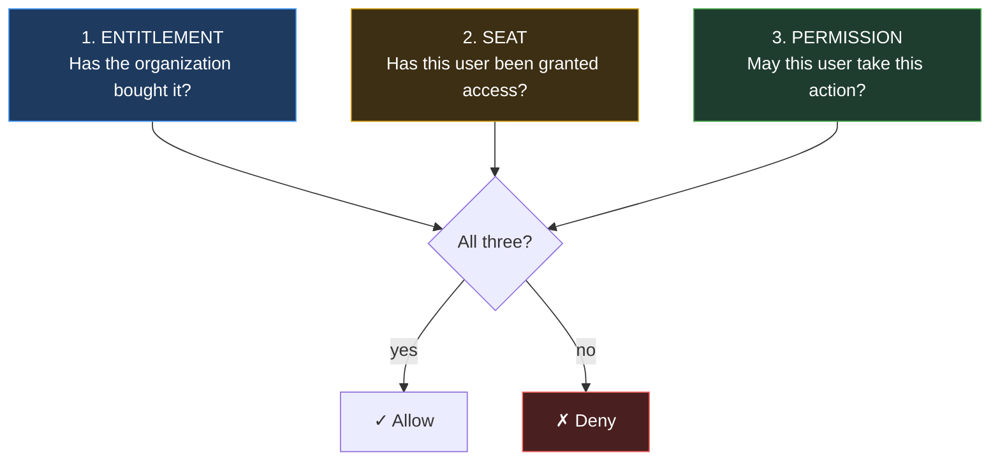
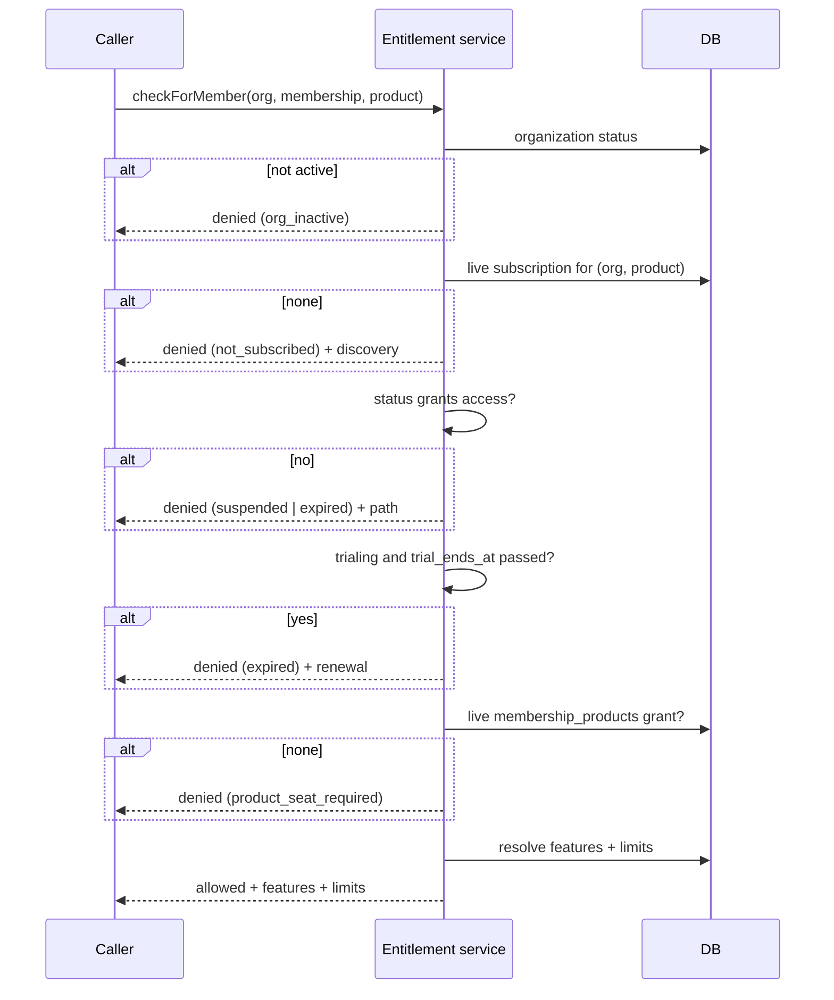
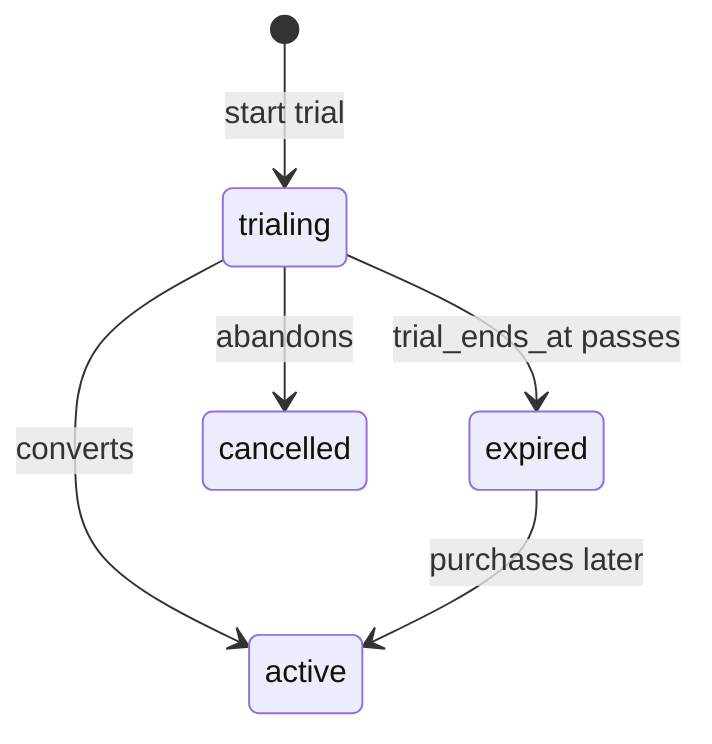
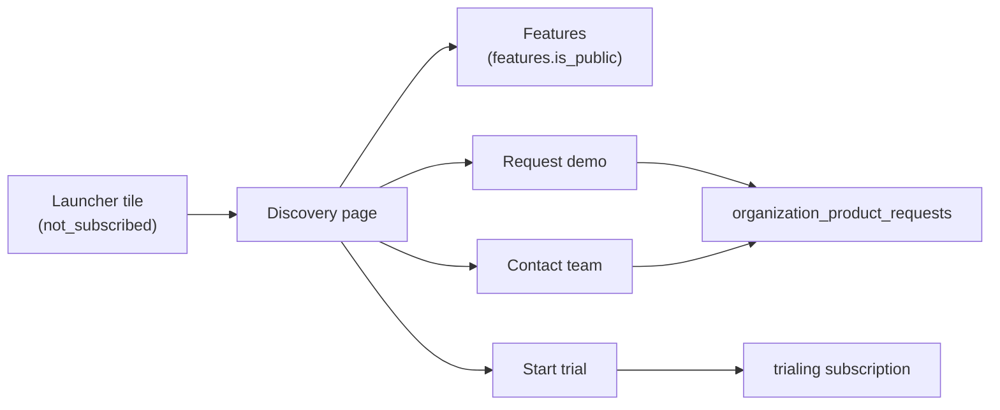

# 08 — Product Entitlements

Answers one question precisely, and makes it the only place that question is answered:

> **Can this organization use this product?**

Per ADR-015 and baseline §23, entitlement is kept strictly separate from user permission. This document specifies the states, the decision algorithm, where it is enforced, and the ways in which a careless implementation would silently give away what the company sells.

---

## 1. The three questions, deliberately separate

Under ADR-018, using a product requires three independent facts:



| | Owns | Scope | Changes when |
|---|---|---|---|
| Entitlement | `subscriptions` | organization × product | Company sells, suspends, or a period lapses |
| Seat | `membership_products` | user × product | Org admin grants or revokes |
| Permission | RBAC | membership | Roles are edited |

They change on different schedules, driven by different actors, which is exactly why they must not be collapsed into one flag. A cached "canUseProduct" boolean would be invalidated by three unrelated events and would be wrong between any of them and the next cache refresh.

**Each collapse is a specific commercial or security failure:**

| Collapse | Consequence |
|---|---|
| Permission implies seat | Granting a read-only reporting role hands out paid capacity |
| Seat implies permission | A Viewer acts as an Admin |
| Entitlement implies seat | Every member consumes a seat on every subscribed product; seat limits become meaningless |
| Seat implies entitlement | A stale grant outlives the subscription — the product is used for free |

---

## 2. Access states

Per baseline §13, computed by `v_organization_products` (ERD §8).

| State | Access | Meaning | Launcher behavior |
|---|---|---|---|
| `active` | **yes** | Paid and current | Open the product |
| `trialing` | **yes** | Trial running (ADR-007) | Open, with days remaining shown |
| `past_due` → reported as `active` | **yes** | Payment failed, in grace | Open, with a payment warning |
| `suspended` | no | Company disabled it | Explain, give support contact |
| `expired` | no | Period or trial ended | Show renewal path |
| `not_subscribed` | no | Never purchased | **Discovery page** (baseline §14) |
| `org_inactive` | no | The organization itself is suspended | Explain, support contact |

### 2.1 Why `past_due` grants access

A failed card charge is usually an expired card, not a refusal to pay. Cutting off a paying customer's operations — their point of sale, mid-service — over a payment-provider retry would cause far more damage than the few days of grace risk. Access continues, the warning is loud and separate (`payment_attention_required`, ERD §8), and the grace period is bounded, after which the status moves to `suspended`.

### 2.2 Why a lapsed trial is `expired`, not `not_subscribed`

Found as review defect R-6. A just-expired trial is the highest-intent conversion moment in the funnel (baseline §39). Reporting it as "never subscribed" erases that signal and shows the user a cold marketing page instead of a renewal path — the most expensive possible wrong answer in the launcher.

### 2.3 `org_inactive` dominates everything

Organization status is evaluated **first** in the view's `CASE`. A suspended organization loses access to every product regardless of how many valid subscriptions it holds. This is baseline §13's company-level kill switch, and its position in the ordering is what makes it absolute.

---

## 3. The decision

One service, one implementation. Duplicating this logic anywhere is an architecture violation, because two implementations diverge and the more permissive one becomes the bypass.

```ts
type EntitlementDecision =
  | { allowed: true;  state: 'active' | 'trialing'; subscriptionId: SubscriptionId
      features: ResolvedFeatures; limits: ResolvedLimits; expiresAt: Date | null }
  | { allowed: false; state: DeniedState; reason: DenialReason; upgradePath?: UpgradeOption[] }

interface EntitlementService {
  /** Organization-level: has this org bought the product? */
  check(scope: OrgScope, productId: ProductId): Promise<EntitlementDecision>

  /** Full gate: entitlement + seat. Permission is RBAC's, checked separately. */
  checkForMember(
    scope: OrgScope, membershipId: MembershipId, productId: ProductId,
  ): Promise<EntitlementDecision>

  /** Every product with its state — the launcher's only source. */
  listForOrganization(scope: OrgScope, membershipId: MembershipId): Promise<ProductAccess[]>
}
```



### 3.1 Expiry is evaluated, never awaited

`trial_ends_at` and `current_period_end` are compared against the current time **at decision time**. The status field is updated by a scheduled job, but the decision never waits for that job to run.

This matters because the alternative is a window — between the moment a trial actually ends and the moment the sweeper notices — during which the product is used for free. An entitlement that depends on a background job having run is an entitlement that is wrong for a while, and "a while" is however long the job queue is backed up.

### 3.2 Features and limits come back with the decision

A caller that is allowed needs to know *what* it is allowed, and asking separately invites a second round trip in which the answers could disagree. Returning them together makes the decision atomic from the caller's perspective:

```json
{
  "allowed": true,
  "state": "active",
  "features": { "pos.split_bill": true, "pos.offline_mode": false },
  "limits": {
    "users":  { "limit": 2,    "used": 2,    "remaining": 0 },
    "orders_per_month": { "limit": 50000, "used": 12430, "enforcedBy": "product" }
  },
  "expiresAt": "2026-11-01T00:00:00Z"
}
```

`enforcedBy` tells the product which limits it must enforce itself (ADR-010 amendment). The Control Plane enforces only `users` and `branches` — its own resources — and passes everything else through as data it does not interpret.

---

## 4. Enforcement points

Entitlement is checked at every boundary where access could be obtained, not only the obvious one. Each row exists because omitting it leaves a usable path.

| Point | When | Omitting it allows |
|---|---|---|
| **Launcher** | Rendering product tiles | Nothing exploitable — but a wrong state misleads |
| **Product open** | Click-through, before redirect | A tile click reaching an unentitled product |
| **`/authorize`** | Before issuing a code (identity §6.1) | A token minted for a product the org cannot use |
| **Product API** | Every product request to the Control Plane | A product relying on a stale login-time check indefinitely |
| **Token refresh** | Each rotation | Access surviving suspension for as long as the client keeps refreshing |
| **Seat grant** | Granting product access to a member | Seats sold on a lapsed subscription |
| **Limit check** | Consuming a limited resource | — |

**The refresh-time check is the one most often forgotten.** Without it, a client that holds a valid refresh token renews access indefinitely after its organization has been suspended, because nothing in the rotation path consults subscription state. The suspension would appear to work — new logins fail — while every existing session continues.

---

## 5. Trial handling

A trial is a subscription in `trialing` status (ADR-007). One lifecycle, one enforcement path.



The single-path property is the reason for ADR-007. A separate trial entity would need its own entitlement check, its own limit enforcement and its own expiry — and duplicated enforcement diverges, with the weaker copy becoming the way in.

Trials carry the same limits as the plan they trial, so conversion changes nothing about how the product behaves — which is the honest trial. Giving trials unlimited capacity and then imposing limits on conversion teaches customers that purchase is a downgrade.

Trial-to-paid is a status transition on the same row, preserving seat grants, usage history and audit continuity.

---

## 6. Suspension

Two independent levers (baseline §20), both company-controlled:

| Lever | Effect | Use |
|---|---|---|
| `organizations.status = 'suspended'` | **All** products denied | Non-payment at the account level, abuse, legal hold |
| `subscriptions.status = 'suspended'` | That one product denied | Product-specific dispute or misuse |

Suspension is reversible and preserves everything — memberships, seat grants, usage, data. Reinstatement restores access without reconstruction, because suspension changed a status and nothing else. This is deliberate: a suspension that destroys state is not a lever, it is a deletion with extra steps.

**Suspension takes effect on the next request.** Because entitlement is checked server-side per request (§4) rather than trusted from a token, there is no window in which a held token outlives the suspension.

---

## 7. Non-subscribed products remain visible

Baseline §14 and §38 require that a product the organization has not bought is **discoverable**, not hidden and not a dead button.



Content comes from `product_discovery_sections` and public `features` (ERD §6.3), so marketing changes copy without a deployment.

Requests land in `organization_product_requests` with a `source` field — and `source = 'limit_reached'` is the high-intent signal that closes baseline §39's loop. Distinguishing it from idle browsing is the difference between a lead list and a sales queue.

Products with `visibility = 'private'` appear only to organizations already holding a subscription; `hidden` products appear to nobody outside the company. Both are honored in the view (review fix R-6) — without that filter, pre-launch products would have appeared in every customer's launcher.

---

## 8. Caching

**Entitlement decisions are not cached across requests.** The temptation is real — it is the hottest read in the system — and it is wrong here.

The reason is that every input changes through an action whose entire purpose is to take effect immediately: suspension, expiry, seat revocation. A cache with a TTL of *n* seconds is a window of *n* seconds in which a suspended organization keeps working, and that window is precisely the thing the company uses suspension to close.

What is done instead:

| Technique | Why it is safe |
|---|---|
| Resolve once per request, pass in context | Scope is a single request; cannot outlive the decision |
| Indexed queries on `(organization_id, product_id)` | The lookup is a single index hit |
| The `v_organization_products` view | Derivation lives in one place |
| Products cache **JWKS**, never entitlement | Keys rotate on a schedule; entitlement does not |

If measurement later shows this is a bottleneck, the answer is a short-TTL cache with **explicit invalidation on every subscription and seat mutation** — not a bare TTL. That is more machinery than it looks, which is why it is not built before there is evidence it is needed (master prompt §38).

---

## 9. Adding a product changes nothing here

The test of ADR-013. A new product becomes entitled through data alone:

1. `products` row.
2. `features` rows, each declaring `enforced_by` and, if Control-Plane-enforced, `countable_resource` and `countable_scope`.
3. `plans` and `plan_features`.
4. `oidc_clients` registration.

No change to this document's logic, the entitlement service, the launcher, or the schema. The service never names a product; it joins on `product_id`.

---

## 10. Failure modes and required tests

Each row is a defect that produces no error — the system continues, giving a wrong answer. `20-testing-strategy.md` makes each a required test.

| Failure | Consequence | Test |
|---|---|---|
| Entitlement not re-checked on refresh | Suspension ineffective for active clients | Suspend, then refresh; assert denial |
| Expiry awaited rather than evaluated | Free usage until the sweeper runs | Set `trial_ends_at` in the past without running the job; assert denial |
| Seat and permission conflated | Paid capacity given away, or privilege escalation | Assert each blocks independently |
| Organization status not checked first | Suspended org still reaches products | Suspend org with a valid subscription; assert all products denied |
| Cross-tenant entitlement read | Tenant leak | Assert Org A's token cannot read Org B's entitlement |
| Decision cached | Suspension delayed by the TTL | Assert immediate effect |
| `visibility` ignored | Hidden products leak to customers | Assert a `hidden` product is absent from the launcher |
| Lapsed trial reported `not_subscribed` | Conversion moment lost | Assert state is `expired` |

---

Next: `09-plans-and-subscriptions.md`.
