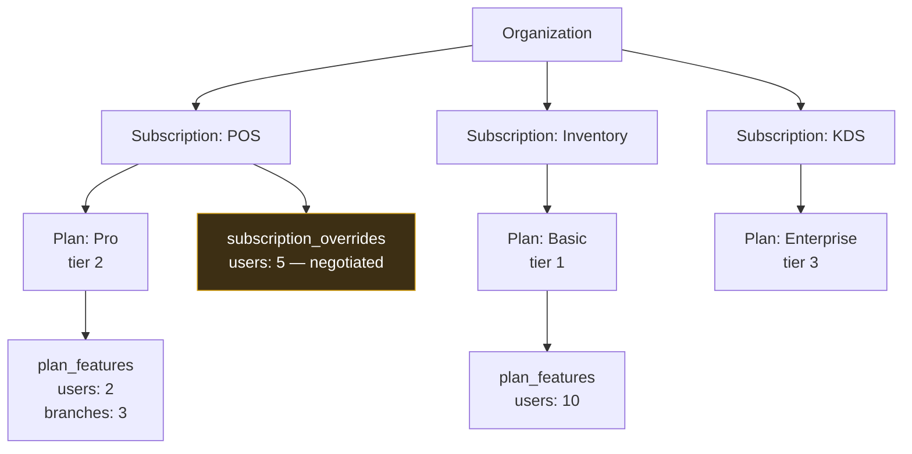
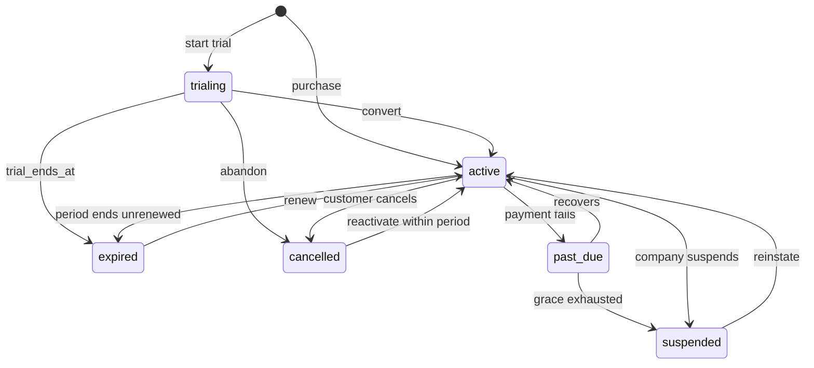

# 09 — Plans, Subscriptions and Limits

Implements baseline §15–19 and §39, and the confirmed seat model (ADR-018, baseline v1.2). This is the document where the platform's commercial rules become mechanical, and the one where a plausible implementation is most likely to be exploitably wrong — so the concurrency and resolution rules here are specified to the level of the SQL.

---

## 1. Shape of the model

Baseline §16 forbids `Organization → One Plan`. The model is per-product:



One organization, several independent subscriptions, each with its own plan, its own limits, and optionally its own negotiated overrides. A future bundle is additive — a bundle becomes a thing that *creates* several subscriptions, not a replacement for them (baseline §16).

---

## 2. Limit resolution

**No numeric limit appears anywhere in source code** (ADR-010). Resolution is always a query, and it is implemented exactly once:

```text
1. Active, unexpired, un-superseded override for (subscription, feature)
2. else plan_features row for (subscription.plan, feature)
3. else the feature is NOT INCLUDED → deny
```

Step 3 is the one that must not be weakened. A missing `plan_features` row means *not included*, never *unlimited* — so a plan that forgot to list a feature restricts rather than silently granting it without bound.

```ts
interface ResolvedLimit {
  featureKey: string
  limit: bigint | null        // null = unlimited, explicitly
  source: 'override' | 'plan'
  enforcedBy: 'control_plane' | 'product'
  scope: 'product' | 'organization' | null
}
```

### 2.1 NULL means unlimited

Explicitly, never a sentinel. `-1` or `999999` eventually meets code that compares it with `>=` without knowing it is magic — producing either a limit that cannot be exceeded or one that cannot be enforced. NULL forces every comparison to be written deliberately, because `used >= null` does not accidentally work.

In `subscription_overrides`, NULL `limit_value` already means "no numeric override", so unlimited needs its own flag — `is_unlimited`. Two meanings cannot share one NULL (ERD §7.5).

### 2.2 Which resource is counted where

From ERD §4.6.1, carried in `features.countable_scope` rather than inferred:

| Resource | Scope | Effective limit | Lock target |
|---|---|---|---|
| `users` (seats) | product | That product's subscription — override, else plan | That subscription row |
| `branches` | organization | **MAX** across access-granting subscriptions; unlimited wins | The organization row |

**MAX, not MIN, for organization-scoped resources.** An organization on POS Pro (3 branches) that adds Inventory Basic (1 branch) keeps 3. Taking the minimum would mean buying an additional product silently *reduced* what the customer could already do — a result no customer would accept as correct, and a support escalation waiting to happen.

Different lock targets give a useful property: invitations to different products never block each other, because they serialize on different rows.

---

## 3. Seat enforcement — the race-safe path

**This is the single most security-critical write path in the platform** (ADR-011). Baseline §18 requires that limits cannot be bypassed via the UI *or the API*, and concurrency is an API-reachable bypass.

### 3.1 The naive version is broken

```text
Request A: count seats → 1 of 2 → ok
Request B: count seats → 1 of 2 → ok      (concurrent)
Request A: insert grant → 2
Request B: insert grant → 3               ← over a 2-seat plan
```

Both requests behaved correctly in isolation. Nothing errors. The organization simply holds three seats on a two-seat plan, and no log records a violation. A single-threaded test passes against this code, which is why the test requirement in §3.3 is specific.

### 3.2 The correct version

```ts
async function grantProductSeat(
  scope: OrgScope, membershipId: MembershipId, productId: ProductId, actor: UserId,
): Promise<MembershipProduct> {
  return db.transaction(async (tx) => {
    // 1. Lock the subscription. Serializes every concurrent grant for this product.
    const sub = await tx
      .selectFrom('subscriptions')
      .selectAll()
      .where('organization_id', '=', scope.organizationId)
      .where('product_id', '=', productId)
      .where('status', 'in', ['trialing', 'active', 'past_due'])
      .forUpdate()
      .executeTakeFirst()

    if (!sub) throw new NotEntitled(productId)

    // 2. Resolve the limit — override, else plan (§2).
    const limit = await limits.resolve(tx, sub, 'users')
    if (!limit.included) throw new FeatureNotIncluded('users')

    // 3. Count seats live: grants + reserved invitations (ERD §4.6).
    const used = await limits.countSeats(tx, scope, productId)

    // 4. Compare while still holding the lock.
    if (limit.value !== null && used >= limit.value) {
      throw new LimitReached('users', limit.value, used,
        await upgrades.optionsFor(tx, sub))
    }

    // 5. Insert, audit, emit — same transaction.
    const grant = await tx.insertInto('membership_products').values({ ... }).returningAll()
      .executeTakeFirstOrThrow()
    await audit.record(tx, { actor, action: 'product_seat.granted', ... })
    await outbox.enqueue(tx, { type: 'ProductSeatGranted', ... })
    return grant
  })
}
```

Four properties, each load-bearing:

1. **`FOR UPDATE` before counting.** The lock is taken first, so a concurrent request blocks until this transaction commits and then sees the new count. This is what closes the race.
2. **The count is live, not cached.** A cached seat count can drift, and a drifted count is either a blocked legitimate grant or a bypassed limit.
3. **Compare inside the lock.** Releasing before comparing re-opens the window entirely.
4. **Insert, audit and event in the same transaction.** A grant cannot occur unaudited, and no event can announce a grant that rolled back.

### 3.3 The test that matters

```ts
test('concurrent seat grants cannot exceed the plan limit', async () => {
  // POS Pro with 2 seats, 1 occupied.
  const results = await Promise.allSettled(
    [userB, userC].map((u) => grantProductSeat(scope, u, posId, admin)),
  )
  const granted = results.filter((r) => r.status === 'fulfilled')
  expect(granted).toHaveLength(1)                       // exactly one wins
  expect(await countSeats(scope, posId)).toBe(2)        // never 3
})
```

A sequential test passes against the broken implementation and is therefore not evidence. The concurrency test is the only one that distinguishes correct from exploitable, so it is mandatory rather than thorough.

### 3.4 Where else the pattern applies

| Operation | Lock | Counts |
|---|---|---|
| Grant product seat | that subscription | grants + pending invitation reservations |
| Invite a member with products | each named product's subscription, **in product-id order** | same |
| Create a branch | the organization row | all branches, including `inactive` |
| Accept an invitation | — | none; seats were reserved at invitation |

**Invitations granting several products lock several subscriptions, always in a deterministic order.** Locking in arrival order would deadlock: two invitations naming POS and Inventory in opposite orders would each hold what the other needs. Ordering by product id makes deadlock structurally impossible.

**`inactive` branches still count.** The resource exists and is recoverable, so freeing capacity requires deletion — otherwise deactivating a branch would be a free way around the limit.

---

## 4. Lifecycle



Transitions are validated by a state machine. A status is never assigned from input — the transition is *requested* and the machine decides legality (data dictionary §10, rule 7). This prevents, for example, a `suspended` subscription being moved straight to `active` by a request that skips the reinstatement path and its audit.

Every transition writes a `subscription_events` row with actor, from/to status, and plan change.

### 4.1 Which statuses grant access

`trialing`, `active`, `past_due` — and this list exists in **exactly one place** in the code, the entitlement service (`08-product-entitlements.md` §3). Duplicating it guarantees that one copy eventually gains or loses a status and becomes the bypass.

---

## 5. Upgrade, downgrade, cancellation

### 5.1 Upgrade

```mermaid
sequenceDiagram
    participant A as Org Admin
    participant API
    participant DB

    A->>API: POST /subscriptions/{id}/change-plan {planId}
    API->>API: permission: organization.subscriptions.manage
    API->>DB: BEGIN; lock subscription
    API->>DB: validate plan belongs to SAME product
    API->>DB: target.tier > current.tier → upgrade
    API->>DB: update plan_id; subscription_events(upgraded)
    API->>DB: audit + outbox(SubscriptionUpgraded); COMMIT
    API-->>A: new limits now effective
```

**The plan must belong to the same product** — guarded structurally by the composite foreign key from review finding R-5. Without it, a subscription could be moved to another product's plan and would then resolve that product's limits entirely.

Upgrades take effect immediately: the customer has paid for more, and withholding it until a period boundary is indefensible. New capacity is available on the next request because limits are resolved per request, not cached.

### 5.2 Downgrade and over-provisioning

A downgrade below current usage is permitted and produces a visible, bounded state (ERD §4.7.2):

| Rule | Reason |
|---|---|
| Seats are **never** auto-revoked | A system removing a named person's access with no human decision destroys trust faster than an overage report |
| New grants blocked until usage ≤ limit | The limit still binds, going forward |
| Existing holders keep working | A paying customer is not cut off by arithmetic |
| Overage shown to the org admin, with the choice | They decide who loses access, or they upgrade |
| Overage surfaced in the company console | It is a renewal conversation for the account manager |

Enforcement therefore compares against the limit **only when granting**, never by sweeping existing grants.

### 5.3 Cancellation

`cancel_at_period_end = true` keeps access until `current_period_end`, then `expired`. Immediate cancellation is a separate, company-side action. A customer cancelling has paid through the period, so revoking at the click would be taking money for nothing.

---

## 6. Scheduled transitions

Run by the single-leader dispatcher (HLD §2), which holds a Postgres advisory lock — three instances independently expiring subscriptions would send three notification emails.

| Job | Cadence | Action |
|---|---|---|
| Trial expiry | 15 min | `trialing` past `trial_ends_at` → `expired`; emit |
| Trial ending soon | daily | Notify at 7, 3, 1 days — the conversion window |
| Period expiry | hourly | `active` past `current_period_end` without renewal → `expired` |
| Grace exhaustion | hourly | `past_due` beyond grace → `suspended` |
| Override expiry | hourly | Expired overrides stop applying; notify the account manager |
| Overage report | daily | Subscriptions where `seats_used > limit` |

**Every job is idempotent and advisory.** Entitlement already evaluates expiry against the clock (`08` §3.1), so these jobs produce accurate *reporting and notification* — they are not what enforces expiry. A job that were load-bearing for enforcement would mean a backed-up queue equals free product usage.

---

## 7. Limit-reached as a conversion moment

Baseline §39 makes hitting a limit the entry to the upgrade flow, not a dead end. The 409 response carries everything needed to act:

```json
{
  "error": "limit_reached",
  "resource": "users",
  "product": { "slug": "pos", "name": "POS" },
  "limit": 2,
  "used": 2,
  "message": "Your POS Pro plan includes 2 user seats.",
  "upgradeOptions": [
    { "planKey": "enterprise", "name": "Enterprise", "limit": 10,
      "price": { "amount": "99.0000", "currency": "USD", "interval": "month" } }
  ],
  "contactSalesUrl": "/products/pos/contact?source=limit_reached"
}
```

409, not 403: the user is permitted, the plan is the constraint (`07` §9). Conflating them sends users to their administrator when they should be sent to the upgrade page.

`source=limit_reached` is recorded on the resulting `organization_product_requests` row — the high-intent signal that distinguishes a sales queue from a lead list.

---

## 8. Negotiated overrides

The mechanism behind the confirmed requirement that limits are decided per customer (baseline v1.1).

| Field | Why it is NOT NULL |
|---|---|
| `reason` | A customer whose limits differ from their plan, with no record of why, is a support and revenue problem waiting to surface |
| `granted_by_user_id` | A commercial concession traces to a person |

An override needs `platform.subscriptions.override` — deliberately narrow, since it is the ability to give product away. Creating, changing and expiring one is audited, and expiry notifies the account manager rather than silently reducing a customer's capacity.

Overrides are **additive to the plan, not a replacement**: a feature not in the plan at all cannot be granted by an override, because that would be selling an entitlement outside the catalog with no plan to renew into.

---

## 9. Billing metadata only

The platform stores what was sold and when (`price_amount`, `billing_interval`, `current_period_*`, `external_billing_ref`) and processes no payments (baseline §39, ADR-D1).

The seam is `external_billing_ref` plus the outbox events. When a provider is chosen, it consumes `SubscriptionActivated` / `SubscriptionCancelled` and calls back to drive `past_due` and recovery. No schema change is required — which is what makes deferring the decision safe rather than merely postponed.

---

## 10. Required tests

| Area | Assertion |
|---|---|
| Concurrency | Simultaneous grants cannot exceed the limit (§3.3) |
| Multi-product lock order | Deterministic ordering; no deadlock under crossed concurrent invitations |
| Resolution order | Override beats plan; missing row denies |
| Unlimited | NULL permits without bound; no sentinel is treated as a number |
| Org-scoped MAX | Branch limit is the maximum, and adding a cheaper product never reduces it |
| Cross-product guard | A subscription cannot move to another product's plan |
| Over-provisioning | Downgrade blocks new grants, revokes nothing, reports the overage |
| Seat reservation | Pending invitations occupy seats; expired ones release them |
| Suspension | Suspended members keep seats — suspend/add/unsuspend cannot exceed the limit |
| Expiry evaluation | A lapsed trial denies before the sweeper runs |
| Idempotency | Every scheduled job is safe to run twice |

---

Next: `10-user-and-organization-management.md`.
