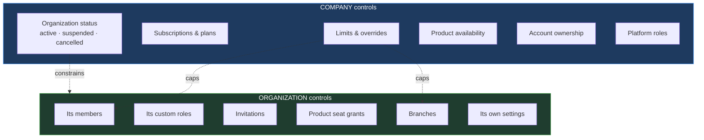
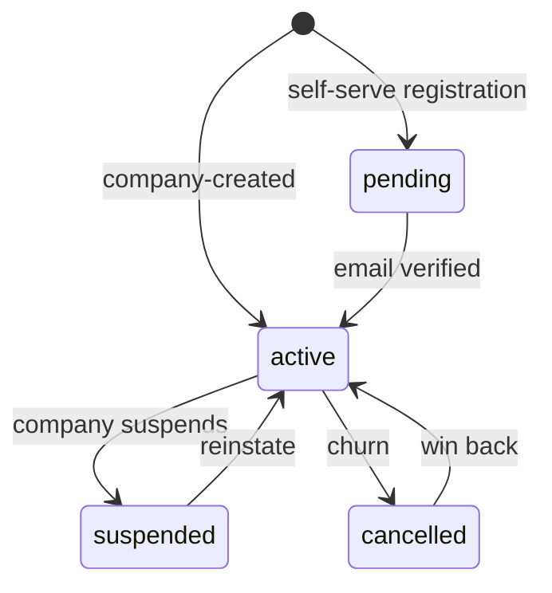
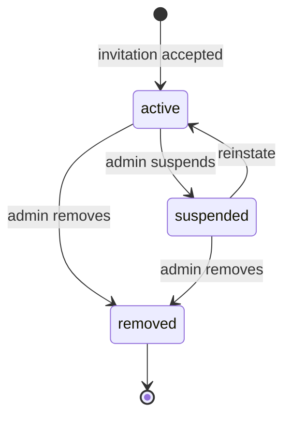

# 10 — User and Organization Management

Implements baseline §7–10, §19 and §20. Defines the lifecycles, and — more importantly — the boundary between what the **company** controls and what an **organization** controls, which baseline §20 calls fundamental.

---

## 1. The responsibility boundary



The organization is **autonomous inside limits the company sets**. It never raises its own ceiling, and the company never manages its users day to day. The dotted arrows are the only coupling, and both point one way.

Two consequences worth stating plainly, because both are tempting to violate:

**An organization admin cannot change a limit.** Not their user limit, not their branch limit. The endpoints do not exist for organization scope. Raising a ceiling is a commercial act.

**Company staff do not routinely manage customer members.** They *can*, for support, through an explicitly-named and audited path (§8) — not through the same endpoints the customer uses. Mixing the two would make every customer action look like it might have been a staff action.

---

## 2. Organization lifecycle



| Status | Members may log in | Products reachable |
|---|---|---|
| `pending` | no | no |
| `active` | yes | per entitlement |
| `suspended` | yes, but no product access | **no** — all denied |
| `cancelled` | no | no |

`suspended` deliberately still permits login. The member sees an explanation and a support contact rather than a failed password — a suspended customer who cannot log in has no way to discover why, and will open a support ticket about authentication instead of about the suspension.

Suspension preserves everything — members, seats, branches, usage, data — so reinstatement is a status change, not a reconstruction (`08` §6).

### 2.1 Creation

Two paths (`06` §2): self-service registration creates `pending` + owner in one transaction; company-created starts `active` for a sales-led onboarding. Both create an owner membership in the same transaction as the organization, because an organization with no owner is unadministrable and requires company intervention to repair.

---

## 3. Branches

Baseline §10. Branch is a dimension inside the tenant, never a tenant itself (ADR-014).

| Rule | Reason |
|---|---|
| Counts against the branch limit, resolved as MAX across subscriptions | Organization-scoped resource (`09` §2.2) |
| Creation locks the **organization** row | The limit derives from several subscriptions; none is the authority |
| `inactive` branches still count | The resource exists and is recoverable; otherwise deactivation is a free bypass |
| At most one `is_primary`, by partial unique index | Application-only enforcement of this fails under concurrency |
| Deletion blocked while memberships reference it | Orphaning a member's default branch breaks their session context |

Products apply branch context to their own domain data (baseline §25) — the Control Plane cannot, since it does not know their schemas.

---

## 4. Membership lifecycle



There is no `invited` state — an invitation is not a membership (ERD §4.3, review R-3).

| Transition | Seats | Sessions |
|---|---|---|
| Accept | Converts reserved invitation seats into grants | New session |
| Suspend | **Keeps seats** | All sessions revoked immediately |
| Reinstate | Keeps seats | Must log in again |
| Remove | **Releases every seat**, by cascade | All sessions revoked |

**Suspension keeps the seat.** Otherwise suspend → add someone → unsuspend puts the organization permanently over its limit, with no single request having violated anything.

**Removal releases every seat atomically.** Revoking product grants one at a time while leaving a removed membership's grants live would strand seats that nobody can see or reclaim — paid capacity lost to a bookkeeping gap.

**Suspension and removal revoke sessions immediately.** An admin removing a member expects access to end now, not within a token lifetime. Combined with per-request entitlement checks (`08` §4), it does.

### 4.1 The last owner

An organization must retain at least one `active` owner. The last one cannot be removed, suspended or demoted; ownership must be **transferred** first. Without this rule an organization can lock itself out and need company intervention to recover — a self-inflicted outage that a single constraint prevents.

---

## 5. Invitations

Baseline §19. The flow is specified in `06` §2.2; this section covers the management rules.

```mermaid
sequenceDiagram
    participant A as Org Admin
    participant API
    participant DB

    A->>API: POST /invitations {email, roleIds, productIds}
    API->>API: permission: organization.members.invite
    API->>API: may the inviter grant these roles? (07 §6)
    API->>DB: BEGIN
    API->>DB: lock each named product's subscription, in product-id order
    loop per product
        API->>DB: resolve seat limit; count seats
        API->>DB: reject if at limit
    end
    API->>DB: insert invitation + invitation_roles + invitation_products
    API->>DB: audit + outbox(UserInvited); COMMIT
    API-->>A: 201 — seats reserved
```

| Rule | Reason |
|---|---|
| Seats reserved at invitation, not acceptance | A user clicking a valid link and being refused is a bad experience manufactured by deferring the check |
| Locks taken in **product-id order** | Two invitations naming products in opposite orders would deadlock |
| Inviter cannot grant roles beyond their own permissions | Otherwise invitation is an escalation path (`07` §6) |
| One pending invitation per `(organization, email)` | Partial unique index; prevents duplicate seat reservations |
| Expiry frees the seat at **read time** | A limit depending on a sweeper having run is wrong for a while |
| Revocation frees the seat immediately | |

Products may be named with no roles, or roles with no products. They are independent: a seat is permission to occupy capacity, a role is what you may do once seated (ADR-018).

---

## 6. Product seat management

The organization-facing surface of ADR-018 (full enforcement in `09` §3).

| Action | Permission | Effect |
|---|---|---|
| Grant seat | `organization.product_seats.grant` | Counts against that product's limit; locks that subscription |
| Revoke seat | `organization.product_seats.revoke` | Frees the seat; `revoked_at` set, history retained |
| List seats | `organization.product_seats.read` | Per product: granted, limit, remaining |

Revocation is a timestamp rather than a delete, so who held a seat and when survives — needed for audit and for answering a customer disputing a charge.

Granting on a product the organization is not entitled to fails with `product_not_entitled`, not `limit_reached`: selling seats on a lapsed subscription would be entitlement laundering through the seat table.

---

## 7. Multi-organization membership

Baseline §8 — a first-class case, not an edge case.

```text
Arun
 ├── ABC Restaurant   → org_admin   → POS seat, Inventory seat
 └── XYZ Cafe         → viewer      → POS seat
```

| Property | Mechanism |
|---|---|
| One identity, one credential | Single `users` row (ADR-005) |
| Independent roles per organization | Permissions attach to the membership (`07` §1) |
| Independent seats per organization | `membership_products` keyed by membership |
| One active context at a time | `sessions.organization_id`; token carries one `org` (ADR-004) |
| Switching | Mints a new token; never mutates one (`06` §4) |

The isolation property that makes this safe: an access token scoped to ABC cannot address XYZ's data, because there is nowhere in the request for a second organization to come from. Multi-organization membership adds no tenant-leak surface.

---

## 8. Company-side customer management

Baseline §21, §28. Staff act on customers through named, audited paths — never the customer's own endpoints.

| Capability | Permission | Scope |
|---|---|---|
| View any organization | `platform.organizations.read` | Cross-tenant, audited |
| Suspend / reinstate | `platform.organizations.suspend` | `is_dangerous`; audited |
| Manage subscriptions | `platform.subscriptions.manage` | |
| Grant limit overrides | `platform.subscriptions.override` | Requires `reason` + grantor |
| Assign account ownership | `platform.accounts.assign` | |
| Member management on behalf | `platform.organizations.members.manage` | **Audited as acting-on-behalf** |

`account_manager`, `success_manager` and `support_agent` are scoped to organizations they are **assigned** via `customer_account_assignments` — a fifty-person support team should not each hold read access to every customer (`07` §3.1).

### 8.1 Acting on behalf

When staff act inside a customer organization, the audit record captures both actor and the on-behalf context, and `actor_type` remains `user` with the platform scope recorded in metadata. The customer's own audit view shows these entries too — a customer must be able to see what the vendor did inside their tenant. Hiding staff actions from the customer's trail would make the trail untrustworthy for exactly the events most worth checking.

**Impersonation — logging in as a customer user — is not implemented.** It is the most abusable capability an admin console can offer, and the legitimate need (seeing what the customer sees) is better served by read access plus the customer's own audit log. If it is ever added it requires explicit customer consent, a hard time box, an unmistakable banner, and its own audit stream.

---

## 9. Customer account management

Baseline §21. `customer_accounts` holds the commercial relationship; `customer_account_assignments` holds ownership.

| Relationship | Responsibility |
|---|---|
| `account_manager` | Commercial: renewals, upgrades, pricing |
| `success_manager` | Adoption, health, proactive retention |
| `support_owner` | Escalation path for issues |

Assignments are rows rather than columns on the organization, because an organization holds several relationships at once and people change roles. `is_primary` is partial-unique per `(organization, relationship)`, so there is exactly one answer to "who owns this account" without forbidding a secondary.

`lifecycle_stage` (`prospect` → `trial` → `customer` → `at_risk` → `churned`) and `health_score` are CSM-maintained. `mrr_amount` is denormalized for reporting and must be refreshed from subscription changes rather than edited by hand — it is derived data, and hand-edited derived data drifts.

---

## 10. Required tests

| Area | Assertion |
|---|---|
| Tenant isolation | Org A's admin cannot read, invite into, or modify Org B |
| Limit authority | No organization-scope endpoint can change a limit |
| Last owner | Cannot be removed, suspended or demoted |
| Seat release | Removing a membership releases every seat atomically |
| Seat retention | Suspension keeps seats; suspend/add/unsuspend cannot exceed the limit |
| Invitation reservation | Pending invitations occupy seats; expiry and revocation release them |
| Deadlock freedom | Crossed concurrent multi-product invitations complete without deadlock |
| Escalation | An inviter cannot grant roles beyond their own permission set |
| Session revocation | Suspension and removal end sessions immediately |
| Branch counting | `inactive` branches count; the limit is the MAX across subscriptions |
| On-behalf audit | Staff actions appear in the customer's own audit view |

---

Next: `11-product-launcher.md`.
