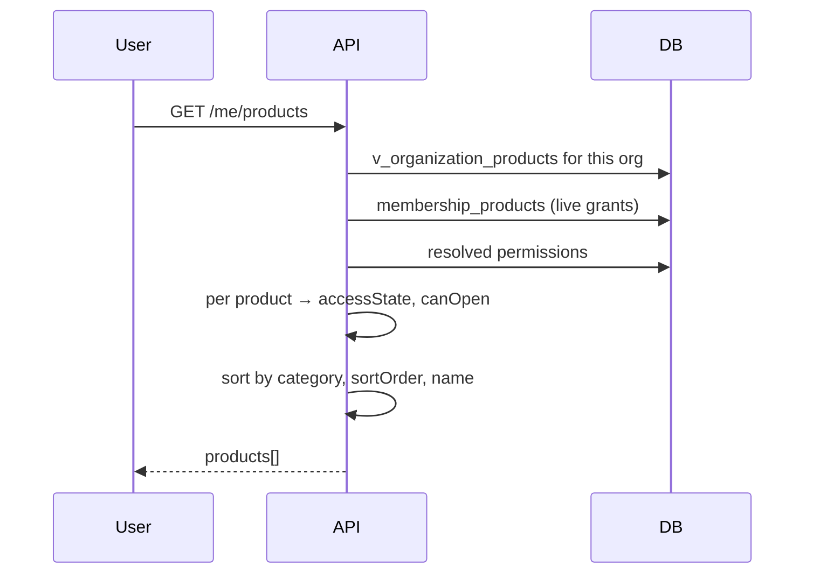
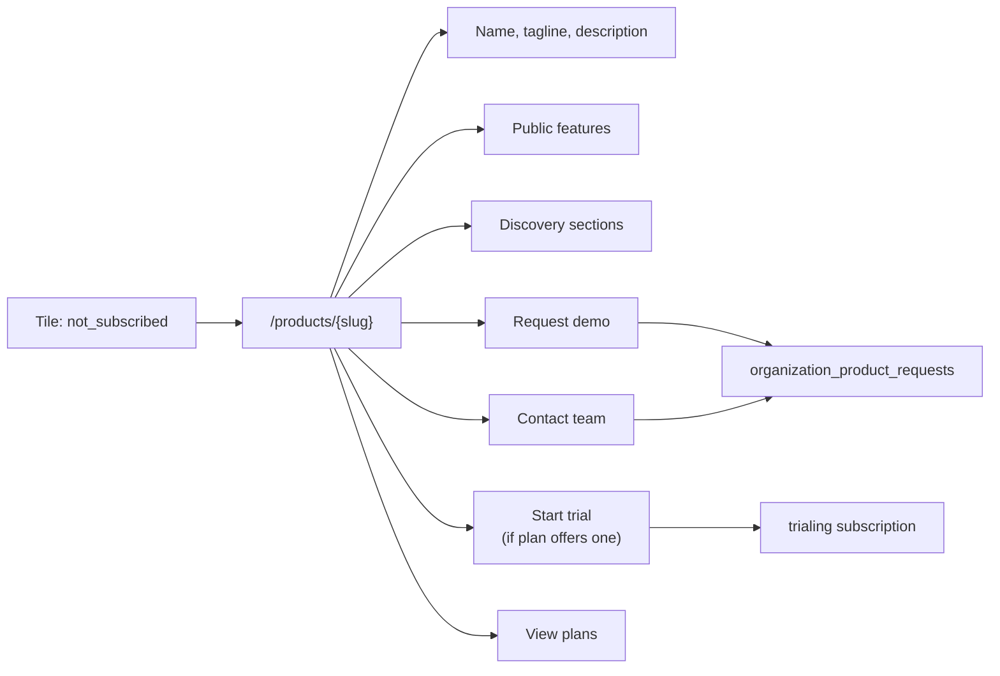

# 11 — Product Launcher and Discovery

Implements baseline §12, §13, §14, §36, §37 and §38. The launcher is the platform's front door and the place where the "one ecosystem" promise either reads as real or does not.

Its governing constraint (ADR-013, master prompt §33): **the launcher contains no product-specific code.** Everything it renders is registry data.

---

## 1. What the launcher is

A single surface showing the **complete** company product ecosystem, with each product in its true access state — including products the organization has not bought (baseline §38).

```text
┌──────────────────────────────────────────┐
│  OUR PRODUCTS                      [⌕]   │
│                                          │
│  MY PRODUCTS                             │
│  ┌────────┐ ┌────────┐ ┌────────┐        │
│  │  POS   │ │Invntry │ │  CRM   │        │
│  │ Active │ │ Active │ │Trial 6d│        │
│  └────────┘ └────────┘ └────────┘        │
│                                          │
│  EXPLORE                                 │
│  ┌────────┐ ┌────────┐ ┌────────┐        │
│  │  KDS   │ │Analytic│ │   HR   │        │
│  │  Learn │ │Expired │ │  Learn │        │
│  └────────┘ └────────┘ └────────┘        │
└──────────────────────────────────────────┘
```

Showing unbought products is a deliberate commercial decision, not clutter. Baseline §38 keeps "My Products" and "Explore Products" conceptually distinct while permitting one visual surface — so the grouping is derived from state, not from two separate fetches.

---

## 2. One endpoint, backend-computed

```http
GET /me/products
```

```json
{
  "products": [
    {
      "id": "01932b...", "slug": "pos", "name": "POS",
      "tagline": "Point of sale for every counter",
      "iconUrl": "https://cdn.../pos.svg", "accentColor": "#3B82F6",
      "category": "Operations", "sortOrder": 10,
      "accessState": "active",
      "canOpen": true,
      "appUrl": "https://pos.company.com",
      "paymentAttentionRequired": false,
      "trialEndsAt": null,
      "seat": { "granted": true },
      "discoveryUrl": null
    },
    {
      "id": "01932c...", "slug": "kds", "name": "KDS",
      "tagline": "Kitchen display and prep queues",
      "iconUrl": "https://cdn.../kds.svg", "accentColor": "#F59E0B",
      "category": "Operations", "sortOrder": 30,
      "accessState": "not_subscribed",
      "canOpen": false,
      "appUrl": null,
      "seat": { "granted": false },
      "discoveryUrl": "/products/kds"
    }
  ]
}
```

### 2.1 `canOpen` is computed server-side

The frontend never derives it. It is the conjunction of everything baseline §23 requires:

```text
canOpen = organization active
        AND subscription grants access (active | trialing | past_due)
        AND membership active
        AND user holds a seat on this product        (ADR-018)
        AND user holds at least one permission for it
```

Returning a single boolean is a design decision with a security consequence: there is no way for the client to get the conjunction wrong, because it never evaluates it. The server also still authorizes the actual product open (§4) — `canOpen` controls presentation only.

### 2.2 `appUrl` is null when access is denied

Not merely hidden in the UI — **absent from the payload**. Sending a URL the user may not use and relying on the client to withhold it means the URL is one devtools inspection away from being tried. It is the same reasoning that keeps the admin console in a separate bundle (HLD §8).

---

## 3. Deriving state



One query over the view (ERD §8), which already honors organization status, subscription status, trial expiry and product visibility. The states are exactly baseline §13's, computed in one place:

| `accessState` | Launcher presentation | Click |
|---|---|---|
| `active` | Normal tile | Opens product |
| `trialing` | "Trial · N days left" | Opens product |
| `active` + `paymentAttentionRequired` | Payment warning badge | Opens product |
| `expired` | Muted, "Expired" | Renewal page |
| `suspended` | Muted, "Unavailable" | Explanation + support |
| `not_subscribed` | Muted, "Learn more" | **Discovery page** |
| `org_inactive` | Whole launcher replaced by an account notice | — |

A product may be `active` for the organization while the user holds no seat. The tile then shows "Access not granted — ask your administrator", which is accurate and actionable. Hiding the product entirely would be worse: the user would not know the capability exists, and would ask support instead of their admin.

---

## 4. Opening a product

```mermaid
sequenceDiagram
    participant U as User
    participant API
    participant P as Product

    U->>API: POST /me/products/{slug}/open
    API->>API: re-verify entitlement + seat + permission
    alt denied
        API-->>U: 403 with reason + path forward
    else allowed
        API->>API: audit product.opened
        API-->>U: 302 → product app_url
    end
    U->>P: lands; OIDC SSO (06 §6.1)
```

**The open is re-authorized server-side**, not trusted from the earlier `canOpen`. State can change between rendering the launcher and clicking a tile — a subscription can lapse, an admin can revoke a seat — and the launcher payload is a snapshot. Trusting it would make every stale tab a bypass.

`product.opened` is audited, which gives the company genuine adoption data (baseline §30) rather than inferring usage from products' self-reports.

---

## 5. Discovery for non-subscribed products

Baseline §14 is explicit: a non-subscribed product must not behave like a disabled button.



Content is entirely data — `products`, public `features`, `product_discovery_sections` (ERD §6.3) — so marketing edits copy without a deployment. Were this content in the frontend, every pricing or positioning change would need an engineer and a release.

### 5.1 Conversion requests

```http
POST /products/{slug}/requests
{ "requestType": "demo", "message": "...", "source": "discovery_page" }
```

`source` is the field that makes this a sales queue rather than a lead list:

| `source` | Intent |
|---|---|
| `launcher` | Browsing |
| `discovery_page` | Interested |
| `limit_reached` | **Highest** — blocked right now by a limit (baseline §39) |

A request from `limit_reached` is a customer who has hit a wall mid-task. Treating it identically to idle browsing wastes the clearest buying signal the platform produces.

### 5.2 Anonymous prospects

Discovery pages for `public` products are reachable unauthenticated, so marketing can link to them and requests can be captured with `organization_id` null (ERD §10.2). This makes the Control Plane the marketplace baseline §14 describes rather than only an internal launcher.

---

## 6. Search and categorization

Both are registry-driven. Search covers name, tagline, description and category; categories come from `products.category` with ordering from `sort_order`.

A new category requires no code — it is a string on a product row. A category list in the frontend would mean adding a product category needed a release, which is the same failure as hardcoding products, one level up.

---

## 7. No hardcoded products — mechanically enforced

The rule from ADR-013 and master prompt §33. Forbidden anywhere in the codebase:

```ts
if (product.slug === 'pos') { ... }              // ✗
const ICONS = { pos: '...', inventory: '...' }   // ✗
if (['pos','kds'].includes(slug)) { ... }        // ✗
```

Correct:

```ts
products.map((p) => <ProductTile key={p.id} product={p} />)   // ✓
```

Enforcement is mechanical, because a rule enforced only by review decays:

1. A lint rule rejecting known product slugs as string literals in `apps/` and `packages/modules/`.
2. A test registering a fictional product and asserting it appears in the launcher, renders a discovery page, and accepts a conversion request — with no code change. This is the real test of ADR-013: if onboarding a product needs a commit, the architecture has regressed.

Presentation that *looks* product-specific — icon, accent color, category, copy — is registry data precisely so it never becomes a conditional.

---

## 8. States the UI must handle

Specified here because an unhandled state in the front door is the most visible possible failure.

| State | Presentation |
|---|---|
| Loading | Skeleton tiles, not a spinner — the layout is known, so it should not jump |
| No products registered | "Products are being set up" — only possible pre-launch |
| No subscriptions | Explore-only launcher, framed as discovery rather than emptiness |
| Organization suspended | Account notice replacing the grid, with support contact |
| No organization selected | Organization chooser (`06` §3.1) |
| Membership suspended | Access notice, direct to their admin |
| Fetch failed | Error with retry; **never** a silently empty grid — an empty launcher implies no products exist, which is a worse lie than an error |
| Product open denied | Reason and path forward, never a bare failure |

---

## 9. Adding a product

The acceptance test for this document. Onboarding requires:

1. `products` row — name, slug, URL, icon, accent color, category, copy.
2. `features` rows, with `enforced_by` and (if Control-Plane-enforced) `countable_resource` + `countable_scope`.
3. `product_discovery_sections` for the discovery page.
4. `plans` + `plan_features`.
5. `oidc_clients` registration.

Zero changes to the launcher, the discovery page, the entitlement engine, the API surface, or the schema. All five steps are achievable through the admin console (`18-admin-console-architecture.md`), so onboarding a product is a configuration task, not an engineering one.

---

Next: `12-product-integration-contract.md`.
