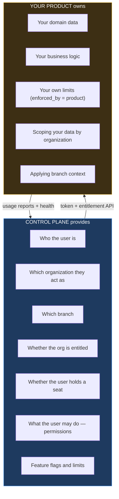

# 12 — Product Integration Contract

**Audience: engineers building a product that integrates with the Control Plane.** Unlike the rest of `docs/architecture/`, this document is written for teams outside the Control Plane, and it is normative — it is the contract, not a description of one.

A product team should be able to integrate using only this document, with no knowledge of how the Control Plane is built internally.

It is written against **OIDC and OAuth 2.1 as specifications**, not against this implementation. That is deliberate (ADR-003): if the Control Plane's identity module is ever replaced, products that followed this contract need no change.

---

## 1. Division of responsibility



**The Control Plane never stores your domain data** (baseline §4.2). No orders, no stock, no kitchen tickets. You own your database, your API and your logic.

**You never store customer credentials** (baseline §24). No password field, no signup form, no password reset. Authentication is delegated, always.

---

## 2. Registration

Before integrating, the Control Plane team registers your product. You provide:

| Item | Example | Notes |
|---|---|---|
| Name, slug | `POS`, `pos` | Slug is permanent — it appears in URLs and permission keys |
| App URL | `https://pos.company.com` | Launcher destination; HTTPS required |
| Redirect URIs | `https://pos.company.com/auth/callback` | **Exact match. No wildcards** |
| Post-logout redirect URIs | `https://pos.company.com/signed-out` | |
| Icon, accent color, category | | Rendered by the launcher as data |
| Discovery copy and public features | | Shown on your product's discovery page |
| Permissions | `pos.orders.create`, `pos.orders.void` | Namespaced by your slug |
| Features | `pos.split_bill`; `orders_per_month` | With `enforced_by` — see §6 |
| Health check URL | `https://pos.company.com/healthz` | Polled for integration monitoring |

You receive a `client_id` and, for a confidential client, a `client_secret` **shown once and unrecoverable**.

Redirect URIs are matched exactly, with no wildcard or prefix matching. This is not pedantry: wildcard redirect matching is a standing open-redirect that converts directly into token theft, and it is the most common OAuth misconfiguration in production.

---

## 3. Authentication

Authorization code flow with PKCE. Both entry paths in baseline §37 are the same flow — you do not special-case them.

```mermaid
sequenceDiagram
    participant U as User
    participant P as Your product
    participant CP as Control Plane

    U->>P: GET /orders/42  (no session)
    P->>P: generate code_verifier, state, nonce
    P->>P: store return path in state
    P->>CP: 302 /authorize?client_id&redirect_uri&code_challenge&state&nonce
    CP->>CP: authenticate if needed; resolve org; verify entitlement
    CP->>P: 302 redirect_uri?code&state
    P->>P: VERIFY state matches
    P->>CP: POST /token (code, code_verifier)
    CP-->>P: id_token, access_token, refresh_token
    P->>CP: GET /.well-known/jwks.json  (cache)
    P->>P: verify id_token signature and claims
    P->>CP: GET /entitlements/pos
    CP-->>P: entitled, features, limits
    P-->>U: /orders/42
```

### 3.1 Required steps

Omitting any of these is a vulnerability, not a shortcut:

1. **Discover endpoints** from `/.well-known/openid-configuration`. Do not hardcode paths.
2. **PKCE is mandatory.** `code_challenge_method=S256`; never `plain`.
3. **`state` is mandatory and must be verified** on callback. This is your CSRF defense — an unverified `state` is a login-CSRF vulnerability.
4. **`nonce` is mandatory** and must be checked against the `id_token`, binding the token to your request.
5. **Verify the JWT signature** against cached JWKS. **Never decode a token without verifying it** — an unverified JWT is user-controlled input wearing a costume.
6. **Validate `iss`, `aud`, `exp`, `nbf`.** Reject on any mismatch.
7. **Cache JWKS**, keyed by `kid`, and refresh on an unknown `kid`. Keys rotate (`06` §5.3); the `retiring` overlap means a rotation never breaks a live token, provided you re-fetch on an unknown key.

---

## 4. The access token

```json
{
  "iss": "https://id.company.com",
  "sub": "01932f8e-...",
  "aud": ["pos"],
  "exp": 1760000900,
  "sid": "01932f8f-...",
  "org": "01932a11-...",
  "mem": "01932a12-...",
  "branch": "01932a13-...",
  "all_branches": false,
  "perm_digest": "sha256:9f2c…",
  "amr": ["pwd"]
}
```

| Claim | Use |
|---|---|
| `sub` | The user. Stable; safe as a foreign key in your database |
| `org` | **Your tenant key.** Scope every query by it |
| `mem` | Membership id, for permission queries |
| `branch`, `all_branches` | Branch context to apply to your data |
| `sid` | Session, for correlation and back-channel logout |
| `perm_digest` | Hash of the permission set — a staleness check, **not** the permissions |

### 4.1 Rules

**Never accept an organization id from a request parameter.** Use `org` from the verified token, always. A client-supplied tenant id is the classic cross-tenant escape, and it is dangerous precisely because it looks like ordinary input. If your API has a path like `/orgs/{orgId}/orders`, the `{orgId}` must be *compared* to the token's `org` and rejected on mismatch — never trusted.

**The token is not an entitlement.** It proves identity and organization. It does not prove the subscription is still valid — that is live state (§5).

**`perm_digest` is not the permission list.** If your cached permissions' digest differs from the token's, re-fetch. Do not attempt to decode the digest.

---

## 5. Entitlement — check it, do not infer it

```http
GET /api/v1/entitlements/pos
Authorization: Bearer <access_token>
```

```json
{
  "entitled": true,
  "state": "active",
  "expiresAt": "2026-11-01T00:00:00Z",
  "paymentAttentionRequired": false,
  "features": { "pos.split_bill": true, "pos.offline_mode": false },
  "limits": {
    "users": { "limit": 2, "used": 2, "remaining": 0, "enforcedBy": "control_plane" },
    "orders_per_month": { "limit": 50000, "used": 12430, "enforcedBy": "product" }
  },
  "organization": { "id": "01932a11-...", "name": "ABC Restaurant", "timezone": "Asia/Kolkata" },
  "branch": { "id": "01932a13-...", "name": "Noida", "allBranches": false },
  "membership": { "id": "01932a12-...", "isOwner": false, "seatGranted": true }
}
```

### 5.1 When to call it

| When | Why |
|---|---|
| On session establishment | The baseline decision |
| **Periodically during long sessions** (≤15 min) | Suspension and expiry must take effect without a re-login |
| Before a feature-gated action | A flag may have changed |
| On a 403 from any Control Plane endpoint | State changed; re-sync |

**The periodic re-check is the requirement most often skipped, and it is the one that matters.** Without it, a user who logged in before their organization was suspended keeps working for the length of their session — which may be all day. Suspension would appear to work, because new logins fail, while every existing session continues untouched. If you implement one thing from this section, implement this.

### 5.2 Denial

```json
{ "entitled": false, "state": "expired", "reason": "subscription_expired",
  "message": "The POS subscription ended on 1 October 2026.",
  "actionUrl": "https://app.company.com/products/pos/renew" }
```

On denial: stop serving product functionality and send the user to `actionUrl`. Do not render a partial or degraded experience — a half-working product after expiry reads as a defect in your product rather than a lapsed subscription, and generates support load for you.

---

## 6. Limits — who enforces what

`enforcedBy` tells you which side owns each limit (ADR-010 amendment):

| `enforcedBy` | Meaning | Your obligation |
|---|---|---|
| `control_plane` | Seats and branches — Control Plane resources | None. Already enforced; display only |
| `product` | Your domain metering, e.g. `orders_per_month` | **You enforce it** |

The Control Plane never interprets a product unit. It does not know what an order is, and must not — knowing would couple it to your domain (baseline §4.2, §41). It stores your limit as configuration and hands it to you as data.

For `product`-enforced limits: fetch the limit, enforce it server-side in your product, and report usage (§8). When a user hits one, direct them to the upgrade path rather than failing opaquely.

---

## 7. Permissions

```http
GET /api/v1/me/permissions?product=pos
```

```json
{ "digest": "sha256:9f2c…",
  "permissions": ["pos.orders.read", "pos.orders.create", "pos.reports.read"] }
```

Cache against the digest; re-fetch when the token's `perm_digest` differs.

**Enforce permissions server-side in your product.** Hiding a button is usability; the server is the control. Your API must reject an unpermitted action regardless of what your UI offered — the Control Plane cannot do this for you, because it does not know your endpoints.

Permission keys are namespaced by your slug and are the ones you registered. Granting them is the customer's business; enforcing them is yours.

---

## 8. Reporting usage

```http
POST /api/v1/products/pos/usage
Authorization: Bearer <client_credentials_token>
Idempotency-Key: pos-2026-10-01-org01932a11-orders
```

```json
{ "organizationId": "01932a11-...", "branchId": "01932a13-...",
  "metricKey": "orders_created", "metricValue": 1284,
  "periodStart": "2026-10-01T00:00:00Z", "periodEnd": "2026-10-01T23:59:59Z" }
```

Uses client credentials — this is a server-to-server call, never from a browser.

| Rule | Reason |
|---|---|
| `Idempotency-Key` required | Delivery is at-least-once; duplicates must collapse |
| Report aggregates, not events | The Control Plane is not an event store |
| These values **never** affect access | Self-reported figures cannot be trusted for enforcement — otherwise a product could grant itself entitlement |

Reported usage powers the admin console's usage view, analytics and upgrade recommendations (baseline §30). Your own `product`-enforced limits are enforced by you, against your own authoritative count — not against these reports.

---

## 9. Events and webhooks

Register a webhook to receive state changes rather than polling.

| Event | Act on it by |
|---|---|
| `SubscriptionActivated` | Enabling product access |
| `SubscriptionSuspended` | Blocking access immediately |
| `SubscriptionExpired` | Blocking access; offering renewal |
| `SubscriptionUpgraded` / `Downgraded` | Re-reading limits |
| `ProductSeatGranted` / `Revoked` | Provisioning or deprovisioning the user |
| `OrganizationSuspended` | Blocking the whole tenant |
| `MembershipRemoved` | Ending sessions, reassigning owned records |
| `UserInvited` | Optional pre-provisioning |

```json
{
  "id": "01932d...", "type": "SubscriptionSuspended", "version": 1,
  "occurredAt": "2026-10-01T11:30:00Z",
  "organizationId": "01932a11-...",
  "data": { "productSlug": "pos", "subscriptionId": "01932c...", "reason": "non_payment" }
}
```

### 9.1 Requirements

1. **Verify the signature.** `X-CP-Signature`, HMAC-SHA256 over the raw body with your webhook secret, compared in constant time.
2. **Be idempotent on `id`.** Delivery is at-least-once (ADR-009) — the same event will sometimes arrive twice.
3. **Respond 2xx quickly**, then process asynchronously. Slow handlers cause retries, which cause duplicates.
4. **Tolerate out-of-order delivery.** Use `occurredAt`; do not assume sequence.
5. **Webhooks are an optimization, not the authority.** A missed webhook must not leave you serving a suspended customer — the periodic entitlement check (§5.1) is the backstop, and it is what makes correctness independent of delivery.

Failures retry with exponential backoff; exhausted events land in a dead-letter state that alerts the Control Plane team.

---

## 10. Health

```http
GET /healthz   →  200 { "status": "ok", "version": "1.4.2" }
```

Unauthenticated, no sensitive data, and must not depend on the Control Plane — a health check that fails when the Control Plane is down reports your product as broken when it is not.

---

## 11. Errors

| Status | Meaning | Your response |
|---|---|---|
| 401 | Token invalid or expired | Refresh; if that fails, re-authenticate |
| 403 `product_not_entitled` | Subscription lapsed | Stop serving; show `actionUrl` |
| 403 `product_seat_required` | User holds no seat | Direct to their admin |
| 403 `forbidden` | Permission missing | Hide or explain |
| 404 | Not found **or another tenant's resource** | Treat as not found |
| 409 `limit_reached` | Limit hit | Show the upgrade path |
| 429 | Rate limited | Honor `Retry-After`; back off |
| 5xx | Control Plane fault | Retry with backoff; **fail safe** |

**404 is also returned for a resource in another organization** — deliberately indistinguishable from nonexistent, because a 403 would confirm it exists (`07` §9).

### 11.1 Failing safe when the Control Plane is unreachable

| Situation | Behavior |
|---|---|
| Entitlement check fails, previous answer cached and fresh (<15 min) | Continue on the cached answer |
| Cache stale or absent | **Deny.** Do not fail open |
| Authentication unreachable | No new sessions; existing valid tokens continue until expiry |

Never fail open on entitlement. An outage must not become a window in which unentitled organizations use the product — the cached-answer window is bounded precisely so that the failure mode is "brief degradation", not "free access during incidents".

---

## 12. Integration checklist

Before going live:

- [ ] Endpoints discovered, not hardcoded
- [ ] PKCE `S256`; `state` and `nonce` generated and **verified**
- [ ] JWT signature verified against cached JWKS; `iss`/`aud`/`exp` validated
- [ ] Unknown `kid` triggers a JWKS refresh
- [ ] Every query scoped by the token's `org`; no tenant id accepted from a request
- [ ] Branch context applied to domain data
- [ ] Entitlement checked at session start **and periodically**
- [ ] `product`-enforced limits enforced server-side
- [ ] Permissions enforced server-side, not only in the UI
- [ ] Usage reported with idempotency keys
- [ ] Webhook signatures verified; handlers idempotent
- [ ] Fails **safe** — denies — when the Control Plane is unreachable with no fresh cache
- [ ] `/healthz` responds without depending on the Control Plane
- [ ] No credential storage, no password reset, no signup form
- [ ] Back-channel logout handled

---

Next: `13-api-specification.md`.
