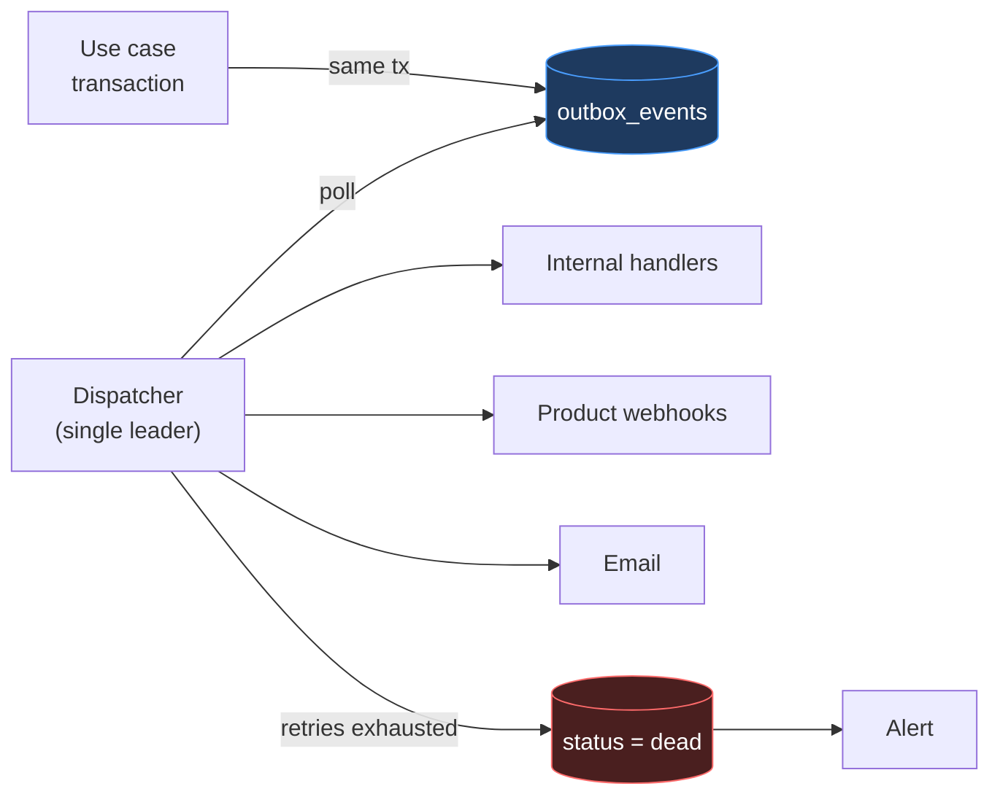

# 14 — Event Architecture

Implements ADR-009. Master prompt §20 is explicit that Kafka must not be introduced because it is popular, so this document first establishes what the events actually are, then selects a mechanism to match.

---

## 1. What the events are

Every event the platform needs, with its real characteristics:

| Event | Volume | Latency tolerance | Loss tolerance |
|---|---|---|---|
| `OrganizationCreated` | ~10s/day | seconds | **none** |
| `OrganizationSuspended` | ~1s/day | seconds | **none** |
| `UserInvited` | ~100s/day | seconds | **none** (an email must send) |
| `MembershipCreated` / `Removed` | ~100s/day | seconds | **none** |
| `ProductSeatGranted` / `Revoked` | ~100s/day | seconds | **none** |
| `SubscriptionActivated` | ~10s/day | seconds | **none** (revenue) |
| `SubscriptionSuspended` / `Expired` | ~10s/day | seconds | **none** (access) |
| `SubscriptionUpgraded` / `Downgraded` | ~10s/day | seconds | **none** |
| `TrialStarted` / `TrialEndingSoon` / `TrialEnded` | ~10s/day | minutes | low |
| `LimitReached` | ~10s/day | minutes | low |
| `ProductRequested` | ~10s/day | minutes | **none** (a sales lead) |

Two facts decide the architecture:

**Volume is tiny** — hundreds of events per day, not millions per second.

**Loss tolerance is zero, but latency tolerance is seconds.** These events drive emails, access revocation and revenue. Losing one is unacceptable; delivering one three seconds late is unnoticeable.

---

## 2. Why a transactional outbox, not a broker

The decisive problem is **atomicity with the state change**, not throughput.

Consider suspending a subscription with a broker:

```text
BEGIN
  UPDATE subscriptions SET status = 'suspended'
  publish('SubscriptionSuspended')   ← a network call inside a transaction
COMMIT
```

This cannot be made correct. Either the publish succeeds and the transaction then rolls back — announcing a suspension that did not happen, so products block a paying customer — or the transaction commits and the publish fails, so the customer is suspended in the database while every product continues serving them. There is no ordering of the two operations that avoids both outcomes, because they are separate systems with no shared transaction.

The outbox resolves it by making the event part of the state change:

```text
BEGIN
  UPDATE subscriptions SET status = 'suspended'
  INSERT INTO outbox_events (...)     ← same database, same transaction
COMMIT
-- a separate dispatcher reads committed rows and delivers
```

Now the event exists if and only if the change happened. **This pattern is required even with Kafka** — the recommended way to publish to Kafka from a transactional system *is* an outbox. So the question is not "outbox or broker" but "does the dispatcher publish to a broker or deliver directly", and at hundreds of events per day the broker adds infrastructure without adding a guarantee.

| Property | Outbox | Broker (would add) |
|---|---|---|
| Atomic with state change | **yes** | Needs an outbox anyway |
| No event loss | yes | yes |
| Replay | Query the table | Better tooling |
| Throughput | thousands/sec | millions/sec — **not needed** |
| Stream processing | no | yes — **not needed** |
| New infrastructure | none | a cluster to run, monitor, secure, upgrade |

Deferred per ADR-D3; if cross-product streaming ever justifies a broker, the outbox becomes its producer, so the change is additive rather than a rewrite.

---

## 3. Mechanism



### 3.1 Production

```ts
await db.transaction(async (tx) => {
  await subscriptions.suspend(tx, scope, subscriptionId, reason)
  await audit.record(tx, { actor, action: 'subscription.suspended', ... })
  await outbox.enqueue(tx, {
    type: 'SubscriptionSuspended', version: 1,
    organizationId: scope.organizationId,
    aggregateType: 'subscription', aggregateId: subscriptionId,
    payload: { productSlug, subscriptionId, reason },
    correlationId: ctx.requestId,
  })
})
```

State, audit and event in one transaction. All three or none.

### 3.2 Dispatch

```sql
-- Claim a batch. SKIP LOCKED lets dispatchers coexist safely during a handover.
SELECT * FROM outbox_events
WHERE status IN ('pending','failed') AND next_attempt_at <= now()
ORDER BY created_at
LIMIT 100
FOR UPDATE SKIP LOCKED;
```

The dispatcher runs **single-leader** via a Postgres advisory lock (HLD §2). Without it, three application instances would each dispatch every event and send three copies of every email. `SKIP LOCKED` is belt-and-braces for the moment of leadership handover, when two processes may briefly overlap.

Ordering is `created_at` — best-effort, not guaranteed (§5).

### 3.3 Retry and dead-letter

| Attempt | Delay |
|---|---|
| 1–5 | 10s, 1m, 5m, 30m, 2h (exponential + jitter) |
| after 5 | `status = 'dead'` |

Jitter matters: without it, a product coming back from an outage receives every queued retry simultaneously and may fall over again.

`dead` is terminal and **alerts** (ERD §12). A partial index exists on it specifically so a non-empty dead set is cheap to detect. An event that silently gave up is worse than one that failed loudly — the failure is invisible precisely when a customer's access state has diverged from reality.

---

## 4. Consumers

### 4.1 Internal handlers

| Event | Handler |
|---|---|
| `UserInvited` | Send the invitation email |
| `OrganizationCreated` | Send welcome; create `customer_accounts` row |
| `TrialEndingSoon` | Notify customer and account manager |
| `LimitReached` | Notify the account manager — an upgrade signal (baseline §39) |
| `ProductRequested` | Notify sales; route to the assigned account manager |
| `SubscriptionExpired` | Notify customer and account manager |
| `SessionTokenReuseDetected` | **Security alert** (ADR-017) |

### 4.2 Product webhooks

Delivered per `12` §9: HMAC-SHA256 signature, at-least-once, idempotent on event `id`.

**Webhooks are an optimization, never the authority.** A product that missed `SubscriptionSuspended` must not keep serving a suspended customer — the periodic entitlement check (`12` §5.1) is the backstop. This is what makes correctness independent of delivery, and it is why webhook failure is an operational problem rather than a security incident.

---

## 5. Guarantees, stated honestly

| Guarantee | Status |
|---|---|
| Atomic with the state change | **Yes** — the outbox's whole purpose |
| At-least-once delivery | **Yes** |
| Exactly-once delivery | **No.** Consumers must be idempotent |
| Global ordering | **No** |
| Per-aggregate ordering | **Best effort**, not guaranteed |
| Durability | Yes — committed Postgres rows |

### 5.1 Why ordering is not guaranteed, and why that is acceptable

Concurrent dispatch and independent retries mean `SubscriptionUpgraded` may arrive after `SubscriptionDowngraded` that happened later. Guaranteeing order would require serial dispatch per aggregate, costing throughput for a property consumers do not need — because every consumer's correct behavior is to **re-read current state** rather than replay a sequence.

The rule that makes this safe: **an event is a notification that something changed, not a description of the new state.** On `SubscriptionUpgraded`, a product re-fetches `/entitlements/{slug}`; it does not apply the event's payload as the new truth. Payloads carry enough to route and log, never enough to reconstruct state.

### 5.2 Idempotency is the consumer's obligation

Every consumer tracks processed event ids and ignores repeats. This is required, not advisory — at-least-once delivery means duplicates *will* occur, and a non-idempotent handler will eventually send a customer two invoices or two welcome emails.

---

## 6. Schema and evolution

```json
{
  "id": "01932d4a-...",
  "type": "SubscriptionSuspended",
  "version": 1,
  "occurredAt": "2026-10-01T11:30:00Z",
  "organizationId": "01932a11-...",
  "aggregateType": "subscription",
  "aggregateId": "01932c33-...",
  "correlationId": "01932f90-...",
  "data": { "productSlug": "pos", "subscriptionId": "01932c33-...", "reason": "non_payment" }
}
```

| Rule | Reason |
|---|---|
| `type` is PascalCase, past tense | An event is a fact that has occurred, not a command |
| `version` increments on a breaking change | Consumers can handle both during migration |
| Additive changes do not bump `version` | A new optional field breaks nobody |
| `correlationId` links to the originating request | Ties the event to logs, traces and audit |
| **No sensitive data in payloads** | Events are delivered to external systems and logged by them; S2/S3 fields never appear (data dictionary §1) |
| Payloads carry ids, not full entities | Prevents consumers treating the payload as state (§5.1), and avoids leaking fields a consumer should not see |

The last two rules are load-bearing. A webhook payload is persisted in someone else's logs, outside this platform's control, and once a personal or confidential field is in it that exposure cannot be withdrawn.

---

## 7. Operational monitoring

A silent dispatcher is the pattern's main failure mode: nothing errors, events simply stop flowing, and the first symptom is a customer wondering where their invitation email went.

| Metric | Alert |
|---|---|
| Pending events older than 5 minutes | warning |
| Pending events older than 15 minutes | **critical** — the dispatcher is probably dead |
| Any `dead` event | **critical** |
| Dispatch error rate per consumer | warning at 10% |
| Dispatcher leader heartbeat | **critical** if stale |
| Webhook p95 latency per product | warning — a slow product causes retries, hence duplicates |

The age-of-oldest-pending alert is the single most important one: it detects a stopped dispatcher regardless of *why* it stopped, including causes nobody anticipated.

---

## 8. Replay

Because events are rows, replay is a query:

```sql
UPDATE outbox_events
SET status = 'pending', attempts = 0, next_attempt_at = now()
WHERE id = $1 AND status = 'dead';
```

Replaying a historical event is possible but requires care: consumers are idempotent on id, so a replay of an already-processed event is correctly ignored — which means genuine re-delivery needs a new event rather than resurrecting an old one. Replay is for events that never succeeded, not for re-running history.

---

## 9. What is deliberately not done

| Not done | Why |
|---|---|
| Event sourcing | State is authoritative in its tables; the audit log covers "who did what" (ADR-D3, master prompt §38) |
| CQRS | One read model, one write model; no divergent scaling |
| Kafka / RabbitMQ | §2 — adds infrastructure without adding a guarantee at this volume |
| Event-carried state transfer | §5.1 — consumers re-read current state, which keeps ordering a non-issue |
| Saga orchestration | No cross-service distributed transactions exist in a modular monolith (ADR-001) |

---

Next: `15-security-architecture.md`.
