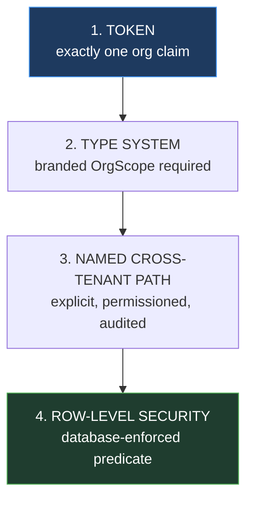

# 15 — Security Architecture

Consolidates the security posture and specifies the controls not covered elsewhere. Written on the assumption the baseline states: the platform will eventually hold many organizations' data, so a single cross-tenant defect is a breach affecting every customer at once.

---

## 1. Principles

| Principle | How it is realized |
|---|---|
| **Default deny** | A route with no declared permission fails at startup, not open (HLD §5) |
| **Structural over conventional** | Branded `OrgScope` makes an unscoped query a compile error (ADR-012) |
| **Defense in depth** | Token scope → typed scope → named cross-tenant path → RLS |
| **Server-side authority** | The UI hides; the server decides. Always |
| **Least privilege** | Platform roles assignment-scoped where possible; time-boxed elevation |
| **No hand-rolled crypto** | argon2, jose, node:crypto only (ADR-003) |
| **Fail closed** | Entitlement denies when state is unknown (`12` §11.1) |
| **Auditable** | Every significant action, including denials |

---

## 2. Threat model

Threats in rough order of expected impact.

| # | Threat | Primary control | Backstop |
|---|---|---|---|
| T1 | **Cross-tenant data access** | Org-scoped tokens + branded repository scopes | RLS; 404-not-403 |
| T2 | **Privilege escalation** | No self-grant; no grant above own set (`07` §6) | Audit on every grant |
| T3 | **Subscription limit bypass** | Row lock + live count in one transaction (ADR-011) | Concurrency tests |
| T4 | **Entitlement bypass** | Per-request server-side check, incl. on refresh | No client-side decisions |
| T5 | Credential stuffing | argon2id, rate limits, lockout | Enumeration-resistant responses |
| T6 | Token theft / replay | Short TTL; per-token family detection (ADR-017) | Family revocation + alert |
| T7 | Account enumeration | Identical responses, equalized timing | |
| T8 | Injection | Parameterized queries only; validated input | |
| T9 | Open redirect | Exact-match redirect allowlist | |
| T10 | CSRF | `state` on OAuth; SameSite cookies; bearer tokens elsewhere |
| T11 | Secrets in logs | S3 never serialized; redaction tested | |
| T12 | Insider abuse | Platform-role audit; no impersonation | Time-boxed grants |

T1–T4 are the ones specific to this platform. The rest are general web-application threats with standard answers.

---

## 3. Tenant isolation — the central control

Four independent layers. The design intent is that no single mistake breaches isolation.



**Layer 1 — one organization per token.** There is nowhere in a request for a second tenant to come from. Organization context is never read from a body, query or path for organization-scoped routes (ADR-012).

**Layer 2 — the type system.** `OrgScope` is a branded type constructible only by middleware from a verified token. Repository methods require it, so a query without tenant scope does not compile. This converts a discipline into a compiler check.

**Layer 3 — one named door for cross-tenant reads.** Company staff need them, so the capability exists in explicitly-named methods (`listAcrossTenants`), each requiring a platform permission and writing an audit record. One visible dangerous door beats a convenient general-purpose escape hatch.

**Layer 4 — row-level security.**

```sql
ALTER TABLE branches ENABLE ROW LEVEL SECURITY;
CREATE POLICY branches_tenant ON branches
  USING (organization_id = current_setting('app.current_organization_id', true)::uuid);
CREATE POLICY branches_platform ON branches
  USING (current_setting('app.platform_scope', true) = 'true');
```

The setting is applied at transaction start from the verified token, using `set_config(..., true)` so it is transaction-local — a connection-level setting would leak across pooled requests, which would be a tenant leak created by the isolation mechanism itself.

**What RLS does and does not cover**, stated plainly because it is often over-trusted: it catches a query that *omits* its tenant filter. It does **not** catch the application setting the wrong organization id. Only correct context resolution covers that, which is why Layer 1 is first and RLS is last.

Views require `security_invoker = true` (review R-6), or querying through a view bypasses the base tables' policies entirely.

### 3.1 Cost

RLS adds a predicate to every query. It will be benchmarked during Phase 2 against the indexes in `04-erd.md`; since every policy filters on the leading column of existing indexes, the expected cost is small. If measurement shows otherwise, RLS stays on the highest-value tables rather than being removed wholesale — the decision will be recorded as an ADR with the numbers, not assumed either way.

---

## 4. Authentication security

Specified in `06-identity-and-sso.md`; the controls summarized:

| Control | Specification |
|---|---|
| Password hashing | argon2id, m=65536 t=3 p=4 minimum; `algorithm` column enables transparent rehash |
| Password policy | Minimum 12 characters; checked against a known-breached list. **No composition rules** — they push users toward predictable substitutions without adding entropy |
| Lockout | Progressive, per account and per IP; **indistinguishable from a wrong password** |
| Enumeration | Identical responses on login, register, reset; dummy hash verification equalizes timing |
| Session | Server-side, revocable; new id on authentication |
| Access token | RS256, 10–15 min, org-scoped, never the sole authority |
| Refresh token | Opaque, hashed, single-use, per-family reuse detection (ADR-017) |
| Key rotation | 90 days, with a mandatory `retiring` overlap ≥ max token TTL |
| MFA | Schema and flow ready; mechanism deferred (ADR-D5) |

---

## 5. Secrets

| Secret | Storage |
|---|---|
| Database credentials | Environment, from the platform secret store |
| JWT signing keys | `jwks_keys`, private key encrypted with a KMS-held key |
| OIDC client secrets | Hashed; shown once, unrecoverable |
| Webhook signing secrets | Encrypted at rest |
| MFA TOTP secrets | Encrypted at rest |
| Session / reset / invitation tokens | **Hashed only** — the plaintext exists only in transit |

**No secret is ever in the repository.** `.env` is gitignored; `.env.example` carries names with empty values. A secret-scanning pre-commit hook and CI check are required, because the realistic leak path is an accidental commit, not an attacker.

Rotation: signing keys every 90 days automatically; client and webhook secrets on demand with an overlap window; database credentials per the deployment platform.

---

## 6. Input and output

| Control | Rule |
|---|---|
| Validation | Zod on every body, path and query; **unknown fields rejected**, not stripped |
| SQL | Parameterized only. String-interpolated SQL fails review unconditionally |
| Output encoding | React escapes by default; `dangerouslySetInnerHTML` is lint-banned, with **one** named exception (below) |
| Markdown | Discovery copy is sanitized on render — it is company-authored, but a compromised admin account must not become stored XSS |
| File uploads | Not in scope initially (ADR-D2) |
| Mass assignment | System-owned fields absent from request schemas, so supplying one is a 400 |

> **Correction (design review D-4).** The blanket `dangerouslySetInnerHTML` ban conflicted with a required control: the pre-paint theme script, which must run before first paint or every dark-mode user sees a white flash on every load. The ban stands with **exactly one** exception — that script, in the root layout, containing a compile-time constant with no interpolated input, carrying a nonce, and marked with a file-scoped lint disable that references this section. A blanket ban developers routinely disable is weaker than a ban with one documented exception.

---

## 7. HTTP security headers

| Header | Value |
|---|---|
| `Strict-Transport-Security` | `max-age=63072000; includeSubDomains; preload` |
| `Content-Security-Policy` | See §7.1 — per-request nonce required |
| `X-Content-Type-Options` | `nosniff` |
| `X-Frame-Options` | `DENY` |
| `Referrer-Policy` | `strict-origin-when-cross-origin` |
| `Permissions-Policy` | Deny camera, microphone, geolocation |
| `Cache-Control` | `no-store` on every authenticated response |

`frame-ancestors 'none'` and `X-Frame-Options: DENY` prevent clickjacking the admin console. `no-store` on authenticated responses stops a shared-computer user's organization data being recoverable from the browser cache via the back button.

### 7.1 Content-Security-Policy

```text
default-src 'self';
script-src  'self' 'nonce-{random}' 'strict-dynamic';
style-src   'self' 'nonce-{random}';
style-src-elem 'self' 'nonce-{random}';
style-src-attr 'unsafe-inline';
font-src    'self';
img-src     'self' data: {asset-host};
connect-src 'self' {issuer-origin};
object-src  'none';
frame-ancestors 'none';
base-uri    'self';
form-action 'self' {issuer-origin};
```

The nonce is generated per request and applied to the framework's scripts and the pre-paint theme script. `'strict-dynamic'` lets nonce-trusted scripts load their own chunks, which is **stronger** than a host allowlist — paths cannot be enumerated and abused.

> **Corrections (design review D-1 to D-3).** The original policy was `default-src 'self'; script-src 'self'` with no `img-src`, `style-src` or `font-src`, plus a claim that the build emits no inline scripts. Three defects followed, each of which would have broken the application using its own security policy:
>
> **`img-src` inherited `'self'`, so every product icon would have been blocked.** `products.icon_url` is an absolute URL — product icons are registry data served from an asset host (ADR-013). The launcher, the platform's front door, would have rendered as a grid of broken images, failing silently server-side and visible only in the browser console.
>
> **`script-src 'self'` would have prevented the application from hydrating at all.** The chosen framework (ADR-019) always emits inline bootstrap and streaming scripts; this is not configurable. The claim that the build emits no inline scripts was simply untrue of the framework, and is removed. A nonce is required.
>
> **`style-src` and `font-src` were undeclared.** Fonts are same-origin and were unaffected, but `font-src 'self'` is now explicit to document that **self-hosting is mandated by this policy** — so nobody later "simplifies" by adding a font-CDN link. `style-src` needs the nonce for injected critical CSS.
>
> `connect-src` and `form-action` name the issuer origin so OIDC redirects and the token endpoint are reachable.

> **Correction (implementation finding D-9, Phase 1).** `style-src-attr 'unsafe-inline'` was added after the browser blocked the running application. A nonce **cannot** cover an inline style *attribute* — per CSP only `'unsafe-inline'` or `'unsafe-hashes'` does — and two things in the approved design require style attributes:
>
> 1. **Product accent colours.** `products.accent_color` arrives at runtime from the registry and is applied as `style={{ '--product-accent': colour }}` (`docs/design/04-color-system.md` §5). ADR-013 forbids compiling product colours into the stylesheet, so there is no static alternative — the CSP as written would have blocked the mechanism the design mandates.
> 2. **Radix overlay positioning.** Dialogs, popovers and tooltips are positioned with inline styles (ADR-020), and this is not configurable.
>
> The permission is scoped to `style-src-attr` rather than relaxing `style-src`, so inline `<style>` **elements** remain nonce-gated via `style-src-elem`. `script-src` is untouched and still carries no `'unsafe-inline'` and no `'unsafe-eval'` in production — which is where XSS actually lives. CSS injection is a materially lower risk than script injection: it enables defacement and, in exotic cases, attribute exfiltration, not code execution.
>
> An end-to-end test asserts this per directive rather than by searching the whole policy for `'unsafe-inline'`, so the narrow permission cannot quietly widen.

---

## 8. CORS

| Origin | Allowed |
|---|---|
| Control Plane web app | yes, with credentials |
| Registered product origins (from `oidc_clients.redirect_uris`) | yes, for the entitlement and usage APIs |
| Anything else | **no** |

The allowlist is derived from registered clients, so onboarding a product configures CORS as a side effect rather than requiring a separate list that will drift. Wildcard origins are never used; `Access-Control-Allow-Origin: *` with credentials is both forbidden by browsers and a sign of a misunderstanding.

---

## 9. Rate limiting and abuse

Limits in `13` §7. Design notes:

- Auth endpoints are limited **per IP and per identifier**. IP-only is defeated by a botnet; identifier-only by spraying many accounts.
- 429 responses carry `Retry-After` so legitimate clients back off correctly.
- Limits are configuration, not constants — tunable without a deploy.
- Only auth endpoints are limited initially (ADR-008); a counter write per authenticated request would make the limiter the hottest table in the database.

---

## 10. Audit as a security control

`audit_logs` is append-only: `UPDATE` and `DELETE` are revoked from the application role, and retention runs as a separate maintenance role dropping partitions (ERD §11.1). An audit log the application can rewrite proves nothing.

Mandatory audit events:

| Category | Examples |
|---|---|
| Authentication | login success/failure, logout, password change, reset, **token reuse detected** |
| Authorization | **every denial** (`outcome = 'denied'`) |
| Privilege | role grant/revoke, platform assignment, ownership transfer |
| Tenancy | organization create/suspend/reinstate, membership changes |
| Commercial | subscription transitions, overrides with reason and grantor |
| Access | product opened, seat granted/revoked |
| Cross-tenant | **every staff read of a customer's data** |

**Denials are logged because they are the signal for probing.** A log of only successful actions cannot show an attack that failed, which is most of them.

Staff actions inside a customer's tenant appear in **the customer's own** audit view (`10` §8.1). Hiding vendor actions from the customer would make the trail untrustworthy for exactly the events most worth checking.

---

## 11. Logging hygiene

| Class | Treatment |
|---|---|
| S3 (secrets) | **Never logged.** Verified by a schema-walking test |
| S2 (sensitive) | Logged as identifiers, never values — never an email body, password, or token |
| Errors | No stack traces, SQL or internal paths in responses |
| Headers | `Authorization` and `Cookie` redacted by the logger |

The redaction is implemented in the logger's serializer, not left to call sites. Relying on every log statement to remember is how secrets reach logs — the usual path is an incidental object spread, not a deliberate decision.

---

## 12. Privilege escalation controls

From `07` §6, restated because this is the attack an insider is most likely to attempt:

| Control | Prevents |
|---|---|
| No self-grant | Admin promotes themselves |
| **Granter's permissions must be a superset of the role's** | Creating a role with permissions you lack, then assigning it |
| Platform grants need `platform.roles.grant` (super admin only) | Staff escalating to cross-tenant |
| `is_system` roles immutable | Editing `viewer` to include writes, affecting all organizations |
| Last owner protected | Tenant lockout requiring company recovery |
| Time-boxed platform grants preferred | Standing privilege accumulation |
| **No impersonation** | The most abusable admin capability |

The superset rule is the subtle one: without it, the ability to *create roles* silently becomes the ability to hold *any* permission.

---

## 13. Data protection

| Aspect | Approach |
|---|---|
| In transit | TLS 1.3; HSTS with preload |
| At rest | Full-disk/volume encryption; column encryption for MFA secrets and private keys |
| Backups | Encrypted; restore tested, because an untested backup is a hope |
| Retention | Audit partitions by policy; sessions and tokens purged after expiry; soft-deleted records purged on a schedule |
| Export | Per-organization export for portability |
| Deletion | Soft delete preserves the audit trail; hard deletion is a deliberate, audited operation |

Personal data (`users.email`, `full_name`, `phone`, session IP and user agent) is classified S2 and retention-bounded, supporting subject access and erasure requests without a schema change.

---

## 14. Dependency and supply chain

| Control | Practice |
|---|---|
| Lockfile committed | Reproducible installs |
| `pnpm audit` in CI | Build fails on high or critical |
| Automated dependency PRs | Reviewed, not auto-merged |
| Minimal dependencies | Each one is attack surface; prefer the standard library |
| Secret scanning | Pre-commit and CI |
| SAST | CodeQL or equivalent on every PR |

---

## 15. Pre-launch security checklist

Derived from the preceding sections; each item is testable.

**Tenant isolation**
- [ ] Org A's token cannot read, write or enumerate Org B — asserted per resource
- [ ] Cross-tenant resources return 404, never 403
- [ ] RLS enabled on every `organization_id` table; views use `security_invoker`
- [ ] `app.current_organization_id` is transaction-local, never connection-level

**Authorization**
- [ ] Every route declares a permission; startup fails otherwise
- [ ] Entitlement and permission tested as **independent** gates (ADR-015)
- [ ] Escalation controls tested, including the superset rule
- [ ] Last-owner protection tested

**Limits**
- [ ] **Concurrent** seat grants cannot exceed the limit (ADR-011)
- [ ] Multi-product invitations lock in deterministic order; no deadlock
- [ ] Suspended members retain seats; suspend/add/unsuspend cannot exceed

**Identity**
- [ ] OIDC conformance suite passes
- [ ] Refresh reuse revokes the family and alerts
- [ ] Enumeration-resistant responses verified, including timing
- [ ] Redirect URIs exact-match; no wildcard accepted
- [ ] Entitlement re-checked on token refresh

**Hygiene**
- [ ] No S3 field appears in any response schema, log or error
- [ ] Headers present on every response; CSP has no `unsafe-inline`
- [ ] No secrets in the repository; scanning active
- [ ] Denials are audited

---

Next: `16-observability.md`.
