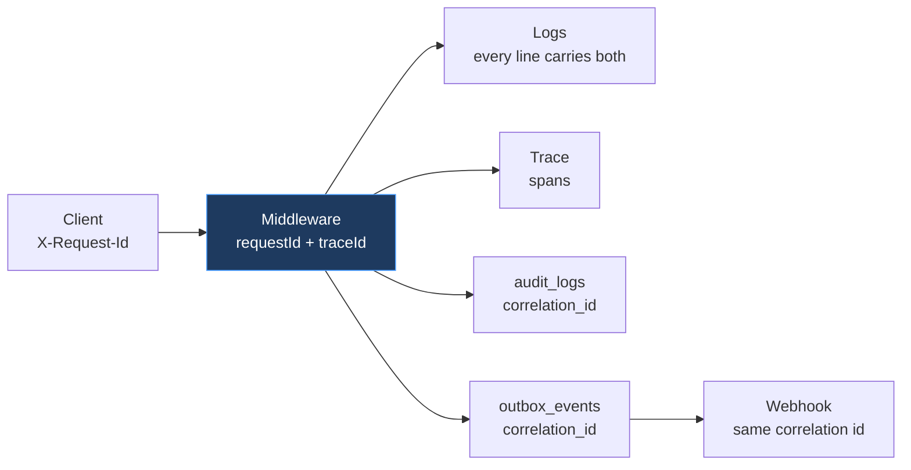

# 16 — Observability

Observability is built in from the first endpoint, not retrofitted (`01-repository-audit.md` §6). The standard this document holds itself to: when a customer reports "I could not add a user at 2pm", the answer should be reachable from their request id in a single lookup — not reconstructed by guessing.

---

## 1. The three signals, and what each is for

| Signal | Answers | Retention |
|---|---|---|
| **Logs** | What happened in this request? | 30 days hot, 1 year archived |
| **Metrics** | Is the system healthy, and trending how? | 15 months aggregated |
| **Traces** | Where did the time go, and in what order? | 7 days, sampled |

Plus a fourth that is not a telemetry signal but answers the most common support question:

| **Audit log** | Who did what, to what, when? | Per retention policy |

The distinction between logs and audit matters and is often blurred. Logs are **operational** — debuggable, sampled, droppable, rotated. Audit is **business record** — append-only, complete, durable, legally meaningful (`04-erd.md` §11). A log line is not an audit entry, and writing audit data only to logs is a correctness failure, not a style choice.

---

## 2. Structured logging

JSON via Pino. Never string-interpolated messages — a log you cannot query is a log you will not use at 3am.

```json
{
  "level": "info",
  "time": "2026-10-01T11:30:00.123Z",
  "requestId": "01932f90-...",
  "traceId": "4bf92f3577b34da6a3ce929d0e0e4736",
  "userId": "01932f8e-...",
  "organizationId": "01932a11-...",
  "membershipId": "01932a12-...",
  "method": "POST",
  "route": "/api/v1/memberships/:id/products",
  "status": 409,
  "durationMs": 23,
  "outcome": "limit_reached",
  "productId": "01932b...",
  "msg": "seat grant rejected: limit reached"
}
```

### 2.1 Mandatory fields

Every log line inside a request carries `requestId`, `traceId`, and — when resolved — `userId`, `organizationId`, `membershipId`. These are injected by middleware into a context the logger reads automatically, not passed by hand. Manual propagation is forgotten exactly where it matters, so it is structural.

`organizationId` on every line is what makes "show me everything that happened to this customer" a single query. In a multi-tenant system that is the most frequent investigation, and without the field it is impossible.

### 2.2 Redaction

The logger's serializer redacts by class (`15` §11): S3 never appears, S2 appears as identifiers only, `Authorization` and `Cookie` are stripped. Implemented centrally, because the realistic leak is an incidental object spread, not a deliberate log of a password.

### 2.3 Levels

| Level | Use |
|---|---|
| `error` | Needs human attention — unhandled faults, dead events, dispatcher down |
| `warn` | Degraded but handled — webhook retry, limit reached, auth failure |
| `info` | Request completion, state transitions, significant actions |
| `debug` | Development only; disabled in production |

Authorization **denials log at `warn`**, not `error`. They are expected in normal operation — someone clicked something they lack permission for — but a *rate* of them is the signal for probing (§4.3). Logging them at `error` would train the team to ignore errors.

---

## 3. Tracing

OpenTelemetry, with the exporter chosen at deployment. Instrumented from the start, because adding tracing after a performance problem appears means lacking data about the problem you have.

```text
POST /api/v1/memberships/:id/products          [23ms]
├── middleware.authenticate                     [2ms]
├── middleware.resolveOrgContext                [3ms]  ← db
├── middleware.authorize                        [4ms]  ← db: permission resolution
├── usecase.grantProductSeat                   [13ms]
│   ├── db.lockSubscription                     [2ms]  ← FOR UPDATE
│   ├── limits.resolveEffective                 [3ms]
│   ├── limits.countSeats                       [5ms]
│   └── (rejected: limit_reached)
└── response.serialize                          [1ms]
```

Spans worth having by name, because each is a known or likely source of latency:

| Span | Why |
|---|---|
| `middleware.authorize` | Permission resolution is the hottest query in the system (`07` §4.1) |
| `db.lockSubscription` | Lock wait time reveals contention under concurrency (ADR-011) |
| `limits.countSeats` | Runs inside the lock — its duration determines how long others block |
| `entitlement.check` | Called on every product request |
| `outbox.dispatch` | Per-consumer delivery latency |

`db.lockSubscription` is specifically valuable: a rising lock wait is the early warning that seat enforcement is serializing more than expected, which no other signal shows.

Sampling: 100% of errors and slow requests, 10% otherwise. Trace ids appear in logs regardless of sampling, so an unsampled request is still correlatable.

---

## 4. Metrics

### 4.1 Technical

| Metric | Type | Alert |
|---|---|---|
| `http_requests_total{route,status}` | counter | 5xx rate > 1% |
| `http_request_duration_seconds{route}` | histogram | p95 > 500ms |
| `db_pool_connections{state}` | gauge | saturation > 80% |
| `db_query_duration_seconds{operation}` | histogram | p95 > 100ms |
| `db_lock_wait_seconds{table}` | histogram | p95 > 1s |
| `outbox_pending_age_seconds` | gauge | **> 300s warn, > 900s critical** |
| `outbox_dead_total` | counter | **any increase** |
| `dispatcher_leader_heartbeat_age` | gauge | **> 60s critical** |

### 4.2 Business

Metrics that make the platform's health visible, not just the server's:

| Metric | Why it matters |
|---|---|
| `logins_total{outcome}` | A failure-rate spike is an attack or a broken deploy |
| `product_opens_total{product}` | Real adoption, independent of products' self-reports |
| `limit_reached_total{resource,product}` | Upgrade demand, and a signal that a plan is mis-sized |
| `entitlement_denials_total{reason}` | A spike means a subscription lapsed unexpectedly |
| `subscriptions_active{product,plan}` | Commercial state at a glance |
| `trials_expiring_7d` | Conversion pipeline |
| `seats_utilization{product}` | Seats used ÷ limit — upsell and right-sizing |
| `webhook_delivery_failures{product}` | A product is down or misconfigured |

`limit_reached_total` is both a product and a commercial metric: a spike on one plan suggests the plan's limit is set wrong, which is a pricing insight the data would otherwise hide.

### 4.3 Security

| Metric | Alert |
|---|---|
| `auth_failures_total{reason}` | Spike — credential stuffing |
| `authorization_denials_total{permission}` | Spike on one user — probing |
| `token_reuse_detected_total` | **Any occurrence** (ADR-017) |
| `cross_tenant_reads_total{actor}` | Unusual volume by one staff member |
| `platform_role_grants_total` | **Any occurrence** |
| `rate_limit_hits_total{endpoint}` | Sustained — abuse |

`token_reuse_detected_total` alerts on a single event because it means a refresh token leaked — there is no benign explanation, and ADR-017 revokes the family automatically, so the alert is to investigate rather than to react.

`cross_tenant_reads_total{actor}` is the insider-abuse signal. Staff reading customer data is legitimate and audited; one staff member reading an unusual *volume* is worth a question.

---

## 5. Health endpoints

| Endpoint | Checks | Used by |
|---|---|---|
| `/healthz` | Process alive. **No dependencies** | Liveness probe |
| `/readyz` | Database reachable, migrations current | Readiness probe, load balancer |

The separation is load-bearing. If liveness checked the database, a brief database blip would cause the orchestrator to **kill every application instance** — turning a recoverable dependency problem into a total outage. Liveness answers "is this process wedged"; readiness answers "should traffic come here".

```json
// /readyz
{ "status": "ok", "checks": {
    "database": { "status": "ok", "latencyMs": 3 },
    "migrations": { "status": "ok", "version": "0042" } },
  "version": "1.0.0", "uptime": 86400 }
```

Neither endpoint reveals internal hostnames, credentials or versions of dependencies — a health endpoint is unauthenticated and is read by anyone who finds it.

---

## 6. Product integration monitoring

Baseline §29 and master prompt §22 require visibility into integrated products, because from a customer's perspective a broken product *is* a broken platform.

| Check | Cadence | Surfaced in |
|---|---|---|
| `health_check_url` poll | 60s | Company console product health |
| Webhook delivery success rate | continuous | Per-product metric |
| Usage report freshness | hourly | Stale report warning |
| Token verification errors from a product | continuous | Possible JWKS caching bug |

A product failing its health check is reported in the console and the launcher shows a degraded indicator on its tile — the customer learns the product is having trouble rather than concluding the platform is broken.

---

## 7. Correlation: the end-to-end path

The property that makes investigation tractable. One identifier threads everything:



A customer quoting a request id from an error message gives support the exact request, its log lines, its trace, its audit entry, and any events it emitted — including the webhooks sent to products as a result. This is why `correlation_id` is on both `audit_logs` and `outbox_events` rather than only in the log stream.

---

## 8. Alerting discipline

| Severity | Response | Examples |
|---|---|---|
| **Critical** | Page immediately | 5xx > 5%, database unreachable, dispatcher dead, dead events, token reuse |
| **Warning** | Next business day | p95 latency, webhook failures for one product, pool pressure |
| **Info** | Dashboard only | Business metrics, limit-reached volume |

Two rules that keep alerts worth reading:

**Every critical alert names its runbook.** An alert that says a thing is broken without saying what to do wastes the responder's first ten minutes.

**No alert without an action.** An alert nobody acts on trains the team to ignore the channel, which costs more than the alert was ever worth. Alerts that fire repeatedly without action are deleted or re-tuned, not tolerated.

---

## 9. Dashboards

| Dashboard | Audience | Content |
|---|---|---|
| Service health | Engineering | Rates, latency, errors, database, pool |
| Event pipeline | Engineering | Pending age, dead count, per-consumer latency, leader heartbeat |
| Security | Engineering / security | Auth failures, denials, cross-tenant reads, role grants |
| Business | Product / leadership | Active subscriptions, trials, seat utilization, limit-reached, adoption |
| Product integration | Operations | Per-product health, webhook success, usage freshness |

The event pipeline deserves its own dashboard because a stalled dispatcher is silent: nothing errors, events simply stop, and the first symptom is a customer asking where their invitation email went.

---

## 10. Development phase

Observability is not deferred to a later phase, and these are the concrete first-commit requirements:

| Phase | Requirement |
|---|---|
| 1 — Foundation | Structured logging with correlation ids; `/healthz`, `/readyz` |
| 2 — Database | Query timing; pool metrics |
| 3 — Identity | Auth metrics; security audit events |
| Every phase | New endpoints instrumented; significant actions audited |
| 23 — Observability | Dashboards, alert rules, trace exporter wired to the chosen backend |

Phase 23 configures the *destinations*. The instrumentation exists from Phase 1, because adding correlation ids to an existing codebase means touching every log statement, while starting with them costs nothing.

---

Next: `17-deployment-architecture.md`.
