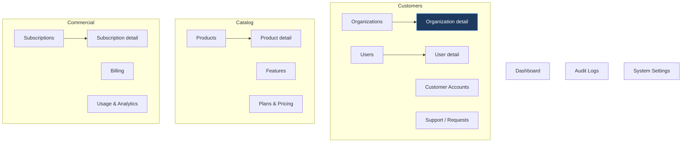

# 18 — Admin Console Architecture

The internal company dashboard from baseline §27–§29. Per master prompt §24, each screen specifies purpose, data, actions, permissions, API dependencies, and the important, empty and error states.

This console is where staff act on customer data, which makes it the highest-privilege surface in the platform. Two consequences shape every screen: nothing here trusts the client, and everything here is audited.

---

## 1. Information architecture

Baseline §27's navigation:

```text
Dashboard
Organizations · Users
Products · Features
Plans & Pricing · Subscriptions
Billing
Usage & Analytics
Customer Accounts · Support
Audit Logs
System Settings
```



**Organization Detail is the centre of gravity.** Baseline §28 describes it as the primary customer management view, and most staff work begins there — so every other screen links into it rather than duplicating its data.

### 1.1 Separate bundle

The console is a lazily-loaded bundle under `/admin/*` (HLD §8). A customer's browser never downloads cross-tenant administration code. Not as a security control — authorization is server-side regardless — but because shipping the admin surface to every customer invites probing.

---

## 2. Permission model

Navigation is driven by the caller's resolved permissions, and every item maps to one:

| Section | Permission |
|---|---|
| Dashboard | `platform.dashboard.read` |
| Organizations | `platform.organizations.read` |
| Users | `platform.users.read` |
| Products / Features | `platform.products.read` |
| Plans | `platform.plans.read` |
| Subscriptions / Billing | `platform.subscriptions.read` |
| Usage | `platform.usage.read` |
| Customer Accounts / Support | `platform.accounts.read` |
| Audit Logs | `platform.audit.read` |
| System Settings | `platform.settings.read` |

**Assignment-scoped roles see only their assigned organizations.** `account_manager`, `success_manager` and `support_agent` are filtered by `customer_account_assignments` (`07` §3.1) — a fifty-person support team should not each hold read access to every customer. The filtering is applied **server-side**; the console does not receive other organizations' rows and then hide them.

Every cross-tenant read is audited (`15` §10). Staff opening a customer's record leaves a trace, and that trace is visible in the customer's own audit view (`10` §8.1).

---

## 3. Dashboard

| Aspect | Detail |
|---|---|
| **Purpose** | Platform health and commercial state at a glance |
| **Data** | Organization counts by status; active subscriptions by product/plan; trials expiring in 7 days; MRR; new organizations (30d); open product requests; limit-reached events (7d); product health; dead events |
| **Actions** | Navigate; no mutations |
| **API** | `GET /platform/dashboard` |
| **Loading** | Skeleton cards — the layout is known, so it must not jump |
| **Empty** | Pre-launch: "No organizations yet" with a create action |
| **Error** | Per-card failure, so one broken metric does not blank the page |

Two tiles are operational rather than commercial and belong here because nobody checks a dashboard they do not already open: **dead events** (`14` §7) and **product health**. A stalled dispatcher is silent, and the first business symptom is a customer asking where their invitation went.

---

## 4. Organizations

### 4.1 List

| Aspect | Detail |
|---|---|
| **Purpose** | Find and triage customers |
| **Data** | Name, slug, status, products subscribed, member count, MRR, account manager, created |
| **Filters** | Status, product, plan, account manager, lifecycle stage, created range |
| **Search** | Name, slug, billing email |
| **Actions** | Open detail · Create · Suspend / Reinstate (permitted only) |
| **Permissions** | `platform.organizations.read`; create and suspend separately |
| **API** | `GET /platform/organizations` (cursor-paginated) |
| **Empty** | No organizations / no matches — distinct messages, since the fix differs |
| **Error** | Retry; never a silently empty table, which reads as "no customers" |

### 4.2 Organization Detail — the primary view

Baseline §28 specifies this screen's content. Organized as tabs over one header:

**Header** — name, slug, status badge, lifecycle stage, account manager, created, quick actions.

| Tab | Content | Key actions |
|---|---|---|
| **Overview** | Status, products with access states, subscriptions, seat usage per product, branch count vs limit, recent activity | Suspend · Reinstate |
| **Products & Subscriptions** | Per product: state, plan, period, trial end, seats used/limit, overrides | Create subscription · Change plan · Start trial · Suspend · Reinstate · Add override |
| **Members** | Members, status, roles, product seats, last active; pending invitations | Suspend · Remove · Manage roles · Grant/revoke seats (audited as on-behalf) |
| **Branches** | Branches, status, primary, count vs effective limit | — mostly read |
| **Usage** | Entitlement counters; product-reported metrics, clearly labelled as self-reported | — |
| **Billing** | Plan values, MRR, renewal date, external refs | Update billing metadata |
| **Account** | Account/success/support owners, health score, churn notes | Assign ownership · Update |
| **Audit** | This organization's audit trail, staff actions included | — read-only |

**Important states this screen must show, not hide:**

| State | Presentation |
|---|---|
| Suspended | Prominent banner with reason and who suspended |
| **Seats over limit** | Warning per product — a downgrade left an overage (`09` §5.2) |
| Trial expiring ≤7 days | Highlighted with the conversion action |
| `past_due` | Payment warning, distinct from suspension |
| Unlimited limit | "Unlimited", never a large number — NULL must not render as a numeral |
| Override active | Badge showing the overridden value, its reason and grantor |

The seats-over-limit warning exists because that state is permitted by design (`09` §5.2) and invisible otherwise — it is a renewal conversation the account manager cannot have if the console does not surface it.

**Empty states:** no subscriptions → "Not subscribed to any product" with a create action; no members beyond the owner → prompt to invite; no usage → "No usage reported yet", which for a new customer is expected rather than broken.

---

## 5. Users

| Aspect | Detail |
|---|---|
| **Purpose** | Find a person across organizations — the usual support entry point |
| **Data** | Name, email, status, verified, organizations with roles, platform roles, last login, sessions |
| **Actions** | Suspend / reinstate · Force password reset · Revoke sessions · Grant/revoke platform role (`platform.roles.grant` only) |
| **API** | `GET /platform/users`, `GET /platform/users/{id}` |
| **Important state** | A user in several organizations — the detail view must show **all** memberships (baseline §8), since support cannot resolve "I can't see my data" without knowing which organization they are in |
| **Danger** | Platform role grants require explicit confirmation naming the privilege; `is_dangerous` permissions are visually marked |

**No impersonation** (`10` §8). It is the most abusable capability an admin console can offer, and the legitimate need — seeing what the customer sees — is served by read access plus their audit log.

---

## 6. Products and Features

### 6.1 Products

| Aspect | Detail |
|---|---|
| **Purpose** | The registry that makes ADR-013 work — this screen is how a product is onboarded |
| **Data** | Name, slug, status, visibility, category, app URL, subscriber count, health |
| **Actions** | Create · Edit · Change status/visibility · Manage features · Manage discovery content · Register OIDC client |
| **API** | `GET/POST /products`, `PATCH /products/{id}` |
| **Important** | Slug is **immutable after creation** — it appears in URLs and permission keys. The form states this before submission, not after |

### 6.2 Product Detail

Tabs: Overview · Features · Plans · Discovery content · OIDC client · Subscribers · Health.

**This screen is the acceptance test for ADR-013.** Everything needed to onboard a product is here — registry row, features, discovery copy, plans, OIDC registration — so adding a product is configuration, not engineering (`11` §9). If onboarding ever needs a code change, the architecture has regressed.

### 6.3 Features

| Aspect | Detail |
|---|---|
| **Data** | Key, name, type (`boolean`/`limit`/`quota`), `enforced_by`, `countable_resource`, `countable_scope`, unit, public |
| **Important** | `enforced_by` is the domain boundary (ADR-010 amendment). The form explains it: `control_plane` means the platform enforces it and only `users`/`branches` qualify; `product` means the product enforces it and the platform only carries the number |
| **Validation** | `countable_resource` and `countable_scope` required together when `control_plane` — the CHECK constraints are mirrored in the form so the error arrives before submission |

---

## 7. Plans and Pricing

| Aspect | Detail |
|---|---|
| **Data** | Product, key, name, tier, price, interval, trial days, status, public, feature matrix with limits |
| **Actions** | Create · Edit · Set feature limits · Retire |
| **API** | `GET/POST /plans`, `PUT /plans/{id}/features` |

The feature matrix is the screen where **ADR-010 becomes operational** — limits are edited here as data, so changing a plan's user limit is an action a product manager takes, not a deployment.

| Important state | Presentation |
|---|---|
| Unlimited | Explicit "Unlimited" control, not an empty or large-number field |
| Feature not included | **Visibly distinct from zero.** Absent means not included; zero means included with no allowance (`09` §2) |
| Retiring with active subscribers | Warns and offers `grandfathered` instead, which honors existing customers |
| Editing a plan with subscribers | Warns that *n* organizations are affected immediately, since limits resolve per request |

The not-included-versus-zero distinction is subtle and consequential. A blank field that silently means "unlimited" is how a plan accidentally gives away an entitlement.

---

## 8. Subscriptions and Billing

| Aspect | Detail |
|---|---|
| **Purpose** | Commercial state across all customers |
| **Data** | Organization, product, plan, status, period, trial end, seats used/limit, MRR, overrides |
| **Filters** | Status, product, plan, expiring soon, trialing, past due, **over seat limit** |
| **Actions** | Create · Change plan · Start trial · Suspend · Reinstate · Cancel · Add/remove override |
| **Permissions** | `platform.subscriptions.manage`; overrides need `platform.subscriptions.override` |

**Override creation requires `reason` and records the grantor** — both NOT NULL (`09` §8). The form cannot be submitted without a reason, because a customer whose limits differ from their plan with no record of why becomes an unanswerable support question.

| Important state | Why it is surfaced |
|---|---|
| Over seat limit | Permitted after a downgrade; invisible otherwise |
| Override expiring | Capacity is about to drop — the account manager should know first |
| Trial ending ≤7 days | The conversion window |
| `past_due` beyond grace | About to suspend automatically |

Destructive actions — suspend, cancel — require typed confirmation of the organization name. A mis-clicked suspension takes a customer offline.

---

## 9. Usage and Analytics

| Aspect | Detail |
|---|---|
| **Data** | Entitlement counters (authoritative); product-reported metrics (informational); seat utilization; adoption from `product.opened` audit events |
| **Important** | The two kinds of usage are **visually separated and labelled.** Authoritative counters drive limits; product reports are self-reported and never affect access (`04-erd.md` §9) |
| **Empty** | "No usage reported" with report freshness, so staff can tell silence from a broken integration |

Seat utilization (used ÷ limit per product) is the upsell and right-sizing signal: consistently full means upgrade; consistently empty means the customer is paying for capacity they do not use, which is a churn risk worth addressing before renewal.

---

## 10. Customer Accounts and Support

| Aspect | Detail |
|---|---|
| **Data** | Lifecycle stage, health score, MRR, renewal date, assigned owners, churn notes |
| **Actions** | Assign/change ownership · Update stage and health · Record notes |
| **Support queue** | `organization_product_requests` — demo, contact, upgrade, trial |

The queue is **sorted by intent, not arrival**. `source = 'limit_reached'` ranks highest (`11` §5.1): that customer is blocked right now by a limit, which is the clearest buying signal the platform produces. Treating it as just another lead wastes it.

| Important state | Presentation |
|---|---|
| Unassigned request | Highlighted — an unowned lead is a lost lead |
| `limit_reached` request | Badged with the product and the limit hit |
| Account with no owner | Warning on the organization record |

---

## 11. Audit Logs

| Aspect | Detail |
|---|---|
| **Purpose** | Investigation and accountability |
| **Data** | Time, actor, actor type, organization, action, resource, outcome, IP, correlation id, changes |
| **Filters** | Organization, actor, action, outcome (incl. **`denied`**), resource type, time range |
| **Actions** | **None.** Read-only, append-only (`15` §10) |
| **API** | `GET /audit-logs` |

Filtering by `outcome = 'denied'` is the probing-detection view — a burst of denials for one actor is the signal, and a log of only successes cannot show it.

`correlation_id` is displayed and copyable, linking an audit entry to its request logs, trace and emitted events (`16` §7). This is what makes "the customer says they couldn't add a user at 2pm" answerable in one lookup.

Changes show before/after with S2 fields redacted and S3 fields absent — the log records that a password changed, never what to.

---

## 12. System Settings

| Aspect | Detail |
|---|---|
| **Data** | Platform role assignments, OIDC clients, signing key status and rotation, webhook endpoints, email templates, feature flags |
| **Actions** | Grant/revoke platform roles · Register/rotate OIDC clients · Trigger key rotation · Manage templates |
| **Permissions** | `platform.settings.*`; role granting is `super_admin` only |
| **Danger** | Every action here is `is_dangerous`. Typed confirmation, and prominent audit |

Key rotation shows the current `active` key, any `retiring` key and its overlap expiry (`06` §5.3), so an operator can see that rotation is mid-flight rather than wondering whether it completed.

---

## 13. Cross-cutting UI requirements

| Requirement | Reason |
|---|---|
| Every destructive action needs typed confirmation of the subject's name | Mis-clicks here take customers offline |
| `is_dangerous` permissions are visually marked | The operator should know before acting |
| Unlimited renders as "Unlimited" | A NULL rendering as a number is a misread waiting to happen |
| Not-included is distinct from zero | They have different meanings (§7) |
| Every list is cursor-paginated with explicit empty and error states | An empty table that means "error" is a lie |
| No client-side authorization | The console hides for usability; the server decides (master prompt §13) |
| **No hardcoded product references** | ADR-013 applies here as much as to the launcher |
| Timestamps show the viewer's zone with UTC on hover | Staff coordinate across zones; ambiguity causes real mistakes |
| Money shows amount and currency | A bare number is ambiguous across customers |

---

## 14. What the console cannot do

Limits that exist by decision, not omission:

| Not available | Why |
|---|---|
| Impersonate a customer user | Most abusable capability; read access + audit serves the need (`10` §8) |
| Edit an audit log | Append-only, enforced by database privileges |
| Raise a limit without a reason | `reason` is NOT NULL (`09` §8) |
| Grant a permission the operator lacks | Superset rule (`07` §6) |
| Self-grant a platform role | Escalation prevention |
| Read customer data outside assignment (scoped roles) | Least privilege, server-enforced |
| Delete an organization with history | Soft delete preserves the audit trail |

---

Next: `19-implementation-plan.md`.
