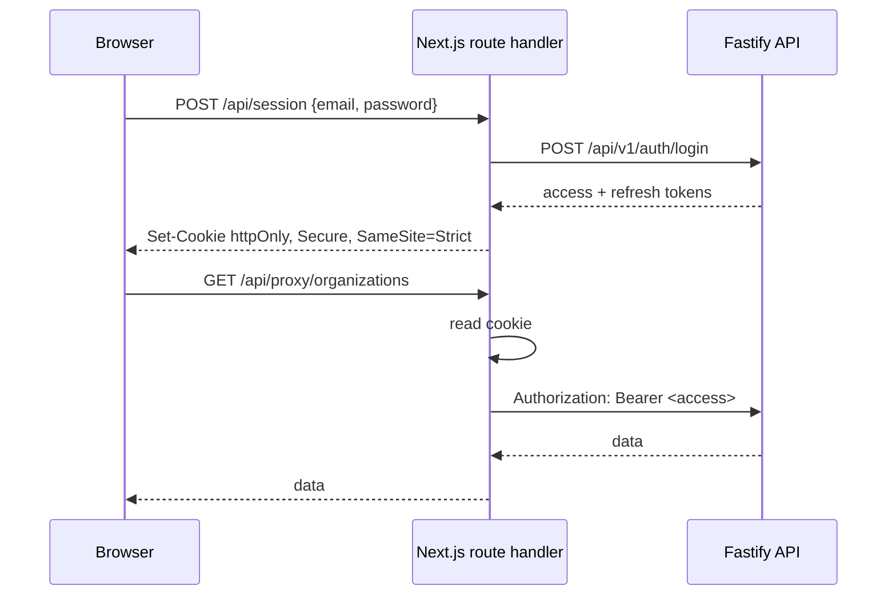

# 11 — Frontend Architecture

How the Next.js application is structured, where data is fetched, how the session is held, and the conventions that keep App Router complexity manageable.

---

## 1. Structure

```text
apps/web/
  app/
    (public)/                      no app chrome, server-rendered, cacheable
      page.tsx                     marketing home
      products/[slug]/page.tsx     discovery page
      layout.tsx
    (auth)/                        unauthenticated identity flows
      login/ register/ verify/
      invitations/[token]/
      forgot-password/ reset-password/
      select-organization/
    (app)/                         authenticated customer surfaces
      page.tsx                     product launcher
      org/
        members/ invitations/ roles/ branches/
        products/ subscriptions/ usage/ audit/
      layout.tsx                   sidebar shell
    (admin)/                       company console — SEPARATE BUNDLE
      admin/
        organizations/[id]/ users/ products/ features/
        plans/ subscriptions/ usage/ accounts/ audit/ settings/
      layout.tsx
    api/
      session/route.ts             login → sets httpOnly cookie
      session/refresh/route.ts     token rotation
      logout/route.ts
      proxy/[...path]/route.ts     authenticated passthrough to Fastify
    layout.tsx                     root: fonts, theme, providers
  components/                      app-specific, not reusable
  hooks/
  lib/
    api-client.ts
    query-keys.ts
    permissions.ts
    format.ts
packages/
  ui/                              the design system (05)
  contracts/                       shared Zod schemas + types (from the API)
```

Route groups are chosen so each has its own layout and, crucially, its own bundle boundary. `(admin)` is separate so **a customer session never downloads cross-tenant administration code** (C7).

---

## 2. Server vs Client Components

App Router's main complexity is deciding where each component runs. A convention removes the per-component judgement.

**Default to Server Components.** Add `'use client'` only for a listed reason:

| Reason | Example |
|---|---|
| Interactive state | Dialog, dropdown, form |
| Browser APIs | `localStorage`, `matchMedia` |
| Event handlers | onClick, onChange |
| Hooks requiring a client | `useQuery`, `useForm`, Zustand |
| Context providers | Theme, query client |

| Surface | Default |
|---|---|
| `(public)` discovery | **Server** — the whole point of ADR-019 |
| `(auth)` | Server shell + client forms |
| `(app)` launcher | Server shell + client grid (needs interactivity) |
| `(admin)` | Mostly client — it is a dense interactive app |

### 2.1 The boundary rule

`'use client'` goes **as deep as possible**. A client component at the top of a tree makes everything below it client, which silently defeats the architecture — and it is the single most common App Router mistake.

```tsx
// ✓ server page, client leaf
export default async function Page() {
  const product = await getProduct(slug)          // server
  return <><ProductHeader product={product} />    {/* server */}
           <RequestDemoButton productId={product.id} /></>  {/* client */}
}
```

A lint rule flags `'use client'` in a `layout.tsx` or `page.tsx` under `(public)`, because that is where the regression costs the most.

---

## 3. Data fetching

Two mechanisms, chosen by surface rather than by preference.

| Surface | Mechanism | Why |
|---|---|---|
| Public discovery | **Server Components**, fetched directly | SEO, cacheable, no client JS |
| Authenticated reads | **TanStack Query** | Caching, invalidation, refetch, rollback |
| Mutations | **TanStack Query** `useMutation` | Optimistic updates with rollback (C8) |
| Initial authenticated page data | Server-fetched, **hydrated into the query cache** | Fast first paint without a loading flash |

### 3.1 Query keys are structured and tenant-scoped

```ts
export const qk = {
  me: ['me'] as const,
  products: (orgId: string) => ['org', orgId, 'products'] as const,
  members:  (orgId: string, p?: Params) => ['org', orgId, 'members', p] as const,
  org:      (orgId: string) => ['org', orgId] as const,
  admin: {
    organizations: (p?: Params) => ['admin', 'organizations', p] as const,
  },
}
```

**Every tenant-scoped key contains `orgId`.** This is not tidiness — it is what makes the organization switch safe. Without the org in the key, cached data from Organization A would be served under Organization B's heading, which looks exactly like a cross-tenant leak even though the server behaved correctly (`06` §5). A user cannot tell the difference.

On switch, the cache is cleared entirely as a second defense:

```ts
async function switchOrganization(orgId: string) {
  await api.post(`/auth/organizations/${orgId}/select`)   // new org-scoped token
  queryClient.clear()                                     // belt and braces
  router.push('/')
}
```

### 3.2 Defaults

```ts
new QueryClient({
  defaultOptions: {
    queries: {
      staleTime: 30_000,
      gcTime: 5 * 60_000,
      retry: (count, err) => !isClientError(err) && count < 2,
      refetchOnWindowFocus: true,
    },
  },
})
```

**4xx responses are never retried.** A 403 or 409 is a decision, not a transient failure; retrying a `limit_reached` three times produces three identical refusals and three audit entries.

### 3.3 Entitlement is never cached beyond a request

`08` §8 of the architecture forbids caching entitlement decisions, because suspension and expiry must take effect immediately. In the client:

| Data | Cached |
|---|---|
| Product list with access states | `staleTime: 0`, refetch on focus |
| Permissions | 60s, invalidated on role change |
| Reference data (plans, features) | 5 minutes |
| Entitlement for an action | **Never** — the server decides at the point of action |

A stale TTL on access state is a window in which a suspended customer keeps working, which is precisely what suspension exists to close.

---

## 4. Session and authentication

The security benefit of ADR-019: **tokens never reach JavaScript.**



| Property | Value |
|---|---|
| Storage | **httpOnly cookie** — not `localStorage`, not memory |
| Flags | `Secure`, `SameSite=Strict`, `Path=/` |
| XSS exposure | **None** — script cannot read the token |
| CSRF | `SameSite=Strict` + origin check on mutations |
| Refresh | Route handler rotates and re-sets the cookie |

`SameSite=Strict` is viable because the Control Plane's own web app is never embedded or linked into cross-site POST flows. The OIDC redirect flows that *do* cross origins go to the Fastify authorization server directly, not through this cookie.

### 4.1 The proxy is thin, deliberately

The route handler attaches the cookie's token and forwards. It contains **no business logic, no authorization, no validation** — all of that stays in Fastify (ADR-019). A BFF that grows logic becomes a second place where authorization is decided, which is exactly the duplication the architecture avoids.

On a 401 it attempts one refresh, then redirects to login.

---

## 5. Client state

Minimal, per ADR-025. Four Zustand slices:

| Slice | Contents | Persisted |
|---|---|---|
| `theme` | light / dark / system | `localStorage` |
| `layout` | sidebar collapsed, density | `localStorage` |
| `palette` | command palette open | no |
| `tablePrefs` | column visibility per table | `localStorage` |

**Server state is never duplicated here.** It is the most common React state bug — two copies that disagree — and here it would also mean caching entitlement.

All `localStorage` access is wrapped in try/catch and renders correctly when it throws or returns nothing: private browsing, blocked site data and SSR all produce that case. A theme store that crashes in private mode takes the whole app with it.

---

## 6. Theme

```tsx
// Inline, before paint, to prevent a flash of the wrong theme
<script dangerouslySetInnerHTML={{ __html: `
  try {
    var t = localStorage.getItem('theme');
    if (t === 'dark' || (!t && matchMedia('(prefers-color-scheme: dark)').matches))
      document.documentElement.dataset.theme = 'dark';
    else if (t === 'light') document.documentElement.dataset.theme = 'light';
  } catch (e) {}
`}} />
```

This must run **before first paint**, which means an inline script — the one justified use of `dangerouslySetInnerHTML` in the codebase (the lint rule carries a scoped exception). Without it, a dark-mode user sees a white flash on every load.

It requires a CSP nonce, which is one of the findings in `13-design-validation.md` (D-3).

Theme is applied via `data-theme` on `<html>`, with both scopes defined so the explicit toggle wins over the OS preference in both directions (`02` §1.1).

---

## 7. Forms

```tsx
const form = useForm<CreateInvitation>({
  resolver: zodResolver(CreateInvitationSchema),   // from packages/contracts
  defaultValues: { email: '', roleIds: [], productIds: [] },
})
```

The schema is **the same one the API validates with** (ADR-023), so client and server cannot disagree about what is valid.

| Rule | Reason |
|---|---|
| Shared schemas cover **shape only** | Limits and permissions are server state (C4) |
| Server field errors mapped back onto fields | `setError` from the `details` payload |
| Form-level errors show `requestId` | Support can find the request (`13` §5) |
| Idempotency key per submit attempt | Double-submit creates one record (`13` §6) |
| Unsaved-change guard on navigation | |

---

## 8. Error handling

| Layer | Mechanism |
|---|---|
| Route | `error.tsx` per route group |
| Component | Error boundary around independent panels |
| Query | `error` state → `ErrorState` with retry |
| Mutation | Toast or inline, with the server's message |
| Not found | `not-found.tsx` |
| Global | Root boundary, logged with correlation id |

Panels have **independent** boundaries so one failed metric tile does not blank a dashboard (`18` §3).

| Status | Client response |
|---|---|
| 401 | One refresh attempt, then login |
| 403 | Show the reason and the path forward — never a bare "denied" |
| **404** | Treat as not found, **even for another tenant's resource** (`07` §9) |
| 409 `limit_reached` | `UpgradePrompt` with limit, usage, options |
| 429 | Honor `Retry-After`; back off |
| 5xx | Retry with backoff; show an error with the request id |

---

## 9. Performance

| Technique | Detail |
|---|---|
| Route-based splitting | `(admin)` never loads for customers (C7) |
| Server Components for public pages | Minimal client JS |
| `next/font` self-hosted, variable | One file; no third-party request; CSP-compatible (C6) |
| `next/image` for product icons | Sized, lazy, modern formats |
| Virtualization | Only audit logs and cross-tenant lists |
| Memoization | Only where measured — not reflexively |
| Prefetch on hover | Next.js `Link` default |

### 9.1 Budgets

| Metric | Target |
|---|---|
| LCP (discovery, 4G mid-range phone) | < 2.5s |
| INP | < 200ms |
| CLS | < 0.1 |
| Initial JS, public routes | < 100KB gzipped |
| Initial JS, app routes | < 250KB gzipped |
| Initial JS, admin routes | < 400KB gzipped |

Budgets are checked in CI; a regression fails the build. Discovery pages are search-ranked, so their Core Web Vitals have a commercial consequence, not just an engineering one.

---

## 10. Testing

| Layer | Tool | Scope |
|---|---|---|
| Component | Vitest + RTL | Behavior and states, not snapshots |
| A11y | `vitest-axe` | Every component, every variant |
| Hooks | Vitest | Query and mutation logic |
| Integration | RTL + MSW | Screens against mocked API |
| E2E | Playwright | The journeys in `20` §9 |
| A11y (page) | `@axe-core/playwright` | Every route, both themes |
| Visual | Playwright screenshots | Light and dark |
| Contrast | Custom script | Every token pair (`10` §9.1) |

MSW mocks the API from the **shared contract types**, so a mock cannot drift from the real response shape — a hand-written mock eventually lies, and the test then passes against an API that has changed.

---

## 11. Conventions

| Convention | Rule |
|---|---|
| File naming | `kebab-case.tsx`; components `PascalCase` |
| Component files | One per file; co-located test |
| Imports | `@/` for app, `@cp/ui` and `@cp/contracts` for packages |
| No barrel files in app code | They defeat tree-shaking |
| No default exports except route files | Named exports refactor better |
| Props typed explicitly | No `any`, no implicit |
| **No business logic in components** | It belongs server-side |
| **No product slug in a conditional** | ADR-013; lint-enforced |
| Tier 2 tokens only in components | `02` §1 |

---

## 12. Anti-patterns

| Forbidden | Why |
|---|---|
| `'use client'` at a layout or public page root | Defeats Server Components silently |
| Tokens in `localStorage` | XSS-readable; cookies are httpOnly |
| Business logic in route handlers | The BFF must stay thin |
| Query keys without `orgId` | Looks like a cross-tenant leak after a switch |
| Caching entitlement | Delays suspension |
| Retrying 4xx | A decision, not a transient failure |
| Duplicating server state into Zustand | Two copies that disagree |
| Unwrapped `localStorage` | Throws in private mode |
| Computing permissions or limits client-side | C3, C4 |
| Reflexive `useMemo` / `useCallback` | Complexity without measured benefit |
| Fetching inside Tier 4 components | They receive props |

---

Next: `12-ui-decisions.md`.
